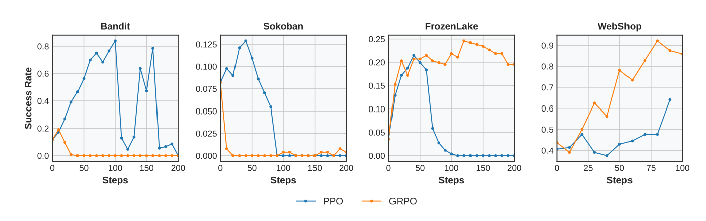
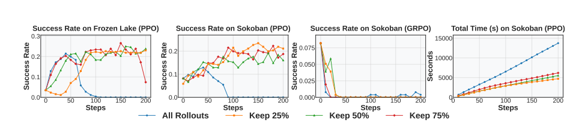
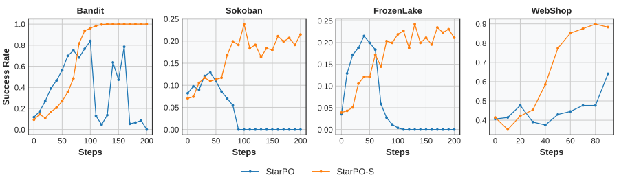

# RAGEN - 从单轮生成LLM的RL到Agentic RL

## 概要（Abstract、Intro）

传统RL后训练：静态的、一次性的代码/数学等生成，让奖励最大化

Agentic RL：长期决策，和环境交互，处理较随机的反馈

**本文提出：**

StarPO（State-Thinking-Actions-Reward Policy Optimization）的RL框架，用于轨迹级别的Agent学习

RAGEN：训练和评估Agent的平台

**3个key points：**

1. Agentic RL容易出现Echo Trap，表现为奖励方差坍塌、梯度激增等，模型容易陷入重复策略。用StarPO-S解决，包括轨迹过滤、引入Critic、梯度稳定等
2. RL rollout 的设计很重要。模型自我进化需要更好的数据生成方式：初始状态要多样，交互粒度要适中，采样/rollout 更新要更频繁。
3. 仅靠多轮 RL 不一定能让模型自然学会推理。如果没有细粒度、面向推理过程的 reward，Agent 可能只学到浅层策略，甚至生成看起来像推理但其实是幻觉的 thought。

## StarPO的RL框架（Framework）

**普通生成任务LLM的RL建模：**

$$J_{step}(\theta)=\mathbb{E}_{s\sim D,a\sim\pi_{\theta}(\cdot|s)}[R(s,a)]$$。针对给定的输入提示词$s$，最大化单轮输出回答$a$ 的期望奖励 $R(s,a)$ 

**Agentic RL建模：**认为是一个马尔可夫过程（MDP）

$\mathcal{M}=\{S,A,P\}$。$S$：代表当前的观察序列或交互历史；$A$：代表模型生成的 Token 序列。$P$：表示环境的内在动态机制。

在每一个时间步 $t$，智能体根据当前状态 $s_t$ 和交互历史 $\tau_{<t}$ 产生动作 $a_t$ ，环境接着返回奖励 $r_t$ 和新状态 $s_{t+1}$ 。直到最大步数 $K$，从而产生一整个长周期的完整轨迹序列 $\tau=\{s_{0},a_{0},r_{0},...,s_{K}\}$

**Star-PO：**将一整条轨迹（观察、中间思维链、行动、反馈）作为一个连贯的单元进行整体 rollout 和模型优化

- 传统RL（PPO、GRPO等）：根据单次prompt-response的奖励进行优化

- Star-PO：直接优化**整个轨迹 $\tau$ 的累积总奖励 $R(\tau)$** ：  $$J_{StarPO}(\theta)=\mathbb{E}_{\mathcal{M},\tau\sim\pi_{\theta}}[R(\tau)]$$。轨迹概率 $\tau$ 可以被分解为**自回归的 Token 级似然概率**，这使得 StarPO 完美兼容现有的自回归大语言模型

  单轮轨迹形如$$a_t^T = \text{<think>} \dots \text{</think>} \text{<answer>} a_t \text{</answer>}$$

  应用以上框架，具体可以用PPO或GRPO来训练

**RAGEN系统：**

完整的Agent训练框架，支持结构化rollouts、灵活自定义奖励、和多轮随机的环境结合。

可扩展：新环境、奖励、rollout策略可以植入

## 实验设置

**几个任务：**

3个符号任务：

- Bi-Arm Bandits：老虎机，让在两个词中选，一个方差更大但收益期望更大，一个稳定但收益期望较小。如Dragon：25%概率拿1.0，75%概率拿0；Phoenix：100%概率拿0.15。这个奖励是在执行完动作后环境给出反馈
- Sokoban：推箱子，每个箱子到规定位置+1分，离开规定位置-1分，执行一次动作-0.1分，所有箱子到规定位置+10分
- Frozen Lake：穿越冰面，避开窟窿，到达目的地。有1/3概率能按照给的动作进行，2/3概率向垂直侧面平移。稀疏奖励，到达给1分，不到达给0分。

1个真实开放域交互任务：

- WebShop：Agent需要在一个包含50条结果的半结构化页面中，通过搜索、点击链接、选择颜色/尺寸等指令，帮用户买到符合自然语言需求的商品

**一些训练超参数：**符号任务用Qwen2.5-Instruct-0.5B，WebShop用3B。训练超参数描述若干

**评估：**每个环境256个prompt（即样本数？），Agent运行**5轮对话**后截断。如下几个指标：

- Average Success Rate：任务成功比例
- Rollout Entropy：Token级别的平均熵，衡量策略水平与不确定性
- In-Group Reward Variability：不同Rollout轨迹的奖励的得分差异。如果方差小，说明模型陷入死板套路
- Total Response Length：回答的长度，直接监控<think>的长度变化
- Gradient Norm：梯度向量的L2范数，监控梯度大小是否剧烈变化

## 实验结果分析

### 一些实验结论

1. “奖励崩塌”：传统的单论对话RL不能直接用于多轮交互的Agentic RL。GRPO和PPO都导致奖励先增后降，PPO可能由于有critic，导致不稳定性推迟发生。
2. “Echo Trap”：训练早期（奖励较高）：think中输出多样化且符合逻辑的假设。训练后期（奖励崩塌）：think开始死板重复，强行记住固定的、重复的拿高分的模式，没有泛化性。例子：老虎机任务中，Dragon-风险更高、奖励期望更大；Phoenix-风险更低，奖励期望也低。可能训多轮后think里无脑说选Dragon，然后后面的交互轮次中读到上面的think更加强化这一效果。但如果新样本中把Dragon和Phoenix的效果互换，还是无脑选Dragon就有问题。
3. Echo Trap的早期识别信号。2个监控指标：Gradient Norm激增、Average Reward平台或下降；2个早期迹象：输出熵下降、奖励方差变小

结论说明了，传统RL没法解决多轮交互的Agentic RL的一些问题

### StarPO-S：稳定版的StarPO，实例过滤+梯度整形

**Trick1：**过滤奖励标准差小的样本

轨迹结果多次采样的奖励标准差：$$U(\pi_{\theta}, \mathcal{M}, s_0) = \text{Std}_{\tau \sim \pi_{\theta}(\cdot|s_0)} [R(\tau)]$$

训练的每个Iteration中，系统让模型对所有prompts运行重复rollouts，根据算出的奖励标准差进行排序。只选前p%的prompts投入训练

效果：过滤后效果变好

**Trick 2：**Gradient Shaping

用了DAPO的两个trick，clip higher+移除KL散度。保证更强的探索性.

**StarPO和StarPO-S效果对比：**

### 生成有用的RL训练轨迹

文中主要提了三点：

1. 高任务多样性。如果prompt数*rollout数一定的情况下，增加不同任务提示词的多样性的效果会好。
2. 中等行动粒度预算。即每轮调用LLM执行的动作数适中（文中说的是5-6个动作）效果比较好，过低抑制探索性，过高引发环境噪声堆积、奖励信号稀释
3. rollout轨迹的绝对新鲜（On-Policy）。定义Online-k表示把一个iteration中采样的结果缓存并训练k次。结论是Online-1的效果最好。微弱的复用会导致训练极其不稳定、引发策略崩溃

### Reasoning相关结论

1. Bandit这种单轮任务，有think能增加泛化性。

   think可以内化底层的统计学关联与符号语义。在遭遇语义冲突、奖励规则严重错位的恶劣新环境下实现真正的泛化，而不仅仅是表面词汇的死记硬背。例如反转老虎机中think也能表现得很好，说明不只是记忆了某个词应该怎么做

2. Sokoban、Frozen Lake这种多轮任务，think可能导致自然萎缩

   多轮任务中，如果只给最终目标的稀疏奖励，随着训练进行think长度变短，且中间产生幻觉。最终导致中间的思维链很多是错的，但多轮动作后可能刚好到了目标点，给了个很大的奖励。

   think和no think最终的效果差不多

   Bandit-Rev中，think反而能一直保持的很长，可能是因为有挑战的、需要大量思考的任务训练过程中可以一直保持大量思考

论文还指出，后续需要一种方法给每个中间过程合适的奖励。但是这篇文章没给具体的设计方法出来，只说了给过程的格式奖励（<think>/<action>等标签不按格式输出则扣-0.1）
