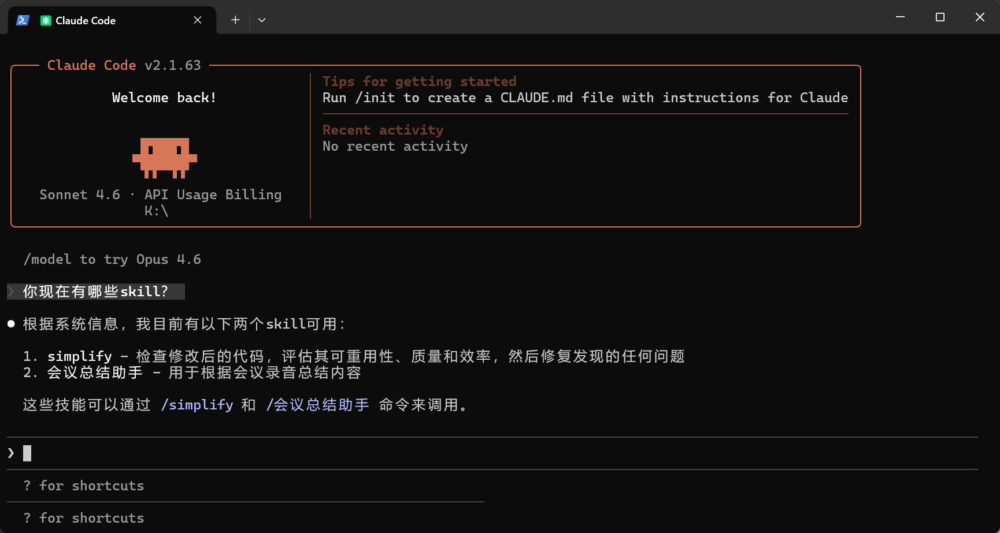
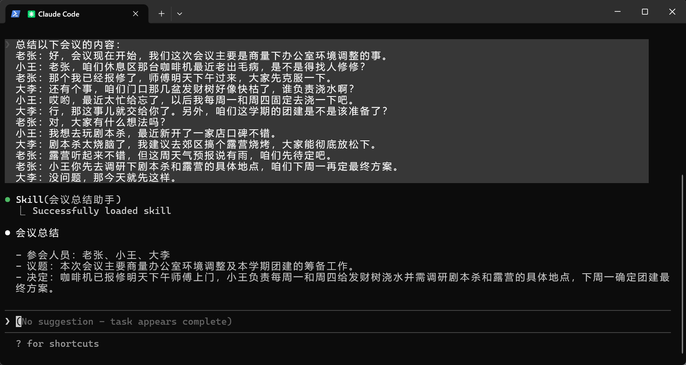
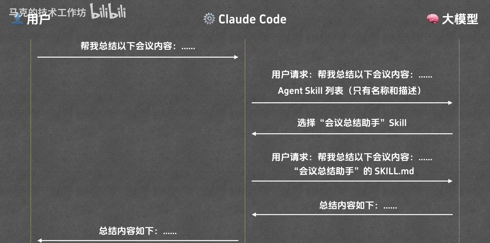
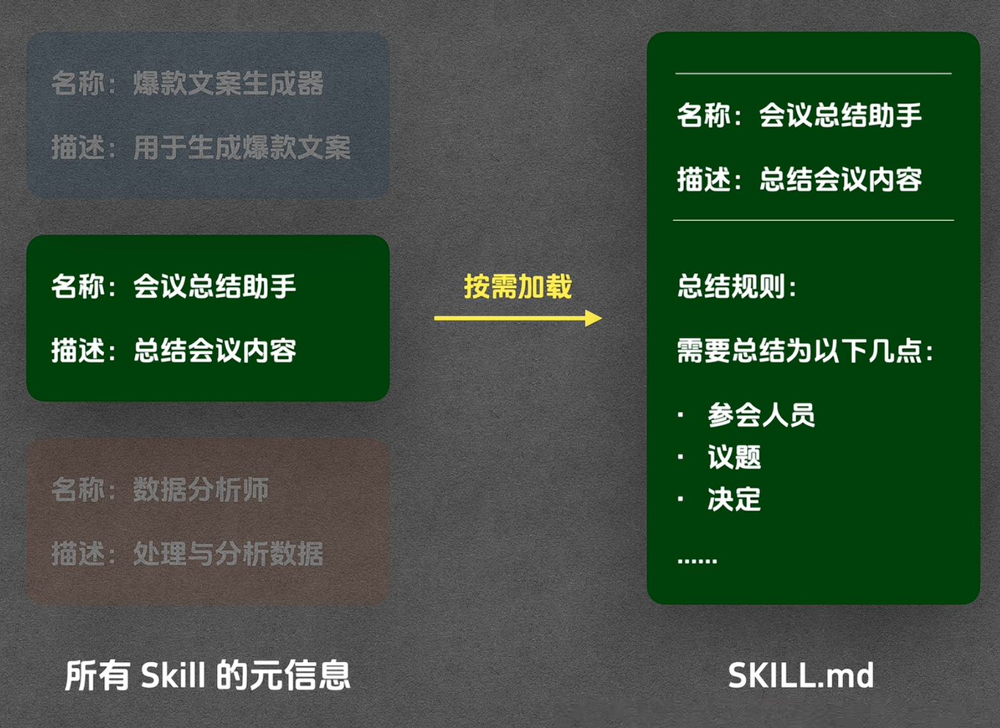
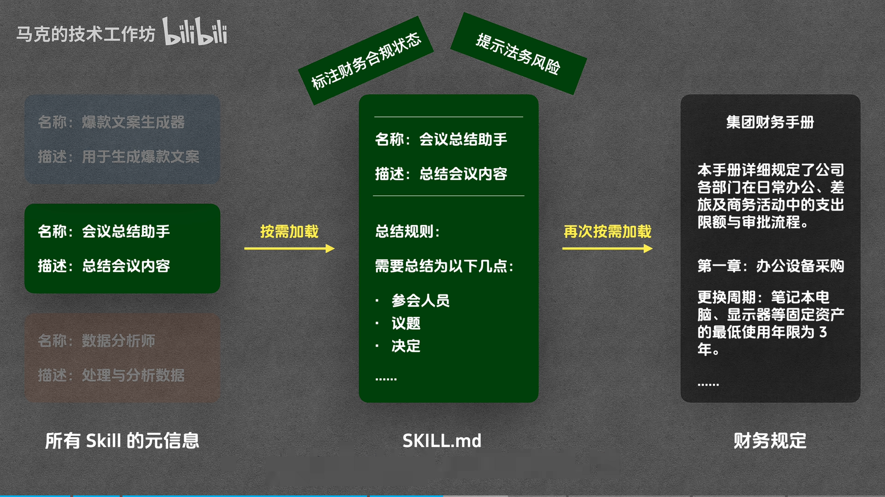
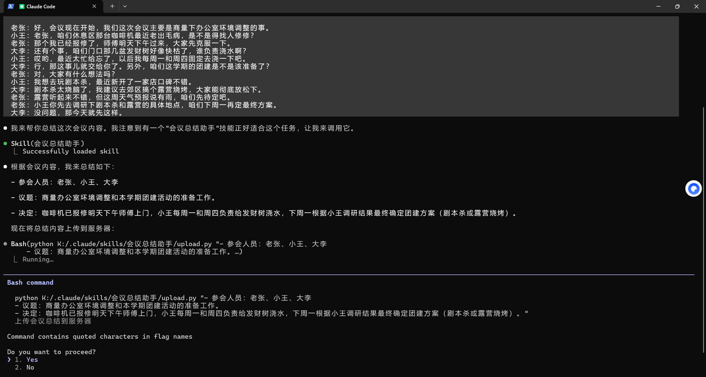
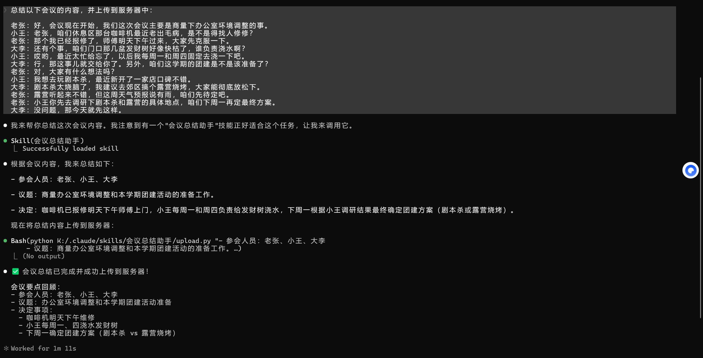

# Agent Skill

必须遵循.claude/skills/skill-name的路径

（来自Claude Code官方文档：[使用 skills 扩展 Claude - Claude Code Docs](https://code.claude.com/docs/zh-CN/skills)）你存储 skill 的位置决定了谁可以使用它：

| 位置 | 路径                                                         | 适用于               |
| :--- | :----------------------------------------------------------- | :------------------- |
| 企业 | 请参阅[托管设置](https://code.claude.com/docs/zh-CN/settings#settings-files) | 你的组织中的所有用户 |
| 个人 | `~/.claude/skills/<skill-name>/SKILL.md`                     | 你的所有项目         |
| 项目 | `.claude/skills/<skill-name>/SKILL.md`                       | 仅此项目             |
| 插件 | `<plugin>/skills/<skill-name>/SKILL.md`                      | 启用插件的位置       |

因此，要在claude code中使用skill，要么在用户目录下的.claude/skills/下建skill，要么在终端当前目录文件夹的.claude/skills/下建skill

## 简单示例，单SKILL.md文件：会议总结助手

SKILL.md：

```markdown
---
name: 会议总结助手
description: 该技能用于根据会议录音总结内容
---

# 会议总结助手

## 总结规则

请将会议内容总结为以下几点：

- 参会人员
- 议题
- 决定

注意：每项都只能分别使用一句话来表述，不要分成多条。

## 示例

输入：

李四：我建议活动放在公园，人多也方便组织。
王五：可以，不过要提前申请场地，不然可能有风险。
赵六：场地申请我可以负责，这周内给大家结果。
孙七：人数最好先有个范围，方便准备物资。
张三：那就先按 50 人左右来估算吧。
李四：上次的手套还能用，但垃圾袋需要再买。
王五：预算要不要设个上限，避免超支。
张三：预算控制在 1000 以内，优先用现有物资。
孙七：时间我建议周六上午，天气也不会太热。
李四：九点集合应该比较合适。
赵六：我周三前把申请结果同步到群里。
张三：好，那报名截止时间定在周四晚上。
王五：周五可以统一分组和采购。
孙七：我来负责写报名文案和活动当天的合影安排。
张三：安全方面提醒大家带水，活动结束简单总结一下就行。
张三：那今天就到这，大家按分工推进。

输出：

- 参会人员：张三、李四、王五、赵六、孙七
- 议题：统一确定下个月社区志愿活动的地点、时间、人数、预算及分工安排。
- 决定：活动定在公园并于周六上午九点举行，按约 50 人规模和 1000 预算执行，由赵六负责场地申请、孙七负责宣传及合影，其余成员配合物资和分组。
```

放在.claude/skills/会议总结助手/下，然后在.claude的上级目录打开命令行，输入claude：



说明claude code已经可以看到我们新建的会议总结助手skill

然后让claude code总结以下会议的内容：

```
总结以下会议的内容：
老张：好，会议现在开始，我们这次会议主要是商量下办公室环境调整的事。
小王：老张，咱们休息区那台咖啡机最近老出毛病，是不是得找人修修？
老张：那个我已经报修了，师傅明天下午过来，大家先克服一下。
大李：还有个事，咱们门口那几盆发财树好像快枯了，谁负责浇水啊？
小王：哎哟，最近太忙给忘了，以后我每周一和周四固定去浇一下吧。
大李：行，那这事儿就交给你了。另外，咱们这学期的团建是不是该准备了？
老张：对，大家有什么想法吗？
小王：我想去玩剧本杀，最近新开了一家店口碑不错。
大李：剧本杀太烧脑了，我建议去郊区搞个露营烧烤，大家能彻底放松下。
老张：露营听起来不错，但这周天气预报说有雨，咱们先待定吧。
老张：小王你先去调研下剧本杀和露营的具体地点，咱们下周一再定最终方案。
大李：没问题，那今天就先这样。
```



说明已经加载这个skill

原理：



按需加载。给LLM的Agent Skill列表中，只有name和description。




## 高级用法：Preference

在具体的skill里，也可以有的章节选择根据条件加载/不加载



创建`集团财务手册.md`

```markdown
# 集团财务手册

本手册详细规定了公司各部门在日常办公、差旅及商务活动中的支出限额与审批流程。

## 第一章：办公设备采购 (IT Assets)

1. **更换周期**：笔记本电脑、显示器等固定资产的最低使用年限为 **3 年**。
2. **采购限额**：
   - 标准办公电脑：单价不得超过 **10,000 元**。
   - 高性能工作站：单价 **10,000 - 20,000 元**，需部门总监 (Director) 审批。
   - 特殊定制设备：单价超过 **20,000 元**，必须由 IT 总监特批，并提交 CFO 最终签字。
3. **招标要求**：单笔采购总额超过 **50,000 元**时，必须启动至少三方参与的公开招标流程。

## 第二章：国内差旅标准 (Domestic Travel)

1. **住宿补贴（按城市等级）**：
   - 一线城市（北京、上海、广州、深圳）：**800 元/晚**。
   - 新一线及二线城市：**500 元/晚**。
   - 其他城市：**350 元/晚**。
2. **交通工具**：
   - 飞行时长 **4 小时**以内仅限经济舱。
   - 高铁限二等座（部门副总及以上级别可选一等座）。

------

## 第三章：商务招待与餐饮 (Entertainment)

1. **招待标准**：
   - 商务正餐：人均限额 **300 元**。若超过 **300 元/人**（如上海、香港等高消费地区最高可至 **500 元/人**），需附完整参会名单并提交业务副总裁 (VP) 特批。
2. **随访要求**：内部陪同人员人数不得超过外部客人人数。

## 第四章：日常零星报销

1. **自主额度**：单笔 **500 元**以下的办公杂费支出可由员工自主报销。
2. **主管审批**：**500 元至 5,000 元**的支出由部门直接主管在系统内审批。

## 第五章：市场活动与公关

1. **预算申报**：所有涉及品牌推广、市场活动的预算需提前 **14 天**提交 O 流程申报。
2. **礼品采购**：单份赠礼价值上限为 **300 元**。

------

**\*注：以上所有金额单位均为人民币 (CNY)。违反以上限额且未获得特批的申请，财务部将予以退回。**\*
```

修改`SKILL.md`，在`请将会议内容总结为以下几点：`后面添加：

```markdown
- 财务提醒：仅在提到“钱、预算、采购、费用”时触发。须读取`集团财务手册.md`，指处决定中的金额是否超标，并明确审批人。
```

新的问法：


可以看到读取了财务手册，也给出了财务提醒

如果没提到钱（没触发reference），就不会读取财务集团手册


## 高级用法：Script

在”总结规则“和”示例“中间添加：

````markdown
## 上传规则

如果用户提到“上传”、“同步”或“发送到服务器”，你必须运行 `upload.py` 脚本将总结内容上传到服务器。脚本使用方法：

```
python upload.py "会议总结内容"
```
````

写个假的upload.py：

```python
import sys
import time
import json

def mock_upload(content):
    """
    模拟将会议总结上传到服务器的逻辑
    """
    if not content:
        print(json.dumps({"status": "error", "message": "内容不能为空"}, ensure_ascii=False))
        return

    print(f"正在准备上传内容: {content[:30]}...")
    
    # 模拟网络延迟
    for i in range(1, 4):
        time.sleep(0.5)
        print(f"上传进度... {i*33}%")

    # 模拟成功返回
    response = {
        "status": "success",
        "message": "会议总结已成功同步至服务器",
        "payload": {
            "timestamp": time.strftime("%Y-%m-%d %H:%M:%S"),
            "data_length": len(content),
            "server_id": "shanghai-node-01"
        }
    }
    
    print("-" * 30)
    print(json.dumps(response, indent=2, ensure_ascii=False))
    print("-" * 30)

if __name__ == "__main__":
    # 从命令行参数获取总结内容
    if len(sys.argv) > 1:
        summary_text = sys.argv[1]
        mock_upload(summary_text)
    else:
        print("错误: 请提供会议总结内容作为参数。")
        print('用法: python upload.py "这里是总结内容"')
```

会尝试调用了：



注意，Agent Skill只会执行Script，而不会看具体里面有什么，以达到节省token的目的

执行之后：




## 原理：渐进式披露

元数据层Metadata：名称、描述 - 始终加载

指令层 Instruction：SKILL.md中除名称和描述之外的内容 - 按需加载

资源层 Resource：Reference、Script - 按需中的按需加载

Reference会被读取，Script会被执行（不会被读取）
