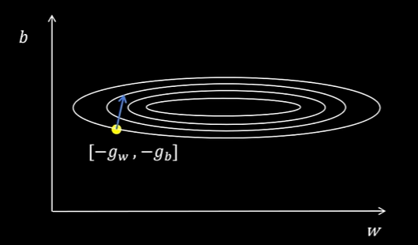
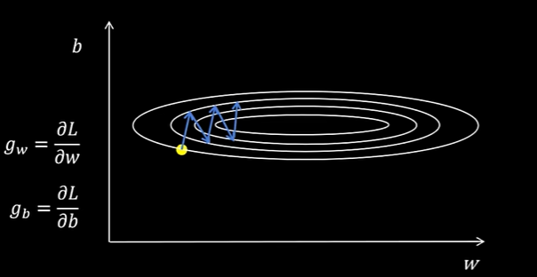
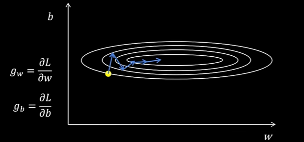
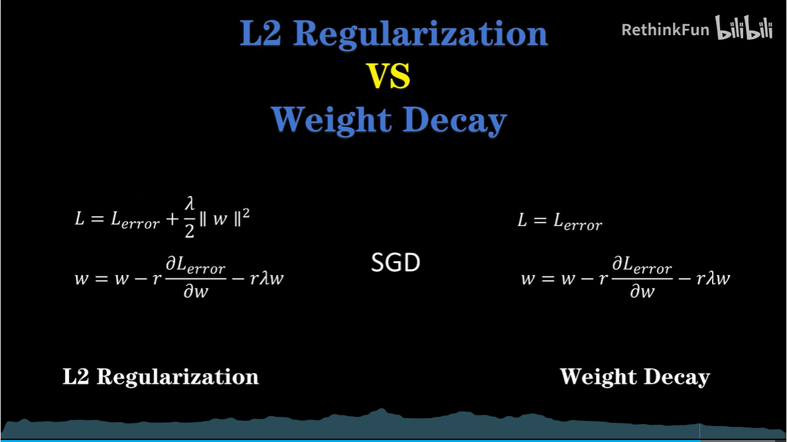
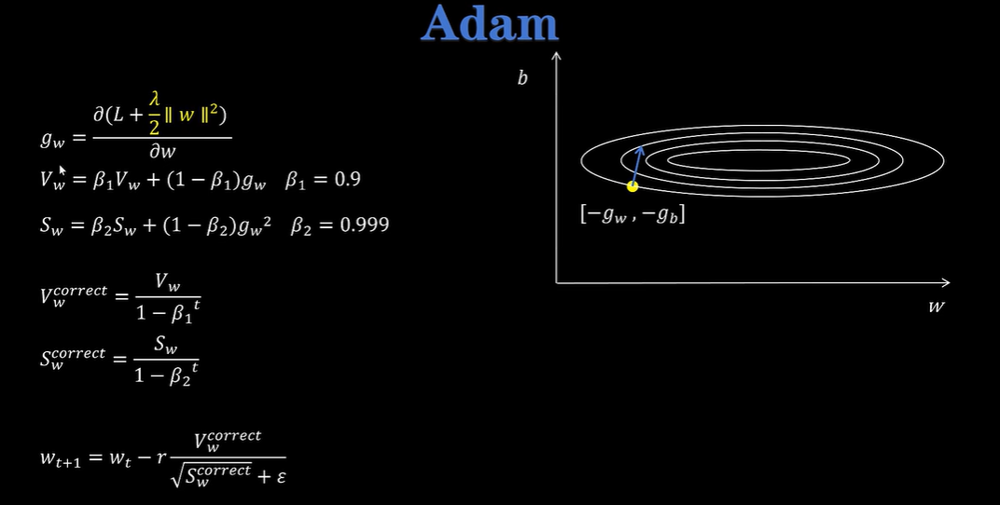

# Optimizer

source: [十分钟搞明白Adam和AdamW，SGD，Momentum，RMSProp，Adam，AdamW_哔哩哔哩_bilibili](https://www.bilibili.com/video/BV1NZ421s75D/?spm_id_from=333.1387.upload.video_card.click&vd_source=73e54c2ac162fbf942d5792a881e18b2)

## 背景知识：指数加权平均

假设开了家商店，营业额如下：

| 第一天 | 100  |
| ------ | ---- |
| 第二天 | 114  |
| 第三天 | 118  |
| 第四天 | 117  |
| 第五天 | 120  |
| 第六天 | 122  |
| 第七天 | ？   |

如何预测第七天的营业额？

- 最朴素做法：直接求前六天的算数平均作为预测值

缺点：没考虑到离第七天越近的值参考价值越大

- 改进：距离现在越近的值权重越大

$\begin{align*} V_0 &= 0,\ \beta = 0.7 \\ V_1 &= 0.7V_0 + 0.3\theta_1 \\ V_2 &= 0.7V_1 + 0.3\theta_2 \\ V_3 &= 0.7V_2 + 0.3\theta_3 \\ V_4 &= 0.7V_3 + 0.3\theta_4 \\ V_5 &= 0.7V_4 + 0.3\theta_5 \\ V_6 &= 0.7V_5 + 0.3\theta_6 \\ \end{align*}$

也即：

$V_0=0$

$V_t=\beta V_{t-1}+(1-\beta)\theta_t,\beta=0.7$

示例：

|        | θ    | V      |
| ------ | ---- | ------ |
| 第一天 | 100  | 30     |
| 第二天 | 114  | 55.2   |
| 第三天 | 118  | 74.04  |
| 第四天 | 117  | 86.9   |
| 第五天 | 120  | 96.83  |
| 第六天 | 122  | 104.38 |
| 第七天 | ？   | ？     |

问题：当序列较短时，总权重很低，预测值不准

- 解决：指数加权平均的修正

$V_0=0$

$V_t=\beta V_{t-1}+(1-\beta)\theta_t,\beta=0.7$

修正：$V_t^{correct}=\frac{V_t}{1-\beta^t}$（即除以了所有$\theta$权重的和）

|        | θ    | V      | 1−$β^t$ | $V_{correct}$ |
| ------ | ---- | ------ | ------- | ------------- |
| 第一天 | 100  | 30     | 0.3     | 100           |
| 第二天 | 114  | 55.2   | 0.51    | 108.2         |
| 第三天 | 118  | 74.04  | 0.657   | 112.6         |
| 第四天 | 117  | 86.9   | 0.76    | 114.3         |
| 第五天 | 120  | 96.83  | 0.832   | 116.4         |
| 第六天 | 122  | 104.38 | 0.942   | 110.8         |
| 第七天 | ?    | ?      | ?       | ?             |

## SGD 随机梯度下降

最简单的方法，直接根据梯度更新参数，没有优化$g_w=\frac{\delta L}{\delta w}, g_b=\frac{\delta L}{\delta b}$

$w_{t+1}=w_t-rg_w$

$b_{w+1}=b_t-rg_b$

示意图：（蓝线为梯度的反方向即等高线的切线）

缺陷：多次更新参数时，可能产生震荡（如下图由于b的梯度大，产生震荡）

## Momentum

SGD问题的解决：不使用当前状态的梯度，而是使用**前序梯度的加权指数平均值**来更新参数

$\begin{align*} V_w &= \beta V_w + (1 - \beta) g_w,\ \beta = 0.9 \\ V_b &= \beta V_b + (1 - \beta) g_b \\ w_{t+1} &= w_t - r V_w \\ b_{t+1} &= b_t - r V_b \\ \end{align*}$

多次正梯度和负梯度，经过指数加权平均后可以互相抵消，减少震荡

## RMSProp

思路：由于不同变量的梯度大小不同导致震荡，那么维护一个变量用于衡量梯度的“大小”，这个变量也是每次梯度的平方加权累计得到的，每次都用我们算出的当前梯度值除以这个大小，得到相对稳定大小的梯度，用这个梯度来更新。防止不同变量的梯度大小差距过大

$\begin{align*} S_w &= \beta S_w + (1 - \beta) g_w^2,\ \beta = 0.9 \\ S_b &= \beta S_b + (1 - \beta) g_b^2 \\ w_{t+1} &= w_t - r \frac{g_w}{\sqrt{S_w} + \varepsilon} \\ b_{t+1} &= b_t - r \frac{g_b}{\sqrt{S_b} + \varepsilon}(这里的\epsilon仅用作防止除数为0) \\ \end{align*}$

## Adam

结合Momentum和RMSProp，另外添加了指数加权平均的修正（除以$(1-\beta)^t$）

$\begin{align*} g_w &= \frac{\partial L}{\partial w} \\ V_w &= \beta_1 V_w + (1 - \beta_1) g_w,\ \beta_1 = 0.9 \\ S_w &= \beta_2 S_w + (1 - \beta_2) g_w^2,\ \beta_2 = 0.999 \\ V_w^{\text{correct}} &= \frac{V_w}{1 - \beta_1^t} \\ S_w^{\text{correct}} &= \frac{S_w}{1 - \beta_2^t} \\ w_{t+1} &= w_t - r \frac{V_w^{\text{correct}}}{\sqrt{S_w^{\text{correct}}} + \varepsilon} \\ \end{align*}$

## AdamW

在Adam基础上添加权重衰减项，缓解过拟合

对于Loss函数中添加了L2正则化项（$\frac{1}{2}||w||^2$）的情况，假设$Loss = L + \frac{\lambda}{2}||w||^2$，如果只用SGD，$\frac{\delta Loss}{\delta w}=\frac{\delta L}{\delta w}+\lambda w$，每次梯度下降过程中$w-=r\frac{\delta Loss}{\delta w}$，相当于额外减去了$r\lambda w$。但如果使用Adam，由于有$S^{correct}$的作用，导致最终优化的量被“变形”，不能起到很好的效果。因此在Adam的基础上，添加权重衰减项，每次优化给权重减少一个很小的值，不在Loss中添加L2正则项。

$\begin{align*} g_w &= \frac{\partial L}{\partial w} \\ V_w &= \beta_1 V_w + (1 - \beta_1) g_w,\ \beta_1 = 0.9 \\ S_w &= \beta_2 S_w + (1 - \beta_2) g_w^2,\ \beta_2 = 0.999 \\ V_w^{\text{correct}} &= \frac{V_w}{1 - \beta_1^t} \\ S_w^{\text{correct}} &= \frac{S_w}{1 - \beta_2^t} \\ w_{t+1} &= w_t - r \frac{V_w^{\text{correct}}}{\sqrt{S_w^{\text{correct}}} + \varepsilon} - r \lambda w_t \\ \end{align*}$

## 权重衰退 vs L2 正则化

对SGD算法，二者一样：

但对Adam算法，二者不等价！

## Adam & AdamW的参数量问题

$\begin{align*} V_w &= \beta_1 V_w + (1 - \beta_1) g_w,\ \beta_1 = 0.9 \\ S_w &= \beta_2 S_w + (1 - \beta_2) g_w^2,\ \beta_2 = 0.999 \\ \end{align*}$

需要额外存储两个量，由于梯度往往较小，因此需要使用Float32来存储。

如果参数用float16存储，这两个值的占用大小将是参数大小的4倍

