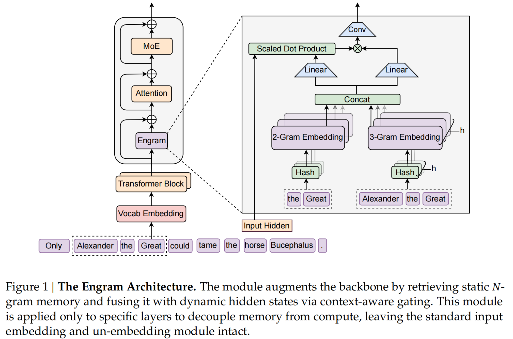

# Engram

## 动机

传统Transformer，“推理”和“背知识”都是要靠多组Attention+FFN层计算才能获得当前这个token上的内容

早期层为了“重建大量静态关系”占用了参数容量与推理算力，真正留给复杂推理（尤其是长程依赖与组合推理）的“有效层数”变少。

而实际上，一些纯背知识的内容，可以直接根据token本身到一个类似知识库的地方映射拿取，不需要这么多计算

## 方法

在一些transformer block（即本来是Attention+FFN的一层）的开始处加一个Engram层

通过N-gram记忆检索，检索到对应隐向量加到主干里，把局部、静态、重复出现的依赖关系交给查表，把主干网络的算力更多留给全局建模与推理

具体结构：

输入为N-gram的token序列（图上展示的是2-gram和3-gram），先通过哈希函数将N-gram映射成哈希值（有多个哈希头，每个N-gram每个头有不同的哈希值），再根据哈希值在字典里找对应的embedding（这是个直接映射的过程，不存在计算。embedding是可学习的）

得到的所有embedding拼接成一起之后，1.和隐藏层一起算点积+归一化得到亲和度得分；2.乘以亲和度得分得到最终输出。最终输出加到主干上，进行常规的transformer block计算