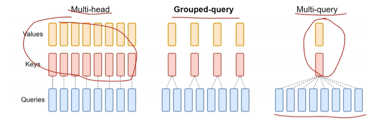
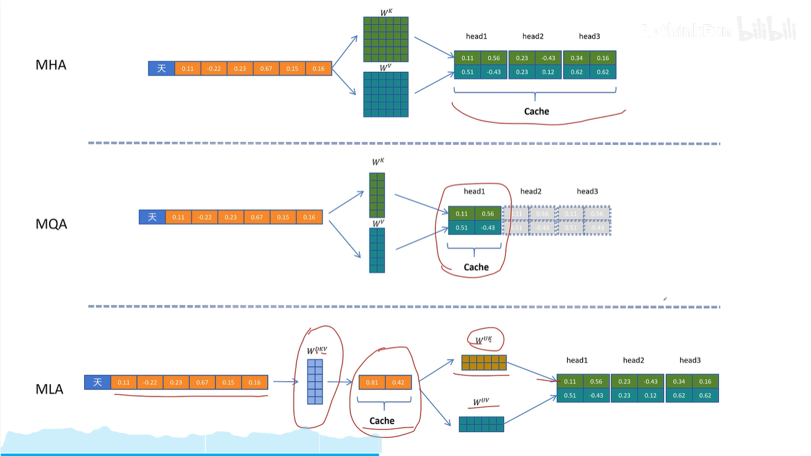
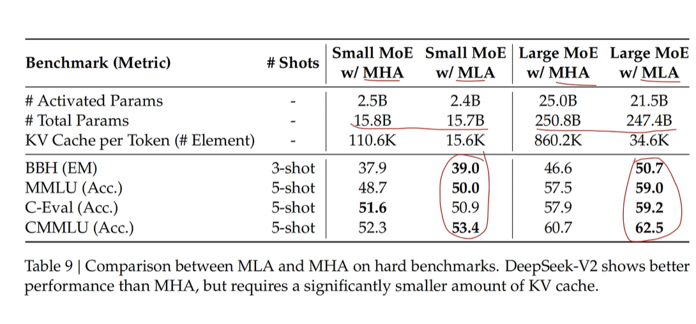
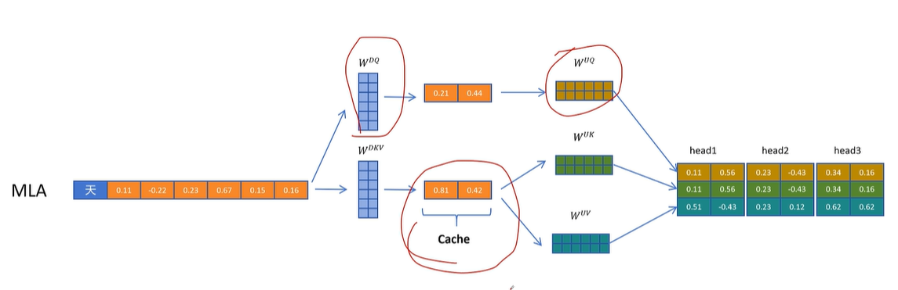
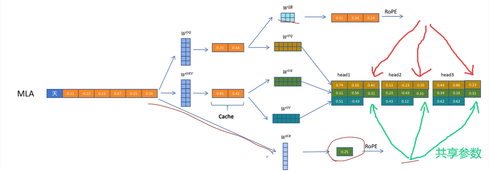
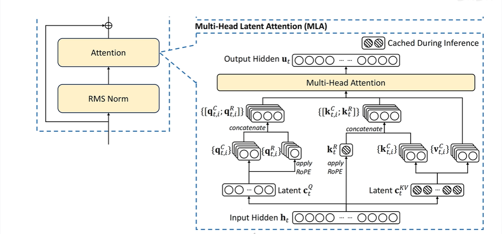

# DeepSeek MLA

## KV Cache

自回归生成任务中，预测下一个token时需要用当前token的Q向量乘以从当前token开始的先前所有token的K向量，计算点积归一化后与所有V向量一起算加权和。也就是说这里前面所有的token的K、V向量都会被用到，需要维护一个cache存储前面所有的K、V向量

pro：减少推理时计算量，加快推理速度

con：随着序列越来越长，KV Cache越来越大，占用大量显存

## 几种注意力机制

- Multi-Head Attention

最经典Transformer，（假设有k个头，QKV向量维度为N）每个token算出的Q、K、V向量拆成k份维度为$\frac{N}{k}$的向量$Q_i,K_i,V_i(i∈[1,k])$，分别并行计算k份$V_i$的加权平均$Z_i(维度为\frac{N}{k})$，最终连接所有$Z_i$得到最终输出（长为N的向量）

补充：也不一定非得拆成k份维度为$\frac{N}{k}$的向量，也可以维度比这个多或少，最终连接所有$Z_i$后再经过$W^O$矩阵换回所要的维度就行

- Multi-Query Attention

Multi-Head Attention变体，Q矩阵还是正常拆为k个头，每个头共享同一组K、V参数，因此只需要一个维度为$\frac{N}{k}$的K、V就行，计算还是正常的多头注意力计算。这样减少了K、V矩阵的参数量（输出维度不需要是N维了）

- Grouped-Query Attention

位于上面两种的中间，Q矩阵拆为k个头，其中每若干个头共享一组K、V参数，这样生成K、V向量的数量大于1，小于k

MQA、GQA能减少KV cache的大小，但影响了模型的性能（相同参数量下）：

## MLA

先使用一个权重矩阵$W^{DKV}$得到“压缩“的KV向量（注意这里是一个向量，不是拆成K、V两个），这个向量用于存在KV cache里，节省了Cache空间。具体的K和V向量需要通过”解压缩“操作，使用$W^{UK}$和$W^UV$矩阵将压缩的KV向量转化为K、V向量

不光节省了KV cache空间，实际效果还比标准MHA要好：

缺点：在解压时，从KV cache取出向量之后，引入了额外的”解压“计算

优化：**将权重矩阵合并**($C^{KV}$是压缩向量)

$attention=softmax(\frac{QK^T}{\sqrt{d}})V=softmax(\frac{XW^Q(C^{KV}W^{UK})^T}{\sqrt{d}})V=softmax(\frac{XW^Q{W^{UK}}^T{C^{KV}}^T}{\sqrt{d}})V$

这里定义一个$W^{QUK}=W^Q{W^{UK}}^T$（这个在推理时显然是常量），就可以避免从KV cache中取出$C^{KV}$向量之后再额外花时间计算K向量

由于$VW^O=CW^{UV}W^O$，

同理可以定义一个$W^{UVO}=W^{UV}W^O$来解决V向量解压缩时的额外计算（这里$W^O$是将V加权平均后的值再映射到输出维度的矩阵）

**对Q向量进行压缩：**

与KV同理，先用一个$W^{DQ}$矩阵将X映射到压缩Q向量，再用$W^{UQ}$映射到Q向量

### 位置编码问题

若使用RoPE位置编码：

$\begin{align*}
q_i R_i (k_j R_j)^T &= h_i W^Q R_i (c_j^{KV} W^{UK} R_j)^T \\
&= h_i W^Q R_i R_j^T W^{UK^T} c_j^{KV^T} \\
\end{align*}$

\(i,j\) 和 token 位置相关，无法合并！

解决方案：

1. 对于Q向量，解压缩时额外使用一个$W^{QR}$权重矩阵，生成Q位置相关信息向量，将这个生成的向量经过RoPE encoding后，拆成k个头，分给每个头本来有的Q向量
2. 对于K向量，对原始输入X使用$W^{KR}$生成一个额外的向量，再经过RoPE，这个向量给**所有头的K向量后面加上，所有头共享参数**。由于K向量后面还要用，这个额外的向量也要存到KV Cache里

不带旋转位置编码的部分：（与上文没添加RoPE时一样）

$\begin{align*} q_i k_j^T &= h_i W^Q (c_j^{KV} W^{UK})^T \\ &= h_i W^Q W^{UK^T} c_j^{KV^T} \\ &= h_i {W}^{QUK} c_j^{KV^T} \\ \end{align*}$

旋转位置编码的部分：（后面新加的，额外的那块向量）

$q_i^R{k_j^R}^T$

将这两块向量再相加，就得到注意力得分。

本质上，就是不带位置编码的q向量后面多拼接了m（图中m=1）维带位置编码的，不带位置编码的k向量后面多拼接了m（图中m=1）维带位置编码的，然后两个合成的最终的q，k向量做点积，算点乘。只不过为了快速计算，不带位置编码的部分可以直接用一个合并的权重矩阵$W^{QUK}$来算，而带位置编码的部分只能和正常的attention一样算

最终，KV Cache里要存储所有的压缩向量和这个多补充的带位置编码的k向量的m维，但确实还是比普通的KV Cache存的东西要少了。

**MLA全景图：**
