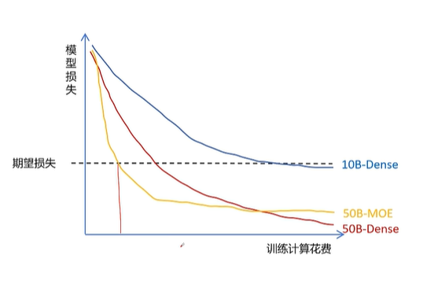
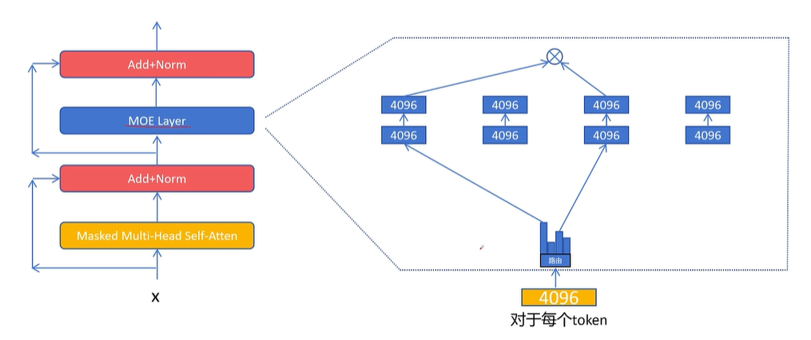
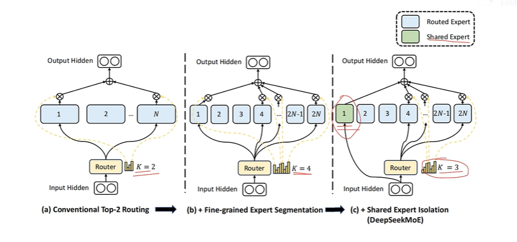
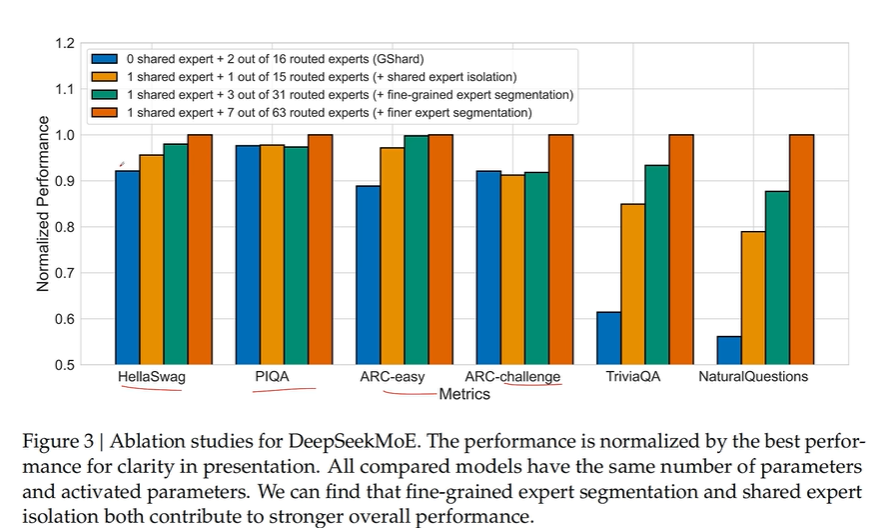
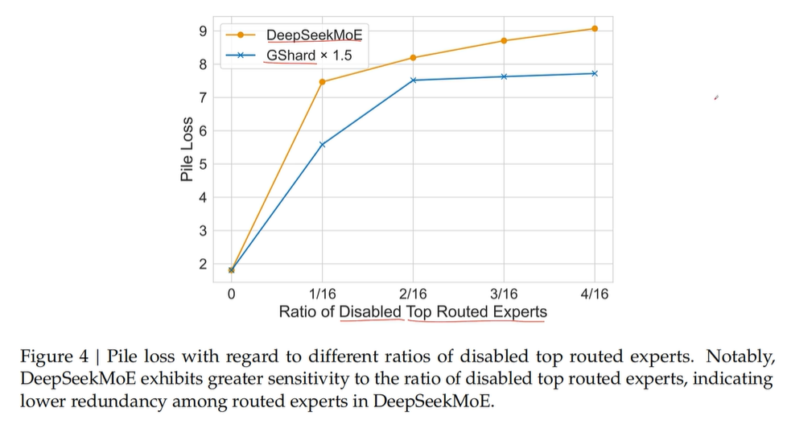
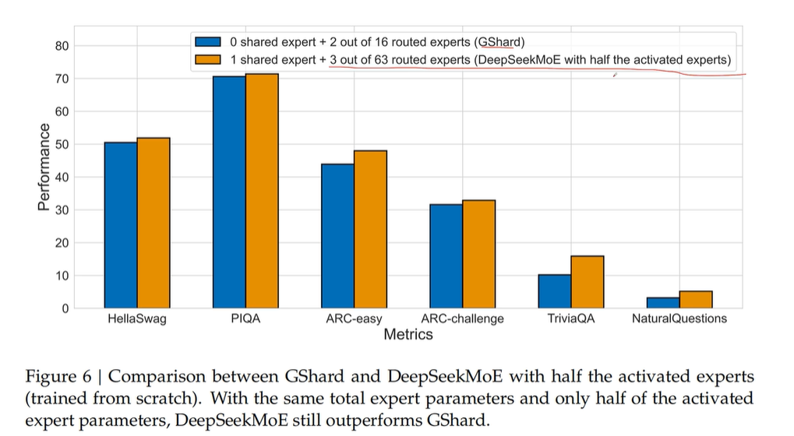

# MoE Mixture of Experts 混合专家模型

选择一个普通的基准大模型：Dense大模型

参数量越大，达到期望损失时训练计算花费越小

但推理时更大参数量的模型花费会更大，且推理是多次后续成本，训练是单次成本


MoE模型：参数量相同时，达到相同训练损失计算花费更小，且推理时所用资源也更少



## 具体结构

稠密大模型：feed forward layer只是一个双层MLP，隐藏层通常大于输入/输出维度


MoE大模型：feed forward layer变成几个并行的、隐藏层维度更小的双层MLP，使用一个路由结构输出选择多个专家的概率分布，选择概率最大的K（超参数）个专家经过，结果加权平均后输出




## 代码实现

```python
import torch
from torch import nn


class ExpertNetwork(nn.Module):
    def __init__(self, hidden_size, intermediate_size):
        super().__init__()
        self.hidden_size = hidden_size
        self.intermediate_size = intermediate_size

        self.linear1 = nn.Linear(hidden_size, intermediate_size)
        self.linear2 = nn.Linear(intermediate_size, hidden_size)

    def forward(self, x):
        x = self.linear1(x)
        x = nn.functional.relu(x)
        output = self.linear2(x)
        return output


class Router(nn.Module):
    def __init__(self, hidden_size, expert_num, top_k):
        super().__init__()
        self.router = nn.Linear(hidden_size, expert_num)
        self.top_k = top_k
        self.hidden_size = hidden_size

    def forward(self, x): # input: (batch_size, seq_len, hidden_size); output: (num_tokens, k), (num_tokens, k)
        x = x.view(-1, self.hidden_size) # (num_tokens, k)
        x = self.router(x)
        x = nn.functional.softmax(x, dim=1) # (num_tokens, k)
        topk_weight, topk_idx = torch.topk(x, k=self.top_k, dim=1, sorted=False) # (num_tokens, k)
        # 对top k权重重新归一化, 使和为1
        topk_weight = topk_weight / topk_weight.sum(dim=1, keepdim=True)
        return topk_weight, topk_idx


class MOELayer(nn.Module):
    def __init__(self, hidden_size, intermediate_size, expert_num, top_k):
        super().__init__()
        self.hidden_size = hidden_size # transformer前馈网络的输入/输出层维度
        self.intermediate_size = intermediate_size # 前馈网络中间的隐藏层维度
        self.expert_num = expert_num
        self.top_k = top_k
        self.experts = nn.ModuleList(
            [ExpertNetwork(self.hidden_size, self.intermediate_size) for _ in range(self.expert_num)]
        )
        self.router = Router(self.hidden_size, self.expert_num, self.top_k)

    def forward(self, x):  # shape of x is (batch_size, seq_len, hidden_size)
        batch_size, seq_len, _ = x.size()
        token_num = batch_size * seq_len # token_num: batch_size*序列长度
        x_flat = x.view(token_num, self.hidden_size)
        # 通过路由器获得 top-k 专家选择的权重和索引，形状均为 (N, top_k)
        topk_weight, topk_idx = self.router(x)
        # 初始化输出张量
        output = torch.zeros_like(x_flat) 
        for token_idx in range(token_num):
            for expert_idx in range(self.top_k): # 枚举top k个要选择的专家
                expert = self.experts[topk_idx[token_idx, expert_idx]]
                output[token_idx] += topk_weight[token_idx, expert_idx] * expert(x_flat[token_idx])

        output = output.view(batch_size, seq_len, self.hidden_size)
        return output


HIDDEN_SIZE = 4096
INTERMEDIATE_SIZE = 2048
EXPERT_NUM = 8
TOP_K = 2

inputs = torch.randn((2, 11, 4096))
moe_layer = MOELayer(HIDDEN_SIZE, INTERMEDIATE_SIZE, EXPERT_NUM, TOP_K)
outputs = moe_layer(inputs)
print(outputs.size())
```


## MOE 特点

- 相同计算代价下，可以增大网络参数规模，性能更好。
- 基本可以达到相同参数规模的稠密网络性能。
- 相比同等参数规模的稠密网络，计算代价变小。
- 相比同等参数规模的稠密网络，显存占用不变。
- 可能有专家负载不均衡问题，训练难度增大。


## 专家负载均衡

解决专家负载均衡的问题：

1. 训练时对每个 token 最少选择 2 个专家。选择 Top1 专家和在剩余专家里按概率再选择一个。

2. 给每个专家设置 token 容量，达到容量后，则跳过处理，输出为全 0。通过残差连接后边。

3. 设置一个负载均衡的辅助损失。


负载均衡损失：

- 希望每个专家被调用的频率是相等的。
- $f_i=(所有专家被调用的次数)(该专家被调用的次数)$
- $loss_{balance}=∑_{i=1}^N(f_i)^2$
- 假设有 2 个专家：

$\begin{align*} &f_1 = 1; \quad f_2 = 0; \quad \text{loss}_{\text{balance}} = 1^2 + 0^2 = 1 \\ &f_1 = 0.8; \quad f_2 = 0.2; \quad \text{loss}_{\text{balance}} = 0.8^2 + 0.2^2 = 0.68 \\ &f_1 = 0.5; \quad f_2 = 0.5; \quad \text{loss}_{\text{balance}} = 0.5^2 + 0.5^2 = 0.5 \\ \end{align*} $


辅助负载均衡损失

$loss_{\text{balance}} = \sum_{i=1}^{N} (f_i)^2 $，$f_i=\frac{(所有专家被调用的次数)}{(该专家被调用的次数)}$

问题：是否选择调用某个专家是通过torch.topk操作得到的，这个操作不可微，无法通过梯度下降优化

（不能让反向传播求导过程经过torch.topk）


优化：

$ loss_{\text{balance}} = \sum_{i=1}^{N} f_i p_i $

$p_i$: 一个批次中所有token对该专家的路由概率的平均值，由softmax得来，只对这个值求梯度


DeepSeek-V3的负载均衡：Auxiliary-Loss-Free Load Balancing

（即不用辅助loss的负载均衡）

对每个专家得分$s_i,t$后添加一个可学习的bias：$g'_{i,t}=s_{i,t}+b_i$

如果一个专家是过载状态，就降低bias；如果一个专家负载不足，就增加bias


## DeepSeek MoE

1. 将专家进一步细分，但中间层维度变小，topk 变大

从8个专家中选择2个专家的组合：28种

从16个专家里选择4个专家的组合：1820种


2. 专家里有一个共享专家，要学习通用能力

第一个专家一定选中，剩下的2N-1个专家中选择topk-1个




deepseek MoE 基本达到MoE的极限



->细分专家、共享专家都有利于效果提升




->禁用掉最高比例专家，DeepSeekMoE的loss更大，说明专家的专业性更强，与其他专家之间不能互相替代




->即使参数量只有一半，DeepseekMoE仍然比GShard效果好

DeepSeek-V3：1个共享专家+256个路由专家，其中8个专家被激活
