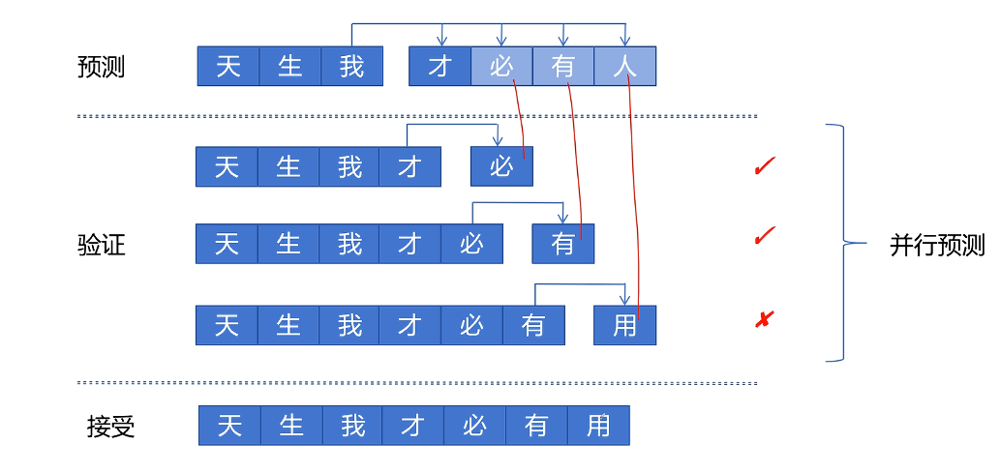
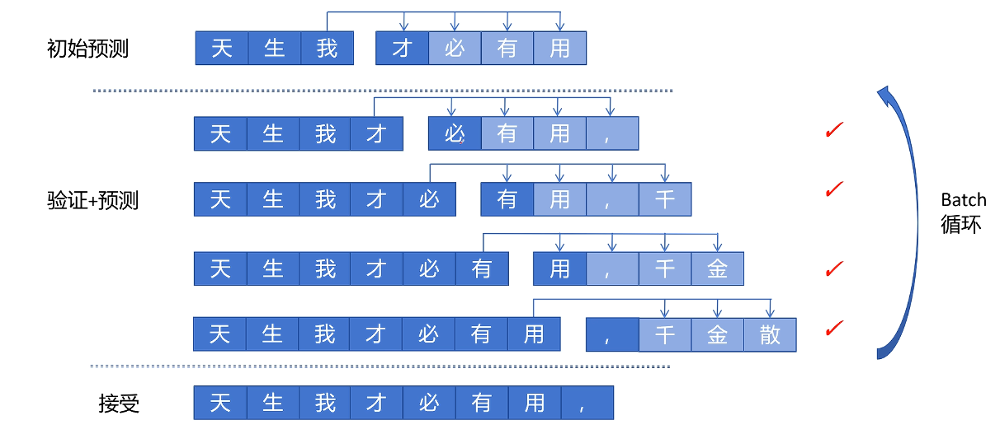
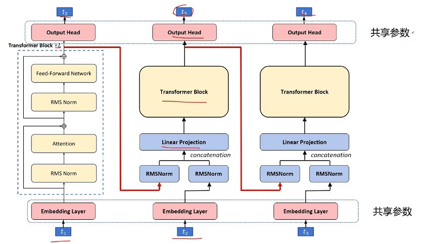
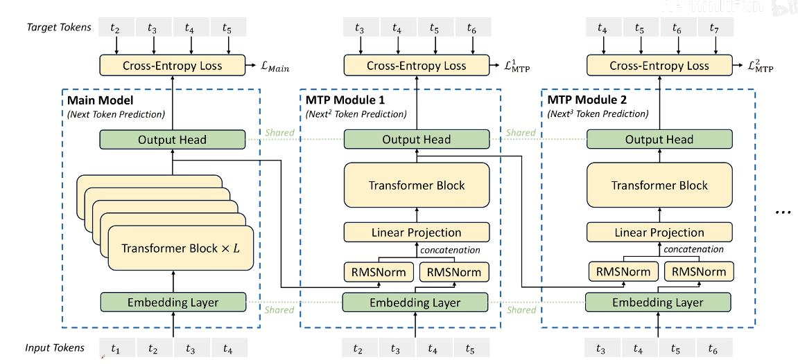

# DeepSeek-V3 MTP

[DeepSeek-v3原理讲解多token预测 MTP_哔哩哔哩_bilibili](https://www.bilibili.com/video/BV1jA9HYfEAC/?spm_id_from=333.337.search-card.all.click&vd_source=73e54c2ac162fbf942d5792a881e18b2)

**成本低：**

Llama3 405B：3080万H100GPU小时

DeepSeek-V3：279万H800GPU小时

## DeepSeek-V3的一些结构改进（速览）：

1. MoE的小改动

DeepSeek-V2中MoE的路由值经过softmax后去Top-K，V3认为没必要，因为取Top-K后和也不为1了，直接用sigmoid后取Top-K，然后再在K个之内归一化

- DeepSeek-V2：

$ \mathbf{h}_t' = \mathbf{u}_t + \sum_{i=1}^{N_s} \text{FFN}_i^{(s)} (\mathbf{u}_t) + \sum_{i=1}^{N_r} g_{i,t} \text{FFN}_i^{(r)} (\mathbf{u}_t), $ 

$ g_{i,t} = \begin{cases} s_{i,t}, & s_{i,t} \in \text{Topk}(\{s_{j,t} | 1 \leqslant j \leqslant N_r\}, K_r), \\ 0, & \text{otherwise}, \end{cases} $ 

$ s_{i,t} = \text{Softmax}_i (\mathbf{u}_t^T \mathbf{e}_i), $  

- DeepSeek-V3：

$ \mathbf{h}_t' = \mathbf{u}_t + \sum_{i=1}^{N_s} \text{FFN}_i^{(s)} (\mathbf{u}_t) + \sum_{i=1}^{N_r} g_{i,t} \text{FFN}_i^{(r)} (\mathbf{u}_t), $ 

$ g_{i,t} = \frac{g_{i,t}'}{\sum_{j=1}^{N_r} g_{j,t}'}, $

 $ g_{i,t}' = \begin{cases} s_{i,t}, & s_{i,t} \in \text{Topk}(\{s_{j,t} | 1 \leqslant j \leqslant N_r\}, K_r), \\ 0, & \text{otherwise}, \end{cases} $ 

$s_{i,t} = \text{Sigmoid} (\mathbf{u}_t^T \mathbf{e}_i), $

2. 负载均衡的改动，使用偏置项超参数调节

- **（核心创新点）Auxiliary-Loss-Free Load Balancing**

为每个专家的亲和度得分后又添加一个偏置项$b_i$，根据专家的过载/闲置情况去调整$b_i$。这个偏置项与实际输出后的加权权重是解耦的（决定调哪几个专家计算得分时加上$b_i$，实际输出时乘以的权重不含$b_i$）

- **权重极小**的序列级损失，避免一个sequence里的不同token有极度负载不均衡的情况发生

$ \mathcal{L}_{\text{Bal}} = \alpha \sum_{i=1}^{N_f} f_i P_i $

其中，$f_i$是专家的“使用频率”，$P_i$是专家的“平均重要性”。具体公式：

$T$：序列长度；$K_r$：每个token选择的专家数；$N_r$：总的路由专家数

$ f_i = \frac{N_r}{K_r T} \sum_{t=1}^{T} \mathbf{1}\left(s_{i,t} \in \text{Topk}\left(\{s_{j,t} | 1 \leq j \leq N_r\}, K_r\right)\right) $

形象理解：假设完全负载均衡，应当$N_r·\{选择该专家的次数\}=K_rT$，而式子右侧$\sum_{t=1}^{T} \mathbf{1}\left(s_{i,t} \in \text{Topk}\left(\{s_{j,t} | 1 \leq j \leq N_r\}, K_r\right)\right)$就是选择该专家的次数。因此，当完全负载均衡时，应当$f_i=1$，负载高于均衡则大于1，低于均衡则小于1

$ P_i = \frac{1}{T} \sum_{t=1}^{T} s_{i,t}' $，其中$ s_{i,t}' = \frac{s_{i,t}}{\sum_{j=1}^{N_r} s_{j,t}} $，就是把每个专家的得分归一化了（变成和为1）。简单粗暴，就是每个token选择第i个专家概率的平均。

## 老版Multi-Token Prediction(MTP)

本质上是将最后一个Attention层换成多个，三个Output Head共享参数。预测$t_3$和$t_4$时的loss权重会比$t_2$小一些，都用交叉熵损失

类比人：人在说一句话时，大脑不是一个字一个字生成序列，而是一下子可以生成一个语义片段

**优势：**

（1 token变成多 token）MTP 目标可以增加训练信号，提高数据利用率

MTP 可能使模型能够提前规划其表示，从而更好地预测未来token

**加速预测：**

- 使用一个**MTP头**和一个**只预测下一个token**的头

每次用MTP头预测下n（这里假设n=4）个token，再并行调用只预测下一个token的头4次，分别检查MTP头预测的四个字是否都是准确的。

从第一个不准确（即两个模型发生分歧）的位置，该位置只保留只预测下一个token的模型的结果，然后后面截断，从当前位置继续开始用MTP预测下n个token，以此类推

例如：

假设原始序列为“天生我材必有用，”

MTP预测下7个token为“千金散尽又再来”

7个单头并行验证的结果：

“天生我材必有用，**千**”，“天生我材必有用，千**金**”，“天生我材必有用，千金**散**”，“天生我材必有用，千金散**尽**”，“天生我材必有用，千金散尽**还**”，“天生我材必有用，千金散尽又**复**”，“天生我材必有用，千金散尽又再**来**”

从预测“又”的地方开始出现分歧，因此保留到“天生我材必有用，千金散尽还”，从此地开始继续开始下一轮MTP预测

（图文无关，不过能表示MTP预测-验证的思想）

如果MTP能保证还行的准确率，那么总速度是提升的；不过由于需要有多个单头模型并行预测，GPU开销大

也可以一边预测一边验证：

这种MTP的问题：无法和vllm兼容，因为有可能前面推理的是错的，需要删掉前面推理KV Cache，导致前面分配的内存块可能要删掉一部分K、V向量

## DeepSeek MTP

原版MTP问题：对预测的后面的token，不知道前面的token（比如MTP有4个头，预测第2、3、4个token时没法看到前一个token），导致很不准

**解决方法：**传入后面的MTP头时，同时传入上一个token和上一个token的隐藏层（即最后一个Transformer Block输出的特征）。Linear Projection作用：将维度从2D转换为1D

这样，DeepSeek MTP仍然是自回归结构的，预测第k个token依赖于第k-1个token的信息。但是由于后面的头参数量小，开销也会更小。

**训练目标：**

由于掩码机制，第一个头可以并行预测输入分别为$t_1,t_2,t_3,...$的下一个词是什么；然后，第二个头拿到了第一个头给的$t_1,t_2,t_3,...$的隐藏状态，开始并行的预测输入分别为$t_2,t_3,t_4,...$，以此类推

对每个MTP头的输出都计算一个交叉熵损失，然后对四个头一起算平均的交叉熵损失：

$ \mathcal{L}_{\text{MTP}} = \frac{\lambda}{D} \sum_{k=1}^{D} \mathcal{L}_{\text{MTP}}^k $ 

$\lambda$：前10T token：0.3；后4.8T token：0.1

结果：做了消融实验，发现无论大一些的模型还是小一些的，做MTP都有用。（具体评测数据表略）
