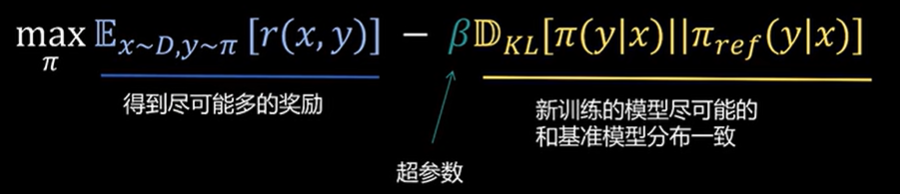

# DPO

## KL散度

略

## Bradley-Terry模型

对比较关系进行建模：

| 对战   | 胜   | 负   |
| ------ | ---- | ---- |
| A 对 B | 8    | 4    |
| A 对 C | 3    | 5    |

问题：B 战胜 C 的概率有多大？

$P(i > j) = \frac{\alpha_i}{\alpha_i + \alpha_j}$，$\alpha_i$表示第i个元素的实力，$P(i>j)$表示第i个元素战胜第j个元素的概率

对数最大似然估计：

$\ln L = 8 \ln\left( \frac{\alpha_A}{\alpha_A + \alpha_B} \right) + 4 \ln\left( \frac{\alpha_B}{\alpha_A + \alpha_B} \right) + 3 \ln\left( \frac{\alpha_A}{\alpha_A + \alpha_C} \right) + 5 \ln\left( \frac{\alpha_C}{\alpha_A + \alpha_C} \right)$

对$\alpha_A,\alpha_B,\alpha_C$求导为0，解得$\alpha_A=1,\alpha_B=\frac{1}{2},\alpha_C=\frac{5}{3}$，从而得到$P(B>C)=\frac{\alpha_B}{\alpha_B+\alpha_C}=0.23$

一般情况下，假如我们的目标是x战胜y，需要向增大$\frac{\alpha_x}{\alpha_x+\alpha_y}$的方向优化，我们的损失函数为

$\text{Loss} = -\mathbb{E}_{(\alpha_x, \alpha_y) \sim D} \left[ \ln \frac{\alpha_x}{\alpha_x + \alpha_y} \right]$

## 强化学习中Bradley-Terry模型应用

强化学习里，大模型输入的prompt是x，回答是y。回答y的好坏（实力得分）是靠Rewar模型进行评估。

$P(y_1>y_2)=\frac{r(x,y_1)}{r(x,y_1)+r(x,y_2)}$

注意r(x,y)有可能返回负数，所以加上指数函数：

$P(y_1 > y_2) = \frac{\exp(r(x, y_1))}{\exp(r(x, y_1)) + \exp(r(x, y_2))}$

取负对数，计算Loss：

$\begin{align*}
\text{Loss} &= -\mathbb{E}_{(x, y_w, y_l) \sim D} \left[ \ln \frac{\exp(r(x, y_w))}{\exp(r(x, y_w)) + \exp(r(x, y_l))} \right] \\
&= -\mathbb{E}_{(x, y_w, y_l) \sim D} \left[ \ln \frac{1}{1 + \exp(r(x, y_l) - r(x, y_w))} \right] \\
&= -\mathbb{E}_{(x, y_w, y_l) \sim D} \left[ \ln \sigma(r(x, y_w) - r(x, y_l)) \right] \\
&= -\ln \sigma(r(x, y_w) - r(x, y_l))
\end{align*}$

## DPO

- DPO训练目标：

奖励模型：r(x,y) - x: prompt, y:response

基准模型：$\pi_{ref}(y|x)$

训练模型：$\pi(y|x)$

逐步推导：

$\begin{align*}
&\max_{\pi} \mathbb{E}_{x \sim D, y \sim \pi} \left[ r(x, y) \right] - \beta \mathbb{D}_{KL} \left[ \pi(y|x) || \pi_{ref}(y|x) \right] \\
&= \max_{\pi} \mathbb{E}_{x \sim D, y \sim \pi} \left[ r(x, y) \right] - \mathbb{E}_{x \sim D, y \sim \pi} \left[ \beta \log \frac{\pi(y|x)}{\pi_{ref}(y|x)} \right] \\
&= \max_{\pi} \mathbb{E}_{x \sim D, y \sim \pi} \left[ r(x, y) - \beta \log \frac{\pi(y|x)}{\pi_{ref}(y|x)} \right] \\
&= \min_{\pi} \mathbb{E}_{x \sim D, y \sim \pi} \left[ \log \frac{\pi(y|x)}{\pi_{ref}(y|x)} - \frac{1}{\beta} r(x, y) \right] \\&= \min_{\pi} \mathbb{E}_{x \sim D, y \sim \pi} \left[ \log \frac{\pi(y|x)}{\pi_{\text{ref}}(y|x)} - \log \exp\left( \frac{1}{\beta} r(x, y) \right) \right] \\
&= \min_{\pi} \mathbb{E}_{x \sim D, y \sim \pi} \left[ \log \frac{\pi(y|x)}{\pi_{\text{ref}}(y|x) \exp\left( \frac{1}{\beta} r(x, y) \right)} \right] \\
&= \min_{\pi} \mathbb{E}_{x \sim D, y \sim \pi} \left[ \log \frac{\pi(y|x)}{\pi_{\text{ref}}(y|x) \exp\left( \frac{1}{\beta} r(x, y) \right) \frac{1}{Z(x)} Z(x)} \right] \\
&= \min_{\pi} \mathbb{E}_{x \sim D, y \sim \pi} \left[ \log \frac{\pi(y|x)}{\frac{1}{Z(x)} \pi_{\text{ref}}(y|x) \exp\left( \frac{1}{\beta} r(x, y) \right)} - \log Z(x) \right] \\
\end{align*}$

（其中$Z(x) = \sum_{y} \pi_{\text{ref}}(y|x) \exp\left( \frac{1}{\beta} r(x, y) \right)$）

单看式子中的一部分：

$\frac{1}{Z(x)} \pi_{\text{ref}}(y|x) \exp\left( \frac{1}{\beta} r(x, y) \right) = \frac{\pi_{\text{ref}}(y|x) \exp\left( \frac{1}{\beta} r(x, y) \right)}{\sum_{y} \pi_{\text{ref}}(y|x) \exp\left( \frac{1}{\beta} r(x, y) \right)}$，这是一个概率分布P(y|x)的形式，我们记作$\pi^*(y|x)$

因此

$\begin{align*}
&原式 = \min_{\pi} \mathbb{E}_{x \sim D, y \sim \pi} \left[ \log \frac{\pi(y|x)}{\pi^*(y|x)} - \log Z(x) \right] （注意到Z(x)中没有要优化的参数\pi，可以消去）\\
&= \min_{\pi} \mathbb{E}_{x \sim D, y \sim \pi} \left[ \log \frac{\pi(y|x)}{\pi^*(y|x)} \right] \\
&= \min_{\pi} \mathbb{E}_{x \sim D} \left[ \mathbb{D}_{KL}(\pi(y|x) \| \pi^*(y|x)) \right] \implies \pi(y|x) = \pi^*(y|x) = \frac{1}{Z(x)} \pi_{\text{ref}}(y|x) \exp\left( \frac{1}{\beta} r(x, y) \right)
\end{align*}$

这说明最优情况下，我们要训练的网络的概率分布是可以计算的一个特定值

继续对这个等式进行推导：

$\begin{align*} \pi(y|x) &= \frac{1}{Z(x)} \pi_{\text{ref}}(y|x) \exp\left( \frac{1}{\beta} r(x, y) \right) \\ \implies \exp\left( \frac{1}{\beta} r(x, y) \right) &= \frac{\pi(y|x)}{\pi_{\text{ref}}(y|x)} Z(x) \\ \implies r(x, y) &= \beta \ln\left( \frac{\pi(y|x)}{\pi_{\text{ref}}(y|x)} Z(x) \right) \\ \implies r(x, y) &= \beta \ln \frac{\pi(y|x)}{\pi_{\text{ref}}(y|x)} + \beta \ln Z(x) \\ \end{align*}$

这个式子表现了最优解下$r(x,y)$和$\pi(x,y)$的定量关系，**好回答（r大）策略概率高，坏回答（r小）概率低**，符合直觉。有了这个式子，就有了r和$\pi$之间的闭式解

根据我们从Bradley-Terry模型中的Loss式子，我们最终的Loss函数（本来是用于训练reward模型的）为：

$\begin{align*}
&-\ln \sigma(r(x, y_w) - r(x, y_l)) \\
&= -\ln \sigma\left( \beta \ln \frac{\pi(y_w|x)}{\pi_{\text{ref}}(y_w|x)} + \beta \ln Z(x) - \beta \ln \frac{\pi(y_l|x)}{\pi_{\text{ref}}(y_l|x)} - \beta \ln Z(x) \right) \\
&=-\ln \sigma\left( \beta \ln \frac{\pi(y_w|x)}{\pi_{\text{ref}}(y_w|x)} - \beta \ln \frac{\pi(y_l|x)}{\pi_{\text{ref}}(y_l|x)} \right)
\end{align*}$

（其中$\sigma(x) = \frac{1}{1 + \exp(-x)}$）

DPO巧妙消除了$r(x,y)$这一奖励函数“中间变量”，损失函数可以直接对策略函数的参数进行优化