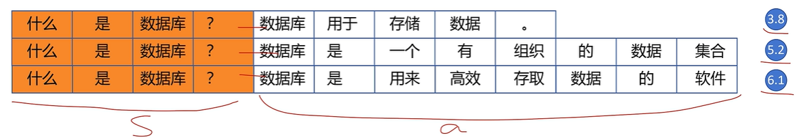
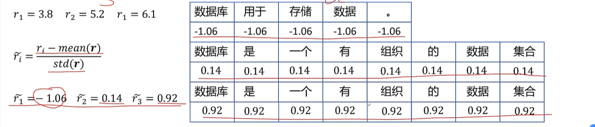

# GRPO - Group Relative Policy Optimization

PPO 在训练大模型时的局限性：

我们定义生成每个token的reward时，是根据生成当前token时基准模型和正在训练模型的KL散度来定义的。除了最后一个token用Reward模型定义了分数相对较准，**前面的token的reward都是我们没有太大依据地定义的**，这没法保证所有状态价值$V(s)$的计算是最优的

**GRPO引入：**采样部分

对于prompt+response的连接，我们先不把后面每个token的生成都作为一个动作，而是把整个回答生成作为一个Action。这样只有prompt本身作为一个State，后面生成的整个回答作为一个Action。对同一个prompt多生成几次回答，分别用Reward模型计算得分，就能计算几次“Action”的相对准确的reward

每个Action的优势函数又如何计算？

每个reward减去所有reward的平均值之后除以reward的标准差。$\tilde{r}_i = \frac{r_i - \text{mean}(r)}{\text{std}(r)}$

然后将计算结果直接赋值给每个token。

GRPO的目标函数：

$J_{GRPO} = \frac{1}{N} \sum_{n=1}^{N} \sum_{t=1}^{T_n} \min \Bigl( A_{\theta}^{\text{GRPO}}(s_n^t, a_n^t) \frac{P_{\theta}(a_n^t | s_n^t)}{P_{\theta'}(a_n^t | s_n^t)}, \text{clip}\Bigl( \frac{P_{\theta}(a_n^t | s_n^t)}{P_{\theta'}(a_n^t | s_n^t)}, 1 - \varepsilon, 1 + \varepsilon \Bigr) A_{\theta}^{\text{GRPO}}(s_n^t, a_n^t) \Bigr) - \beta \text{KL}(P_{\theta}, P_{\theta'})$

实际上**clip和KL散度只要有一个就行**，写两个重复了

与PPO唯一区别：将优势函数从$A^{GAE}_\theta$换成了$A^{GRPO}_\theta$

论文中的公式：

$J_{GRPO}(\theta) = \mathbb{E}\Bigl[ q \sim P(Q), \{o_i\}_{i=1}^{G} \sim \pi_{\theta_{\text{old}}}(O|q) \Bigr]  \frac{1}{G} \sum_{i=1}^{G} \frac{1}{|o_i|} \sum_{t=1}^{|o_i|}  \Bigl\{ \min\Bigl[ \frac{\pi_{\theta}(o_{i,t}|q, o_{i,<t})}{\pi_{\theta_{\text{old}}}(o_{i,t}|q, o_{i,<t})} A_{i,t}^{\text{GRPO}},  \text{clip}\Bigl( \frac{\pi_{\theta}(o_{i,t}|q, o_{i,<t})}{\pi_{\theta_{\text{old}}}(o_{i,t}|q, o_{i,<t})}, 1 - \varepsilon, 1 + \varepsilon \Bigr) A_{i,t}^{\text{GRPO}} \Bigr] - \beta \text{KL}[\pi_{\theta} \| \pi_{\text{ref}}] \Bigr\}$

$Q$: 查询(prompt)集合

$q$: 单个查询(prompt)

$G$: 对单个查询采样的回答数量

$O$: 对单个查询生成的若干个回答的集合

$o_i$: 对某个查询生成的第i个回答

$|o_i|$: 第i个回答的token数

$o_{i,t}$: 第i个回答的第t个token
