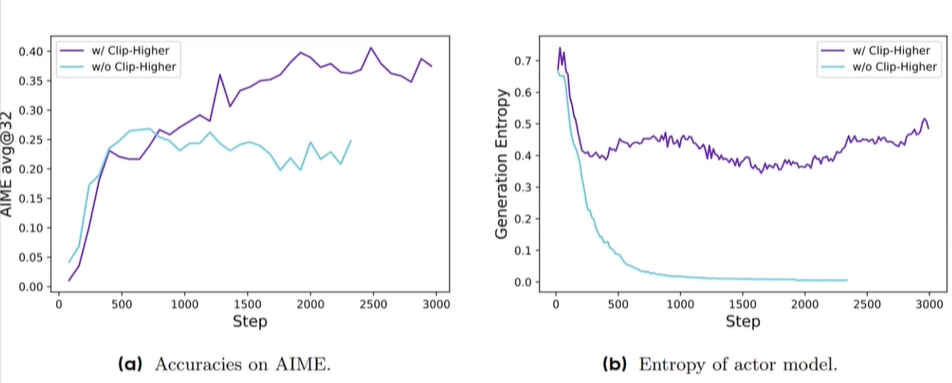
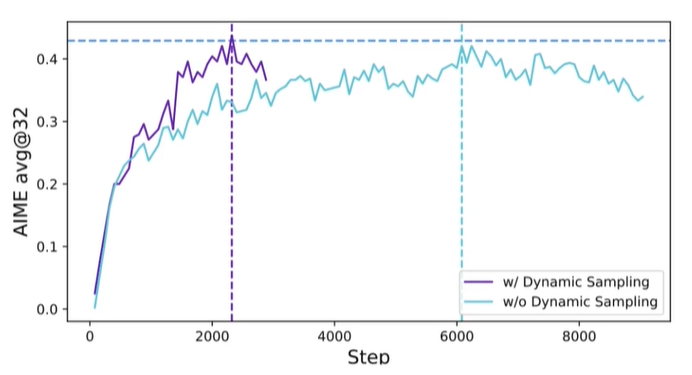
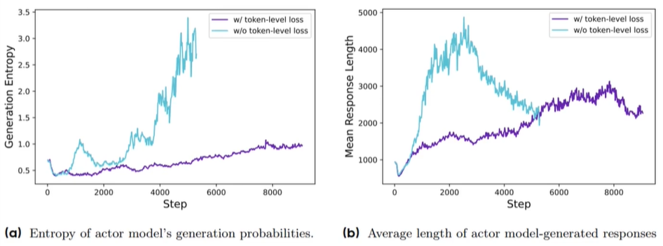
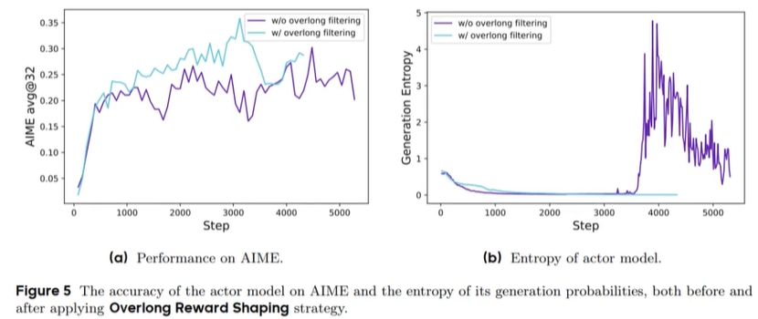
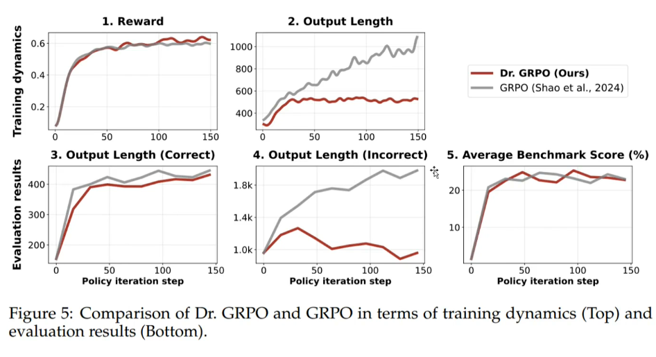

# GRPO 各种变体

## 原版 GRPO

$$ \begin{aligned} \mathcal{J}_{\text{GRPO}}(\theta) &= \mathbb{E}_{(q,a) \sim \mathcal{D}, \{o_i\}_{i=1}^G \sim \pi_{\theta_{\text{old}}}(\cdot \mid q)} \left[ \frac{1}{G} \sum_{i=1}^G \frac{1}{|o_i|} \sum_{t=1}^{|o_i|} \left( \min\left( r_{i,t}(\theta) \hat{A}_{i,t}, \text{clip}\left(r_{i,t}(\theta), 1 - \epsilon, 1 + \epsilon\right) \hat{A}_{i,t} \right) - \beta D_{\text{KL}}(\pi_\theta \| \pi_{\text{ref}}) \right) \right], \end{aligned} $$ 

where $$ r_{i,t}(\theta) = \frac{\pi_\theta(o_{i,t} \mid q, o_{i,<t})}{\pi_{\theta_{\text{old}}}(o_{i,t} \mid q, o_{i,<t})}. $$

## DAPO

https://arxiv.org/abs/2503.14476

$$ \begin{aligned} \mathcal{J}_{\text{DAPO}}(\theta) &= \mathbb{E}_{(q,a) \sim \mathcal{D}, \{o_i\}_{i=1}^G \sim \pi_{\theta_{\text{old}}}(q)} \left[ \frac{1}{\sum_{i=1}^G |o_i|} \sum_{i=1}^G \sum_{t=1}^{|o_i|} \min\left(r_{i,t}(\theta) \hat{A}_{i,t}, \text{clip}\left(r_{i,t}(\theta), 1 - \epsilon_{\text{low}}, 1 + \epsilon_{\text{high}}\right) \hat{A}_{i,t}\right) \right] \\ &\text{s.t.} \ 0 < \left| \{o_i \mid \text{is\_equivalent}(a, o_i)\} \right| < G, \end{aligned} $$ 

where $$ r_{i,t}(\theta) = \frac{\pi_\theta(o_{i,t} \mid q, o_{i,<t})}{\pi_{\theta_{\text{old}}}(o_{i,t} \mid q, o_{i,<t})}, \quad \hat{A}_{i,t} = \frac{R_i - \text{mean}(\{R_i\}_{i=1}^G)}{\text{std}(\{R_i\}_{i=1}^G)}. $$

大框架和GRPO接近。

- 去除了KL散度的回答。对于训练long-CoT的场景，生成内容可以差别很大，不需要减小差异的限制

- clip的参数解耦为low和high两个

不使用clip higher：entropy降低的很快，到一定程度后降到平台，生成的准确率到达上限，后面基本不变，略有下跌。这时模型生成对应token时的概率已经很大，不生成的token概率很小，也即“对生成的token非常自信”，失去了exploration。

（浅色的线是对照，紫色的线是新提出的）

加上clip higher之后，模型就会放宽对小概率token的概率增长上限。

例如，原本$\epsilon_{higher}=0.2$，那么对于采样模型$\pi(a,s)=0.9$的动作，clip的上限是$1.08$；而对于采样模型$\pi(a,s)=0.01$的动作，clip的上限是$0.012$，依然很小。只要把$\epsilon_{higher}$提高，大概率动作反正最大只能到1，但却能鼓励概率低的、好的动作的概率提的更高。

但$\epsilon_{lower}$不能太大。因为一旦太大，对于概率低的、坏的动作的概率下限直接变得特别小。

- Dynamic Sampling：采样的回答中，既不能没有正确答案，也不能只有正确答案（0<正确答案数<G）

对于基于规则的奖励函数，在训练中后期模型准确度提升，如果采样的所有回答都是正确的（或都是错误的），经过组间归一化后，优势函数就全是0了。这样会导致梯度为0，减慢训练速度。

使用Dynamic Sampling后训练效率变高了：

（浅色的线是对照，紫色的线是新提出的）

- Sample Level Loss→Token Level Loss：

原始GRPO是先枚举所有回答，对每个回答的每个token的优势按照$\frac{1}{句子所有token数}$求平均。这样会导致短句子的单个token传递的梯度更大，惩罚和奖励都会更大。DAPO则是直接算所有句子的token总数一共来求一个平均

长回答中不好的pattern被惩罚的力度减小了。所以会生成低质量pattern，如低质量的话或重复的词。（因为长的句子中，只要大多数token是好的，混一些不好的token惩罚也不大）

但优势值除以所有token总量，长回答的token的惩罚也不会更小了

（浅色的线是对照，紫色的线是新提出的）

- Soft Overlong Punishment：过长回答的奖励调整

强化学习中，默认会对过长回答进行裁剪，这样会导致噪音的增加，通过实验说明了这一点。

保留裁剪过的 vs filter掉裁剪的回答，只使用在允许的长度内的回答：（蓝色是filter，紫色是不filter）

这意味着，需要避免让模型生成过长的回答。使用如下策略：

$ R_{\text{length}}(y) =  \begin{cases}  0, & |y| \leq L_{\text{max}} - L_{\text{cache}} \\ \frac{(L_{\text{max}} - L_{\text{cache}}) - |y|}{L_{\text{cache}}}, & L_{\text{max}} - L_{\text{cache}} < |y| \leq L_{\text{max}} \\ -1, & L_{\text{max}} < |y| \end{cases} $

对过长回答，直接给最大惩罚（-1）；对不长的回答，不惩罚；对一定限度内的长度，给一个平滑的、-1和0之间的回答

这样也能一定程度上解决DeepSeek - R1过度思考的问题。避免生成过长的回答

- Dataset Transformation

使用LLM将原始数学数据集的问题改写，答案一定是整数，使得答案更好判定。

可能会导致一种bias，就是模型倾向输出整数

## Dr.GRPO - "GRPO Done Right" (without bias)

两个bias：

- Response-level length bias：和DAPO想解决的问题类似。GRPO中，长文本的每一个token梯度小，短文本的每一个token梯度大。因此正确的回答一般比较短，错误的回答一般比较长
- Question-level difficulty bias：因为所有的采样组都进行了先减去mean再除以标准差的归一化，会导致这些样本实际的差距被一定程度上抹除了。（比如，一个组里奖励分别是+1和-1，另一个组里奖励分别是+10和-10，但归一化后，两组中二者的差异一样了

Dr.GRPO的目标函数：

$$ \frac{1}{G} \sum_{i=1}^{G} \sum_{t=1}^{|o_i|} \left\{ \min\left[ \frac{\pi_\theta(o_{i,t} \mid \boldsymbol{q}, o_{i,<t})}{\pi_{\theta_{\text{old}}}(o_{i,t} \mid \boldsymbol{q}, o_{i,<t})} \hat{A}_{i,t}, \text{clip}\left( \frac{\pi_\theta(o_{i,t} \mid \boldsymbol{q}, o_{i,<t})}{\pi_{\theta_{\text{old}}}(o_{i,t} \mid \boldsymbol{q}, o_{i,<t})}, 1 - \epsilon, 1 + \epsilon \right) \hat{A}_{i,t} \right] \right\} $$ where  $\hat{A}_{i,t} = R(\boldsymbol{q}, o_i) - \text{mean}\left( \{ R(\boldsymbol{q}, o_1), \dots, R(\boldsymbol{q}, o_G) \} \right) $

1. 去掉了除以$|o_i|$的环节。注意DAPO中虽然对组内的每个token都统一对待了，但对于不同组问题的回答，可能有的问题就是倾向于需要更长的回答，那么组之间不同长度的回答的梯度就不一样了。
2. 去掉了除以标准差的环节。

Dr.GRPO与原版GRPO的对比：

## GSPO

https://arxiv.org/pdf/2507.18071

原版GRPO存在的问题：尝试将奖励模型给整个序列的评分作为优势值加在序列中的每个token上，这会导致token的优势预估不准。对于一个序列，噪声会逐字累积，使得整个学习过程受到扰动。

GSPO的思想：让优化的单位与奖励的单位保持一致。直接对整个序列进行优化。

既然奖励是给整篇文章的，那么我们也应该从整篇文章的层面来评估新旧策略的差异。GSPO不再问“这个词写得怎么样？”，而是问一个更宏观、更本质的问题：

> **“以我新的写作水平，写出这篇一模一样的文章的整体可能性，和过去相比，变化了多少？”**

GSPO的优势函数定义：

$ s_i(\theta) = \left( \frac{\pi_\theta(y_i \mid x)}{\pi_{\theta_{\text{old}}}(y_i \mid x)} \right)^{\frac{1}{|y_i|}} = \exp\left( \frac{1}{|y_i|} \sum_{t=1}^{|y_i|} \log \frac{\pi_\theta(y_{i,t} \mid x, y_{i,<t})}{\pi_{\theta_{\text{old}}}(y_{i,t} \mid x, y_{i,<t})} \right) $

引入$\frac{1}{|y_i|}$是为了防止长序列的概率连乘变得太小，使得不同长度序列的优势值在一个相对合理的范围内

GSPO的最终优化目标：

$ \mathcal{J}_{\text{GSPO}}(\theta) = \mathbb{E}_{x \sim \mathcal{D}, \{y_i\}_{i=1}^G \sim \pi_{\theta_{\text{old}}}(\cdot \mid x)} \left[ \frac{1}{G} \sum_{i=1}^G \min \left( s_i(\theta) \hat{A}_i, \text{clip} \left( s_i(\theta), 1 - \varepsilon, 1 + \varepsilon \right) \hat{A}_i \right) \right] $