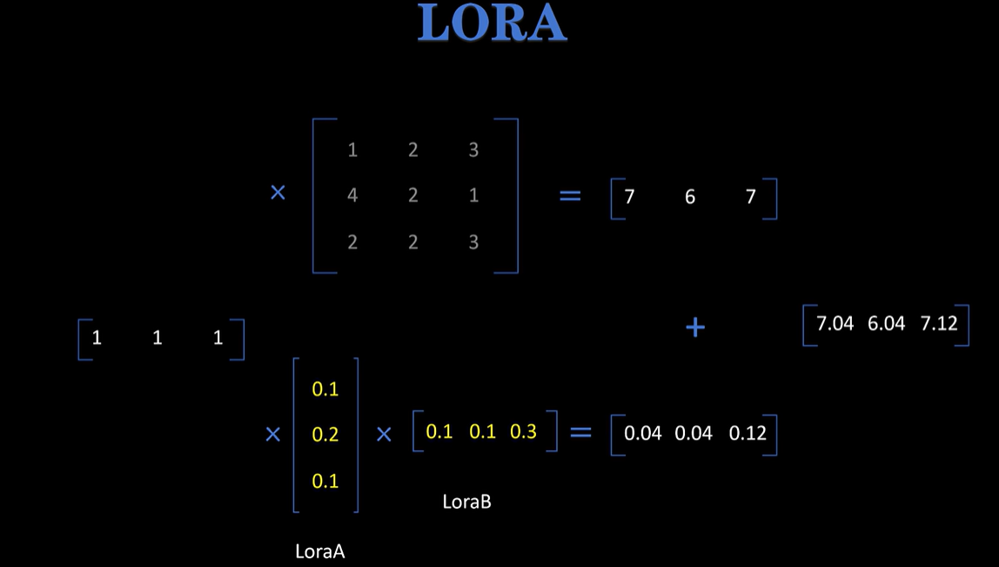

# LoRA

对原始权重矩阵，使用两个维度小的矩阵相乘来补充，原始权重的参数被冻结，只有LoRA矩阵被更新。

LoRA训练结束后，只需要将LoraA·LoraB的值加到原始权重矩阵上，就能实现原始参数的更新

$\boldsymbol{\text{LoraA}} \quad  \begin{bmatrix} 0.1 \\ 0.2 \\ 0.1 \end{bmatrix} \boldsymbol{\times} \quad \begin{bmatrix} 0.1 & 0.1 & 0.3 \end{bmatrix} \quad \boldsymbol{\text{LoraB}} = \begin{bmatrix} 0.01 & 0.01 & 0.03 \\ 0.02 & 0.02 & 0.06 \\ 0.01 & 0.01 & 0.03 \end{bmatrix}$

$ \begin{bmatrix} 1 & 2 & 3 \\ 4 & 2 & 1 \\ 2 & 2 & 3 \end{bmatrix} + \begin{bmatrix} 0.01 & 0.01 & 0.03 \\ 0.02 & 0.02 & 0.06 \\ 0.01 & 0.01 & 0.03 \end{bmatrix} =\begin{bmatrix} 1.01 & 2.01 & 3.03 \\ 4.02 & 2.02 & 1.06 \\ 2.01 & 2.01 & 3.03 \end{bmatrix}$

假设原始权重矩阵维度为4096*4096，使用维度为4的LoRA矩阵来拆分，

$4096 * 4096 = 16,777,216$

$4096 * 4 + 4 * 4096 = 32768$

参数量缩小 512 倍，同时保证微调效果基本不变 

## LoRA的两个重要参数r和alpha：

1. r：

- 原始权重矩阵 Weight：M*N
- Lora 权重矩阵
  - LoraA：M*r
  - LoraB：r*N
- r 就是连接 LoraA 和 LoraB 矩阵的维度，远远小于 M 和 N。

2. alpha

- input 和原始权重输出为 X
- input 和 lora 权重输出为 $\Delta X$
- 前向传播：$X = X + \frac{alpha}{r} \Delta X$
- 权重合并：$weight = weight + \frac{alpha}{r} lora\_weight$

一般设置alpha为r的2~8倍

## 反向传播推导

原本公式：$$h = W_0 x + \Delta W x = W_0 x + BAx$$

本层输出对矩阵B的梯度：$$\frac{\partial \mathcal{L}}{\partial B} = \frac{\partial \mathcal{L}}{\partial h} \cdot \frac{\partial h}{\partial B} = \nabla_h (Ax)^T$$

本层输出对矩阵A的梯度：$$\frac{\partial \mathcal{L}}{\partial A} = B^T \cdot \frac{\partial \mathcal{L}}{\partial h} \cdot x^T = B^T \nabla_h x^T$$

## 初始化顺序

对$h = W_0x + BAx$：

B全0初始化，A随机初始化。

若都全0：根据上面的梯度计算，梯度全为0；

若都全随机：引入大量噪声，可能一开始直接崩了

一般希望后算的模块为全0，这样无论Ax是啥，都能被0兜住

## LoRA的优点

1. 大大节省微调大模型的参数量
2. 效果和全量微调差不多
3. 微调完的Lora模型，权重可以Merge回原来的权重，不会改变模型结构，推理时不增加额外计算量
4. 你可以通过改变r参数，最高情况等同于全量微调

