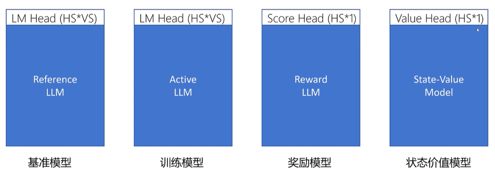
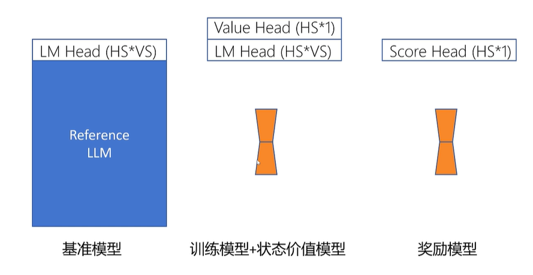
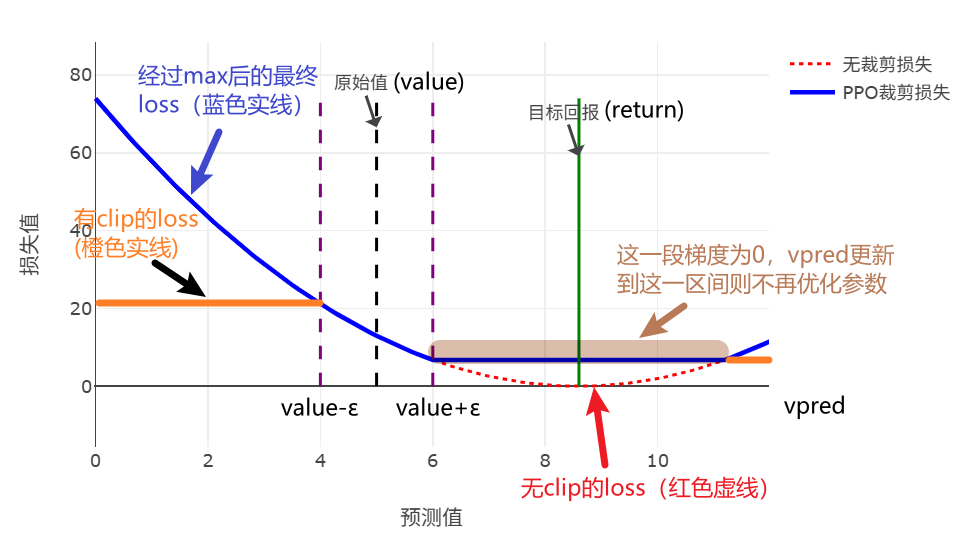
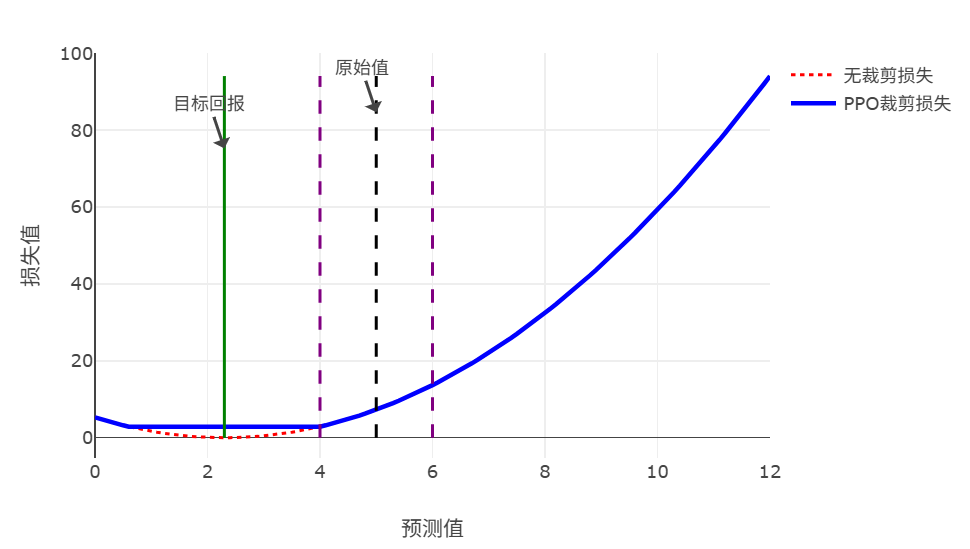
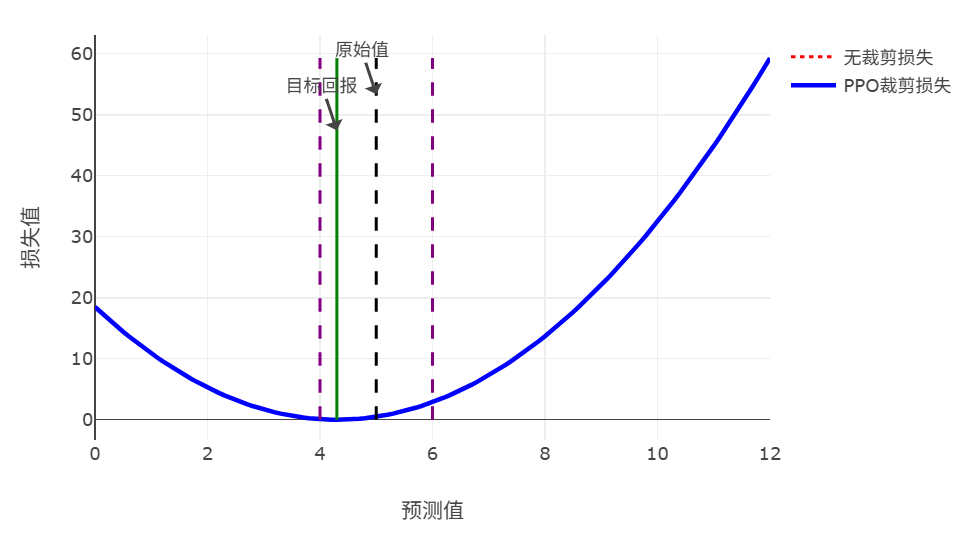

# 用PPO训练LLM

Pretrain -> SFT -> Reward -> PPO


## 如何训练Reward Model？

微调第一步：训练一个Reward Model，为模型输出打分，提供奖励信号

- 用户偏好数据

例如：

question: 什么是数据库？

chosen: 数据库是一个有组织的数据集合，允许高效的数据存储、检索和管理

rejected: 数据库用于存储数据


- Reward Model

接受问答对序列，输出得分值，可以用Bert/大模型

能力不能比当前模型弱很多，一般采用和当前模型差不多或能力更高的模型

为什么差不多能力的大模型可以提供改进的监督信号？评价回答的好坏比生成一个好的回答容易很多；输出能力提升->回答能力也会提升

大模型能力极限由预训练决定，强化学习只是尽可能达到极限


如何用LLM做Reward Model？最后输出层的权重本来是$num\_hidden*num\_vocabulary$（这里称LM Head，用来预测next token的），现在给换成$num\_hidden*1$（这里称Score Head），输出单一的值。且只对最后一个输入token的输出做这个score head，因为只有最后一个token可以看到整个序列


训练Reward Model的Loss是什么？

$Loss = -log\ sigmoid(score_{chosen}-score_{rejected})=-\log(\frac{1}{1+e^{-x}}),x=score_{chosen}-score_{rejected}$


## 如何训练PPO模型？

- 准备query数据

各种问题，如“量子计算是什么”...

- 准备四个模型

基准模型（SFT后的模型）-> LM Head，输出是字典维度

训练模型，结构与基准模型一致，训练过程中训练模型的输出与基准模型不能相差太大

奖励模型，输出对回答序列的评分 -> Score Head

状态价值模型，对每个状态（即，历史token——包括prompt和已生成的token——的序列）进行打分



四个大模型参数太大？**Lora**：（其中在训练的模型和状态价值模型公用一个基座，采用不同的输出头）




- 如何定义每个action（即生成单个token）的reward？

这里使用直接的reward（奖励模型输出的值，只有最后一个有）和基准/训练模型在输出每个token时概率分布的KL散度来计算。$reward = KL*(-0.2)+score$。0.2是设置的权重超参数


### 状态价值网络的优化

- 状态价值的Label是什么？

蒙特卡洛法：$V_{label}(s_t)=r_t+\gamma r_{t+1}+\gamma^2 r_{t+2}+\dots+\gamma^{T-t}r^T$，方差大，偏差小

时序差分法：$V_{label}(s_t)=r_t+\gamma V(s_{t+1})$，偏差大，方差小

广义优势法：$V_{label}(s_t)=A_t^{GAE}+V(s_t)$，平衡方差和偏差

这个label后续会被用于训练优化critic模型，即**状态价值模型**

（注意，这里式子后面的$V(s_t)$等是状态价值模型给出的，再用其计算为$V_{label}$用来更新状态价值模型）


- 怎么计算$A_t^{GAE}$ ？

先看之前的公式：

$ \delta_t^V = r_t + \gamma \cdot V_\theta(s_{t+1}) - V_\theta(s_t) $

$ A_\theta^{GAE}(s_t, a) = \sum_{b=0}^{\infty} (\gamma \lambda)^b \delta_{t+b}^V $

$ A_\theta^{GAE}(s_t, a) = \delta_t^V + \gamma \lambda A_\theta^{GAE}(s_{t+1}, a) $

在这里使用第三个式子来从后向前递推，计算采样的每个状态的优势值，只需要O(n)就可以计算长度为n的状态-动作序列的所有$A^{GAE}$


- 反向传播更新状态价值函数的具体代码逻辑：

```python
returns = advantages + values # returns: 状态价值函数的目标值; values: 状态价值函数最初的输出; advantages: 上述计算的A^{GAE}

# ...

vpredclipped = clip_by_value( # vpredclipped: 训练过程中状态价值函数的输出
    vpreds,
    values - self.config.cliprange_value,
    values + self.config.cliprange_value,
) # 训练过程中的输出不能超出最初的输出(values)上下一定的范围(+-cliprange_value)

vf_losses1 = (vpreds - returns) ** 2 # 不加clip的mse loss
vf_losses2 = (vpredclipped - returns) ** 2 # 加clip的mse loss
vf_loss = 0.5 * masked_mean(torch.max(vf_losses1, vf_losses2), mask)
```

clip+max的效果：当return和原始value差距比较大的时候，最终更新到**vpredclipped不会和原始value差距过大，但仍然缩小了和return的差距**（即减小了loss）

原理：

①当$return > value + \epsilon$，在$value+\epsilon$右侧会产生一小段梯度为0的区域（$(vpredclipped-returns)^2>(vpreds-returns)^2$），难以精准梯度下降到$vpreds逼近return$的值



②当$return<value-\epsilon$，基本同理



③当$value-\epsilon<return<value+\epsilon$，在整个定义域上都是$(vpreds-returns)^2$最大，可以优化到最优值附近



### 策略模型的优化

PPO的Loss：

$Loss_{ppo} = -\frac{1}{N} \sum_{n=1}^{N} \sum_{t=1}^{T_n} A_{\theta'}^{GAE}(s_n^t, a_n^t) \frac{P_{\theta}(a_n^t | s_n^t)}{P_{\theta'}(a_n^t | s_n^t)} + \beta KL(P_{\theta}, P_{\theta'})$

实际上，

1. 进行重要性采样的模型可以与参考模型不一样
2. KL散度已经在Reward中体现，已经通过Reward进入了Loss函数

实际训练使用的公式：$Loss_{\text{ppo}} = -\frac{1}{N} \sum_{n=1}^{N} \sum_{t=1}^{T} A_{\theta''}^{\text{GAE}}(s_n^t, a_n^t) \frac{P_{\theta}(a_n^t | s_n^t)}{P_{\theta''}(a_n^t | s_n^t)}$

$\theta$：训练模型

$\theta'$：基准模型

$\theta''$：重要性采样模型，训练过程中逐步更新，始终保持和训练模型相差不大（每个batch开始时将训练模型的参数同步到该模型上）

代码：

```python
ratio = torch.exp(logprobs - old_logprobs)

pg_losses = -advantages * ratio
pg_losses2 = -advantages * torch.clamp(ratio, 1.0 - self.config.cliprange, 1.0 + self.config.cliprange)

pg_loss = masked_mean(torch.max(pg_losses, pg_losses2), mask)

loss = pg_loss + self.config.vf_coef * vf_loss  #总的loss包含PPO loss 和 State Value的Loss
```

PPO loss和State Value的loss一起做反向传播


## PPO训练循环

（这里伪代码省却了最终计算ppo的loss时clip的部分，因为过于麻烦。实际应该加上）

```python
for batch_prompt in prompt_dataset:
    batch_response = active_model.generate(batch_prompt) # prompt数据集中抽一个batch的prompt，使用重要性采样网络即现在正在训练的模型进行回答生成
    batch_data = concat(batch_prompt, batch_response) # 问题和回答合并，生成训练文本
    batch_scores = reward_model(batch_data) # 用reward model对回答进行打分

    batch_all_probs, batch_probs, batch_all_values = active_model.forward_pass(batch_data) # 使用重要性采样模型计算: batch_all_probs(输出每个token时, 整个词表上的的状态分布), batch_probs(每个输出token的概率), batch_all_values(每个输出token的状态价值)
    ref_all_probs, ref_probs, ref_all_values = ref_model.forward_pass(batch_data) # 基准模型也计算上述的三个值
    kls = compute_KL(batch_all_probs, ref_all_probs) # 基准模型和当前正在训练模型(在输出每个token时概率分布)的KL散度
    rewards = compute_rewards(batch_scores, kls) # 计算每个输出token的reward
    advantages = compute_advantages(batch_all_values, rewards) # 计算A^{GAE}优势值
    returns = advantages + batch_all_values # 状态价值函数的目标值

    for i in range(epoch):
        active_all_probs, active_probs, active_all_values = active_model.forward_pass(batch_data) # 每epoch训练，都用训练网络生成all_probs, probs, all_values

        loss_state_value = torch.mean((returns - active_all_values) ** 2) # 状态价值函数的loss
        ratio = active_probs / batch_probs
        loss_ppo = torch.mean(-advantages * ratio) # 被训练大模型的loss
        loss = loss_ppo + value_loss_rate * loss_state_value #两个loss加权平均，一起反向传播和优化参数
        loss.backward()
        optimizer.step()
        optimizer.zero_grad()
```

额外补充：

- 外循环是每batch prompt，都用active_model（正在训练的模型）进行采样，并生成advantages和returns，用于每个epoch内的训练
- 内循环才是多次epoch的循环，每epoch中active_model和state_value_model（这里内置成active_model的一部分了）的参数都会被更新

采样的模型和正在训练的模型是又不完全是一个模型（训练过程中用的是历史采样的数据）
