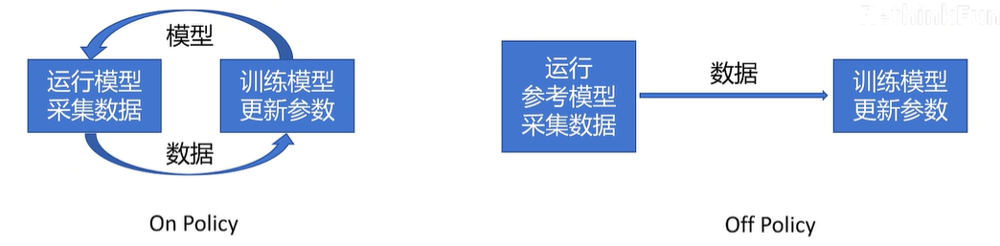

# 基于策略的RL-Policy Gradient到PPO

## RL基础

马尔可夫过程：$M = (S, A, P, R, \gamma)$。状态、动作、策略（概率）、奖励、折扣因子

**Action Space:** 可选择的动作，比如 {left, up, right}

**Policy:** 策略函数，输入 State，输出 Action 的概率分布。一般用 π 表示。

π(left|sₜ) = 0.1
π(up|sₜ) = 0.2
π(right|sₜ) = 0.7

**Trajectory:** 轨迹，用 τ 表示，一连串状态和动作的序列。Episode,Rollout。 {s₀, a₀, s₁, a₁, …}

sₜ₊₁ = f (sₜ, aₜ) 确定
sₜ₊₁ = P (・|sₜ, aₜ) 随机（比如游戏里开宝箱，给定“开宝箱”动作，由于宝箱内物品随机，下一个状态也是随机的）

**Return:** 回报，从当前时间点到游戏结束的 Reward 的累积和。

强化学习的目标：训练一个Policy神经网络$\pi$，在所有状态S下，给出相应的Action，得到Return的期望最大

强化学习的目标：训练一个Policy神经网络$\pi$，在所有的Trajectory中，得到Return的期望最大

## Policy Gradient

### b站@RethinkFun的推导

**前置知识：$\nabla f(x)=f(x)\nabla logf(x)$**

要优化的式子：$E_{τ∼P_θ(τ)}[R(τ)]=∑_τR(τ)P_θ(τ)$，其中$τ$是某条轨迹，这个式子表示策略下所有被采样轨迹的期望return

使用梯度上升法，两边同时取梯度得：（要优化的参数是$\theta$）

$\nabla E_{τ∼P_θ(τ)}[R(τ)]=\nabla \sum_τR(τ)P_θ(τ)=\nabla\sum_\tau R(\tau)\nabla P_\theta(\tau)=\sum_\tau R(\tau)\nabla P_\theta(\tau)\frac{P(\tau)}{P(\tau)}=\sum_\tau R(\tau) P_\theta(\tau)\frac{\nabla P(\tau)}{P(\tau)}$

这里$\sum_\tau R(\tau) P_\theta(\tau)$可以通过采样n份求平均来近似预估，因此：

$原式\approx \frac{1}{N}\sum_{i=1}^N R_\theta(\tau_i)·\frac{\nabla P_\theta(\tau_i)}{P_\theta(\tau_i)}=\frac{1}{N}\sum_{i=1}^N R(\tau_i)·\nabla log(P_\theta(\tau_i))$

现在考虑怎么表示$P_\theta(\tau_i)$。我们知道一条Trajectory是由初始状态与一系列action导致的状态转移导致的，因此只需要对各个状态取走这条路径的action概率连乘即可：

$P_\theta(\tau_i)=\Pi_{t=1}^{T_i}P_\theta(a_i^t|s_i^t)$，其中$T_i$表示第i条路径的长度，$P_\theta(a_i^t|s_i^t)$表示第i条路径上，第t个状态取转化到第(t+1)个状态的动作的概率。

因此：

$上式=\frac{1}{N}\sum_{i=1}^N R(\tau_i)·\nabla log(\Pi_{t=1}^{T_i}P_\theta(a_i^t|s_i^t))=\frac{1}{N}\sum_{i=1}^N R(\tau_i)· \sum_{t=1}^{T_i}\nabla log(P_\theta(a_i^t|s_i^t))=\frac{1}{N}\sum_{i=1}^{N}\sum_{t=1}^{T_i}R(\tau_i)·\nabla log(P_\theta(a_i^t|s_i^t))$

用这个梯度来做梯度上升，乘以学习率更新神经网络中的参数：Policy Gradient

因此我们（在当前epoch中）要优化的式子可以写作

第一部分：Trajectory得到的return，第二部分：某一步骤的概率的连加。这个式子表示：当$R(\tau_i)>0$，倾向于使$\theta$向路径上的所有动作选择概率增大的方向优化，反之则向路径上所有动作选择概率变小的方向优化

等价于定义$Loss=-\frac{1}{N}\sum_{i=1}^{N}\sum_{t=1}^{T_i}R(\tau_i)·log(P_\theta(a_i^t|s_i^t))$，然后梯度下降更新网络参数

需要运行模型采集数据，根据采集到的数据训练模型，再重复采集数据，以此循环。是**On-Policy**算法，训练慢

### Policy Gradient改进——衰减因子、从当前步开始计算

上面的式子有两个问题：

1. Return > 0，trajectory中所有Action的概率全增大，反之全减小，这个需要优化。每个Action应该只看它之后的Return，因为这个Action没法改变之前已经发生的Return变化，只能影响后面的Reward
2. 一个Action可能只影响接下来的几步，影响逐步衰减，特别后面的Reward主要还是由后面的Action影响

改进：

$R(\tau_i)→\sum_{t'=t}^{T_i}\gamma^{t'-t}r_{i}^{t'}=R_i^t$（①对当前步到Trajectory结束进行reward求和，②引入衰减因子$\gamma$）

原式可优化为$\frac{1}{N}\sum_{i=1}^{N}\sum_{t=1}^{T_i}R_i^t\nabla logP_\theta(a_i^t|s_i^t)$

## 继续改进 —— 定义优势函数

上面的改进后，还是有问题：

当一条路径整体处于“好的局势”（return为正）时，所有动作的概率提升；整体处于“坏的局势”（return为负）时，所有动作的概率下降。会使得收敛速度变慢，因为有些差的动作反而概率变大了，有些好的动作反而概率变小了。方差很大，训练不稳定

改进：增加一个baseline，对所有reward都减去baseline，就能看出来哪个动作相对更好，哪个动作相对更差

$原式=\frac{1}{N}\sum_{i=1}^N\sum_{t=1}^{T_i}(R_i^t-B(s_i^t))\nabla logP_\theta(a_i^t|s_i^t)$

- 先交代几个概念：

**Action-Value Function**

$Q_\theta(s,a)$: 在state s下，做出Action a，期望的回报。动作价值函数

**State-Value Function**

$V_\theta(s)$: 在state s下，期望的回报。状态价值函数

**Advantage Function**

$A_\theta(s,a)=Q(s,a)-V_\theta(s)$: 在state s下，做出Action a，比其他动作能带来多少优势

$\frac{1}{N}\sum_{i=1}^N\sum_{t=1}^{T_n}A_\theta(s_i^t,a_i^t)\nabla log P_\theta(a_i^t|s_i^t)$

- 如何计算优势函数？

$Q(s_t,a)=r_t+\gamma*V_\theta(s_{t+1})$

优势函数$A_\theta(s_t,a)=r_t+\gamma*V_\theta(s_{t+1})-V_\theta(s_t)$

-> 只需要训练一个代表状态价值的函数

$V_\theta(s_{t+1})\approx r_{t+1}+\gamma*V_\theta(s_{t+2})$

向未来看不同采样步骤数的优势函数：

$A_θ^1(s_t,a_t)=r_t+γV_θ(s_{t+1})−V_θ(s_t)$

$A_θ^2(s_t,a_t)=r_t+γr_{t+1}+γ^2V_θ(s_{t+2})−V_θ(s_t)$

$A_θ^T(s_t,a_t)=(r_t+γr_{t+1}+…)−V_θ(s_t)$

从上到下：偏差减少，方差增大。（看的越远，受到未来事件的随机性影响越大，$A_\theta$方差越大）

定义$\delta$，表示在某一步执行特定动作带来的优势

$\delta_t^V=r_t+\gamma*V_\theta(s_{t+1})-V_\theta(s_t)$

$\delta_{t+1}^V=r_{t+1}+\gamma*V_\theta(s_{t+2})-V_\theta(s_{t+1})$

这样就可以简洁地表示优势函数：

$A_\theta^1(s_t,a)=\delta^V_t$

$A_\theta^2(s_t,a)=\delta^V_t+\gamma\delta_{t+1}^V$

$A_\theta^3(s_t,a)=\delta^V_t+\gamma\delta_{t+1}^V+\gamma^2\delta^V_{t+2}$

在进行优势函数计算时，应该采样几步呢？——“我全都要”

**Generalized Advantage Estimation (GAE)** - 后面所有采样步骤的优势函数都考虑了，但越靠后的权重越低

$A_\theta^{GAE}(s_t,a)=(1-\lambda)(A_\theta^1+\lambda A_\theta^2+\lambda^2A_\theta^3+\dots)=(1-\lambda)(\delta_t^V+\lambda(\delta_t^V+\gamma\delta_{t+1}^V)+\lambda^2(\delta_t^V+\gamma\delta_{t+1}^V+\gamma^2\delta_{t+2}^V)+\lambda^3(\delta_t^V+\gamma\delta_{t+1}^V+\gamma^2\delta_{t+2}^V+\gamma^2\delta_{t+3})+...)$

根据等比数列可推知，

$上式=(1-\lambda)(\delta_t^V\frac{1}{1-\lambda}+\gamma\delta_{t+1}^V\frac{\lambda}{1-\lambda}+\dots)=\sum_{b=0}^∞(\gamma\lambda)^b\delta_{t+b}^V$

- 最终，我们得到了三个最关键的式子：

$\delta_t^V=r_t+\gamma*V_\theta(s_{t+1})-V_\theta(s_t)$**（某一状态下，某一步执行特定动作带来的优势）**

$A_\theta^{GAE}(s_t,a)=\sum_{b=0}^∞(\gamma\lambda)^b\delta_{t+b}^V$**（某一状态采取某步骤的总体优势函数）**

$\frac{1}{N}\sum_{i=1}^N\sum_{t=1}^{T_n}A_\theta(s_i^t,a_i^t)\nabla log P_\theta(a_i^t|s_i^t)$**（策略网络参数的梯度）**

为了最终结果的优化，首先要训练状态价值函数$V_\theta(s_t)$，用一个神经网络拟合，一般可以**和策略函数的网络共享参数**，只是最后一层不同，输出层为单一的值

如何训练价值函数的网络？使用带衰减的reward和作为$V_\theta(s_t)$的label

## 步入PPO

### 重要性采样——使用旧策略采集的数据，变成Off Policy

On Policy v.s. Off Policy

例子：小明找老师评价，老师批评小明上课玩手机，小明根据批评调整自己的策略（降低上课玩手机的概率），属于On Policy

其他同学根据老师对小明的批评，调整自己的策略，属于Off Policy。如果上课玩手机比小明多，降低的概率更多；反之降低的概率更小。

- 重要性采样

$E(f(x))_{x\sim p(x)}=\sum_xf(x)*p(x)=\sum_xf(x)*p(x)\frac{q(x)}{p(x)}=\sum_xf(x)\frac{p(x)}{q(x)}*q(x)=E(f(x)\frac{p(x)}{q(x)})_{x\sim q(x)}\approx \frac{1}{N}\sum_{n=1}^Nf(x)\frac{p(x)}{q(x)}_{x\sim q(x)}$

即：把x换到另一个概率分布里，再乘以原始概率与新分布中的概率的比值，就能达到在对应值“伸缩”的结果

（Gemini的推导：）

原始的目标函数是$J(θ)=E_{s,a∼π_θ}[A_θ(s,a)]=\sum_{s,a} A_\theta(s,a)·\pi_\theta(s|a)$，故$\nabla J(\theta)=\sum_{s,a}A_\theta(s,a)\pi_\theta(s|a)\nabla\log\pi_\theta(s|a)$

利用重要性原理采样可以转化为$J(θ)=E_{s,a∼π_{θ′}}[\frac{π_θ(a∣s)}{π_{θ′}(a∣s)}A_{θ′}(s,a)]$，故$\nabla J(\theta)=E_{s,a\sim\pi_{\theta'}}[\frac{\nabla\pi_\theta(a|s)}{\pi_{\theta'}(a|s)}A_{\theta'}(s,a)]=E_{s,a\sim\pi_{\theta'}}[\frac{π_θ(a∣s)}{π_{θ′}(a∣s)}A_{θ′}(s,a)\nabla log\pi_{\theta}(a|s)]$

可以采样N份来近似目标函数的梯度：$\frac{1}{N}\sum_{n=1}^N\sum_{t=1}^{T_n}A_{\theta'}^{GAE}(s_n^t,a_n^t)\frac{\nabla P_\theta(a_n^t|s_n^t)}{P_{\theta'}(a_n^t|s_n^t)}$

因此我们可以用$Loss = -\frac{1}{N}\sum_{n=1}^N\sum_{t=1}^{T_n}A_{\theta'}^{GAE}(s_n^t,a_n^t)\frac{P_\theta(a_n^t|s_n^t)}{P_{\theta'}(a_n^t|s_n^t)}$

但注意原始的目标函数和经过重要性原理采样转化后的**目标函数不是完全等价的**。

（Gemini回答：）**我们用来进行Off-Policy更新的目标函数（你推导出的左边），并不是我们真正想要优化的那个On-Policy目标函数（右边），而只是它的一个“代理”或“近似” (Surrogate Objective)。**我们之所以要优化这个“代理目标函数”，是因为：

- **它可以用旧数据计算**，从而提升了样本效率。
- 在 θ 和 θ′ **非常接近**的时候，这个代理目标和真实目标也**非常接近**，优化它就约等于在优化真实目标。

- 为什么重要性采样的公式是完全相等的，而到了PPO这一应用上就只是一个近似？

>你说得完全没错，**重要性采样的数学公式本身是严格相等的**，但**它在PPO中的应用却是一个近似**。
>
>这个问题的根源在于，PPO的优化问题**不满足**应用严格相等的重要性采样公式的前提条件。
>
>我们来把这个过程彻底拆解开。
>
>------
>
>
>
>### 1. 严格相等的重要性采样（理论世界）
>
>我们再看一下纯粹的数学公式：
>
>$E_{x∼p(x)}[f(x)]=E_{x∼q(x)}[\frac{p(x)}{q(x)}f(x)]$
>
>这个等式能够**严格成立**，有一个被我们忽略的、至关重要的前提：
>
>> **函数 `f(x)` 必须是固定的，它不能随着你选择的分布 `p(x)` 或 `q(x)` 而改变。**
>
>`f(x)` 就像一个中立的、客观的测量工具。无论你是从A班抽人还是从B班抽人，你用的那把测量身高的尺子 `f(x)` 是不会变的。
>
>------
>
>
>
>### 2. PPO的优化问题（现实世界）
>
>现在我们来看PPO要解决的问题。我们的目标是优化新策略 πθ 的期望回报，这个回报是用优势函数来衡量的：
>
>J(θ)=Es,a∼πθ[Aθ(s,a)]
>
>我们来对应一下各个部分：
>
>- 分布 `p(x)` 对应于新策略的分布 πθ。
>- 函数 `f(x)` 对应于新策略下的优势函数 Aθ(s,a)。
>
>**这里就是问题的关键！**
>
>我们的“测量工具”——优势函数 Aθ(s,a) ——**它本身是依赖于策略 πθ 的！**（因为 Aθ(s,a)=Qθ(s,a)−Vθ(s)，而价值函数 Vθ 是由策略 πθ 决定的）。
>
>所以，当我们试图应用重要性采样时，就出问题了：
>
>- **我们想求的**：Es,a∼πθ[Aθ(s,a)]
>- **我们手上的数据来自**：旧策略 πθ′
>- **我们天真地直接套用公式**： Es,a∼πθ[Aθ(s,a)]=?Es,a∼πθ′[πθ′(a∣s)πθ(a∣s)Aθ(s,a)]
>
>这个等式是“**无法计算**”的！因为等式右边的 Aθ(s,a) 是新策略下的优势，我们根本没法用旧数据算出来。
>
>
>
>### 3. PPO做出的近似（妥协方案）
>
>既然没法计算，PPO就做了一个非常关键的**近似**：
>
>> **“我假装新策略下的优势 $A_θ(s,a)$ 和旧策略下的优势 $A_{θ′}(s,a)$ 差不多，我就用旧的 $A_{θ′}$ 来代替新的 $A_θ$ 吧！”**
>
>所以，PPO实际优化的目标变成了：
>
>$J(θ)≈E_{s,a∼π_{θ′}}[π_{θ′}(a∣s)π_θ(a∣s)A_{θ′}(s,a)]$
>
>现在你再看，我们用来建立等式的两个函数已经不一样了：
>
>- 左边是：$A_θ(s,a)$
>- 右边是：$A_{θ′}(s,a)$
>
>因为 $A_θ=A_{θ′}$，所以那个严格的等号 `=` 就只能变成一个约等号 `≈` 了。
>
>
>
>### 总结
>
>这个不等，源于两个层面的近似：
>
>1. **优势函数的近似**：我们用旧的优势 Aθ′ 代替了我们真正想求的、但无法计算的新的优势 Aθ。
>2. **状态分布的近似**：更深一层，重要性采样只修正了动作选择概率 π(a∣s) 的差异，但它忽略了新旧策略导致的状态分布 d(s) 本身也是不同的。我们实际上是从旧的状态分布 dθ′ 中采样，而不是从新的 dθ 中采样。
>
>PPO算法的设计哲学就是：承认我们必须做这些近似，然后通过**Clip机制**来强制让新旧策略 $π_θ$ 和 $π_{θ′}$ 不要离得太远。只要它们足够接近，那么 $A_θ≈A_{θ′}$ 和 $d_θ≈d_{θ′}$ 这两个近似就足够准确，从而保证了整个学习过程的稳定。

- 为什么需要添加这一比例转换？直接用旧策略采样的数据+新策略的概率计算目标值不行吗？（Gemini回答）

>### 陷入局部最优，无法发现新大陆
>
>这个是最常见也最致命的问题。你的策略更新会被旧策略的“偏见”所束缚。
>
>**举个例子：一个投资机器人**
>
>- **旧策略 (πold)**：是一个非常保守的机器人。它的经验是，95%的时间都应该购买A类“稳健型”股票，这能带来稳定但微小的正回报（优势值 A=+1）。另外5%的时间它会随机探索，购买了B类“风险型”股票，结果发现回报极高（优势值 A=+10）。
>- **你拿到的数据**：所以，你的数据集中，95%都是关于购买A类股票的“好评”记录，只有5%是关于B类股票的“超级好评”记录。
>- **你的错误优化过程（不使用比例校正）**：
>  - 你的新模型开始训练。它看到了海量的A类股票数据，每次都告诉它“这是个不错的选择，概率应该提升”。
>  - 它偶尔看到一次B类股票的数据，告诉它“这是个绝佳的选择，概率应该大大提升”。
>  - 但是，因为A类数据的数量是B类的19倍，所以**总的梯度更新方向，绝大部分都被“提升A类股票概率”这个任务给占据了**。来自B类股票的信号虽然强烈，但太稀疏了，无法在总的更新中占据主导地位。
>- **最终结果**：你的新策略，经过长时间“优化”，成了一个**更牛的保守型机器人**。它在购买A类股票这个任务上做到了极致，但它**永远也学不会**那个能带来10倍回报的、去购买B类股票的更优策略。
>
>**它被旧策略的“行为配比”困在了局部最优的陷阱里。**
>
>**如何修正？** 重要性采样比例 $\frac{π_{new}(B∣s)}{π_{old}(B∣s)}$ 在这里会起作用。因为B类股票回报高，新策略会倾向于提升它的概率，而旧策略概率很低，所以这个比例会变得很大，**极大地放大了B类股票数据在更新中的话语权**，告诉模型：“快看这里！虽然这个样本少，但它极其重要！”

### 添加约束

用来采样的策略$\pi_{\theta'}$和目标策略$\pi_\theta$不能差的太多

举例：老师批评小明，其他同学学习这一批评的前提是小明和自己的差距不能太大，不然很难学到有用的经验和教训。

比如：小明经常交白卷，老师表扬小明这次没有交白卷，但你从未交过白卷，这一表扬对你更新策略就没用了

- 方法一：添加KL散度

> #### KL散度：用来描述一个概率分布和另一个的不相似程度
>
> 对于P、Q两个离散分布：$D_{KL}(P||Q)=\sum_xP(x)\log\frac{P(x)}{Q(x)}$
>
> 对于P、Q两个连续分布：$D_{KL}(P||Q)=\int P(x)\log\frac{P(x)}{Q(x)}dx$
>
> $D_{KL}(P||Q)$: 这个式子描述了使用预估分布Q来观察实际分布P时，看到差别的“惊讶情况”。也就是当我们用一个不完美的分布Q来代替真实的分布P时，平均会损失多少信息。
>
> 我们来拆解这个公式：
>
> - P(x): 真实分布的概率（比如，真实情况是70%的车直行）。
> - Q(x): 模型分布的概率（比如，你的模型预测60%的车直行）。
> - Q(x)P(x): 两个概率的比值。这个比值反映了在事件`x`上，两个分布的差异有多大。
>   - 如果 P(x)≈Q(x)，比值接近1。
>   - 如果 P(x) 很大但 Q(x) 很小，比值就很大，说明模型严重低估了这件事发生的可能性。
> - log(⋅): 取对数。这会放大差异。比值为1时，log(1)=0，表示没有差异；比值越大，log值也越大。
> - P(x)log(⋅): **加权平均**。这是最关键的一步！我们用**真实概率** P(x) 来加权这个差异。这意味着，我们更关心那些**经常发生的事件**上的差异。如果P和Q在一个几乎不可能发生的事件上有很大分歧，我们其实不太在乎；但如果它们在一个高频事件上有分歧，那问题就严重了。
>
> #### 两个至关重要的特性
>
> 1. **非负性 (Non-negativity)**: $D_{KL}(P∣∣Q)≥0$。 KL散度永远不会是负数。只有当两个分布完全相同时，$D_{KL}(P∣∣Q)=0$。
> 2. **不对称性 (Asymmetry)**: $D_{KL}(P∣∣Q)=D_{KL}(Q∣∣P)$。 这是KL散度最特别、也最反直觉的特性。它不是一把对称的“尺子”。从P到Q的“距离”和从Q到P的“距离”是不一样的。
>    - $D_{KL}(P∣∣Q)$：衡量用Q来近似P时的信息损失。如果有一件事在真实情况P中会发生（P(x)>0），但你的模型Q认为它绝对不会发生（$Q(x)→0$），那么$\log(\frac{P(x)}{Q(x)})$会趋近于无穷大。KL散度会对这种情况给予**无限的惩罚**。这在强化学习中非常重要，意味着我们**不希望新策略完全放弃旧策略认为可能发生的任何动作**。
>    - $D_{KL}(Q∣∣P)：$衡量用P来近似Q时的信息损失。如果你的模型Q认为某件事可能发生（$Q(x)>0$），但真实情况P中它绝不会发生（$P(x)=0$），这种情况不会导致无限大的惩罚。
>
> #### $D_{KL}(P||Q)和D_{KL}(Q||P)$的区别
>
> **$D_{KL}(P∣∣Q)$：用模型Q去近似真实P。**这个方向也叫 **Forward KL**。
>
> - **公式**：$D_{KL}(P∣∣Q)=\sum P(x)log(\frac{P(x)}{Q(x)})$
> - **核心惩罚点**：当真实世界会发生某件事（P(x)0），但你的模型却认为它绝对不可能发生（Q(x)to0）时，log 里的比值会趋近于无穷大，导致KL散度爆炸。
> - **行为特点**：**“宁可错杀，不可放过”**。为了避免无穷大的惩罚，模型Q必须在所有P不为零的地方，都给自己留一点概率。这会迫使模型Q变得“胖”一些，尽量覆盖所有P的可能性。
> - **效果**：**均值寻求 (Mean-seeking) / 零避免 (Zero-avoiding)**。如果真实的分布P有两个高峰（双峰分布），用一个单峰的模型Q去近似它，Q会选择待在两个高峰的中间，试图同时覆盖两者，尽管中间地带的概率其实很低。
>
> **$D_{KL}(Q∣∣P)$：用真实P来评估模型Q。**这个方向也叫 **Reverse KL**。
>
> - **公式**：$D_{KL}(Q∣∣P)=\sum Q(x)log(\frac{Q(x)}{P(x)})$
> - **核心惩罚点**：当你的模型认为某件事可能发生（Q(x)0），但真实世界里它绝对不会发生（P(x)to0）时，KL散度会爆炸。
> - **行为特点**：**“只选最有把握的”**。为了避免惩罚，模型Q会确保自己有概率的地方，必须也是真实世界P有概率的地方。这会迫使模型Q变得“瘦”一些，只专注于P中概率最高的区域。
> - **效果**：**模式寻求 (Mode-seeking) / 零强制 (Zero-forcing)**。同样是近似一个双峰分布P，模型Q会选择其中一个高峰，并完美地拟合它，而完全忽略另一个高峰的存在。

$Loss_{ppo}=-\frac{1}{N}\sum_{n=1}^N\sum^{T_n}_{t=1}A_{\theta'}^{GAE}(s_n^t,a_n^t)\frac{P_\theta(a_n^t|s_n^t)}{P_{\theta'}(a_n^t|s_n^t)}+\beta KL(P_{\theta'}||P_\theta)$

如果旧策略认为某个动作是可能的（$π_{θ′}(a∣s)>0$），而新策略变得过于自信，把这个动作的可能性完全抹除（$π_θ(a∣s)→0$），那么KL散度会趋近于无穷大。

在优化 $Loss_{ppo}$ 时（我们希望最小化它），这个无穷大的惩罚项会迫使算法**避免**这种情况的发生。

- 方法二：使用clip约束

$LOSS_{ppo2} = -\frac{1}{N} \sum_{n=1}^{N} \sum_{t=1}^{T} \min \left( A_{\theta'}^{GAE}(s_n^t, a_n^t) \frac{P_{\theta}(a_n^t | s_n^t)}{P_{\theta'}(a_n^t | s_n^t)}, \text{clip} \left( \frac{P_{\theta}(a_n^t | s_n^t)}{P_{\theta'}(a_n^t | s_n^t)}, 1 - \varepsilon, 1 + \varepsilon \right) A_{\theta'}^{GAE}(s_n^t, a_n^t) \right)$

clip：将新策略的概率与旧策略的概率的比值约束在一个范围内

便于理解的帖子：[(99+ 封私信 / 80 条消息) 如何理解 PPO-CLIP 目标函数中的 clip 和 min 操作？过犹不及论 - 知乎](https://zhuanlan.zhihu.com/p/28223597805)

**四种情况的具体分析：**

为了方便，我们把概率比记为 $r_t=\frac{P_{θ}}{P_θ'}$

1. **A>0 (好动作), $r_t>1+\epsilon$**

如果 $r_t$ 超过 $1+ε$，$min$ 函数会选择被 $clip$ 函数限制住的项 $(1+ε)A$，这会使得目标函数在这个区间里变为一个常数，目标函数是平的，$\theta$的梯度变为0，从而**阻止策略被更新**。

阻止策略继续增加好动作概率（刹车）

2. **A>0 (好动作), $r_t<1+\epsilon$**

$min$ 函数会选择未被裁剪的项 $r_t * A$。因为 $r_t$ 很小，导致目标函数值也很小。一个很低的目标函数值会产生一个**与不加clip和min相比正常的梯度**，推动策略向着“增大 $r_t$”的正确方向更新。

鼓励策略增加好动作概率（油门）

3. **A<0 (坏动作), $r_t>1-\epsilon$**

$min$ 函数会选择未被裁剪的项 $r_t * A$。这会产生一个**与不加clip和min相比一样的梯度**，将策略拉回到“减小 $r_t$”的正确方向上。

拉回到正确方向（刹车）

4. **A<0 (坏动作), $r_t<1-\epsilon$**

如果 $r_t$ 小于 $1-ε$，$clip$ 函数会把第二项的值固定在 $(1-ε)A$。因为 $A$ 是负数，$min$ 函数会选择更小的那个值，也就是被裁剪后的 $(1-ε)A$。同理这里$\theta$的梯度也为0，不会起到使新策略概率继续减小的作用。

防止坏动作概率进一步降低（踩刹车）

- 一个简单的直觉理解clip的效果：

$f(x)=clip(x,0.5,1.5)$，当$x∈(0.5,1.5)$时$x$的梯度为1，$x>1.5或x<0.5$时$x$的梯度为0，不让x更新了。

类比”分段函数“理解，就能想明白为什么clip之后梯度变得很小

总结：PPO-Clip 通过 `min + clip` 实现了如下行为：

- **抑制好动作过高的概率增长**$(> 1+ε)$
- **抑制坏动作过低的概率下降**$(< 1−ε)$
- **仅在小范围内允许策略自由更新**

🌟 使新策略和旧策略之间的偏移受控，提高训练的稳定性与鲁棒性。

## PPO训练过程（Gemini给出）

PPO (Proximal Policy Optimization) 算法通过一个“**采样-评估-学习**”的迭代循环，来稳健地优化策略网络和价值网络。以下是该算法在实际训练中的完整分步流程。

### **第零步：初始化**

1. **初始化网络**：创建两个神经网络：
   - **Actor (策略网络)** $π_θ$：输入状态`s`，输出动作`a`的概率分布。
   - **Critic (价值网络)** $V_ϕ$：输入状态`s`，输出一个标量价值`V(s)`。
   - （通常，这两个网络会共享大部分底层参数，只在输出层不同。）
2. **复制策略**：创建一个“旧”策略网络 $π_{θ_{old}}$，并将 $π_θ$ 的参数完全复制给它。这个旧网络的作用是作为后续计算概率比的基准。

### **第一步：数据采样 (Rollout)**

此阶段的目标是使用**当前不变的旧策略** $π_{θ_{old}}$ 与环境互动，收集一个批次的经验数据。

1. **设定采集数量 `N`**：定义一个批次的数据量大小（例如2048步）。

2. 与环境互动：循环执行以下操作，直到收集满N步数据：

   a. 获取动作：将当前状态$s_t$输入旧策略网络 $π_{θ_{old}}$，得到动作的概率分布。从此分布中随机采样一个动作$a_t$，并记录其对数概率$log p(a_t|s_t)$。

   b. 执行并记录：在环境中执行动作$a_t$，获得奖励$r_t$、新状态$s_{t+1}$和结束标志$done_t$。

   c. 存入缓冲区：将元组 $(s_t, a_t, r_t, done_t, log\ p(a_t|s_t))$ 存入一个临时的缓冲区。

### **第二步：评估与预处理 (Calculate Advantages & Targets)**

此阶段的目标是利用刚刚采集到的一整批数据，为每一条记录计算出用于训练的“标签”。这个过程是一次性的，并且是**从后往前**计算的。

1. **获取价值预测**：将缓冲区中所有的状态$s_t$（以及最后一步的$s_{t+1}$）输入**Critic网络** $V_ϕ$，得到它们各自的价值预测值$V(s_t)$。

2. 计算优势函数和价值目标：从缓冲区的最后一步（t=N-1）开始，向前遍历至第一步（t=0）：

   a. 计算TD-error $δ_t$：$δ_t=r_t+γ⋅V(s_t+1)⋅(1−done_t)−V(s_t)$。这个值代表了“惊喜”或“预期差”。

   b. 计算GAE优势 $A_t$：$A_t=δ_t+γ⋅λ⋅A_{t+1}$。这是一个递推公式，其中$A_{t+1}$是上一步（即时间上更靠后的一步）计算出的优势值。

   c. 计算价值目标 $V_{target,t}$：$V_{target,t}=A_t+V(s_t)$。这是我们为训练Critic网络准备的“正确答案”。

完成遍历后，缓冲区中的每一条数据现在都额外附带了两个重要的计算结果：优势$A_t$和价值目标$V_{target,t}$。

### **第三步：多轮学习与更新 (Multi-Epoch Updates)**

此阶段的目标是利用这批处理好的数据，**同时**对Actor网络 $π_θ$ 和Critic网络 $V_ϕ$ 进行多轮（`K`个Epoch）的迭代更新。

1. 循环学习 K 轮：对于每一轮Epoch：

   a. 打乱数据：将缓冲区中的数据随机打乱，以打破时序关联。

   b. 分批次训练：将打乱后的数据切分成若干个小批量（mini-batch）。

   c. 对每个mini-batch进行更新：

   i. 计算损失：

   \* Actor Loss:

   1. 用当前正在训练的Actor网络 $π_θ$​ 计算该mini-batch中每个动作的新对数概率。
   2. 计算概率比 $ratio = \frac{π_θ(a∣s)}{π_{θ_{old}}(a∣s)}$。
   3. 代入PPO-Clip损失函数：$L_{CLIP}=min(ratio⋅A,clip(ratio,1−ϵ,1+ϵ)⋅A)$。
   4. Actor的最终损失是 $−L_{CLIP}$（因为要最大化，所以梯度下降时取负）。

   \* Critic Loss:

   1. 用当前正在训练的 Critic 网络 $V_ϕ$​ 得到价值预测值$V(s)$。
   2. 计算均方误差损失：$LVF=(V(s)−V_{target})^2$。

   \* Entropy Loss (可选): 计算当前策略的熵，以鼓励探索。

   ii. 合并总损失：$L_{Total}=−L_{CLIP}+c_1⋅LVF−c_2⋅S$。

   iii. 执行梯度更新：根据总损失$L_{Total}$，使用Adam等优化器，同时更新Actor网络 $π_θ$ 和Critic网络 $V_ϕ$ 的参数。

### **第四步：更新旧策略并循环**

1. **完成`K`轮学习**：当所有mini-batch和所有Epoch都训练完毕后，学习阶段结束。
2. **更新旧策略**：将训练完成后**新**的Actor网络 πθ 的参数，完全复制给旧策略网络 πθold。
3. **清空缓冲区**，然后**回到第一步**，使用更新后的策略开始新一轮的采样。

这个循环不断重复，Actor的决策能力和Critic的评价能力就会协同进化，螺旋式上升。

