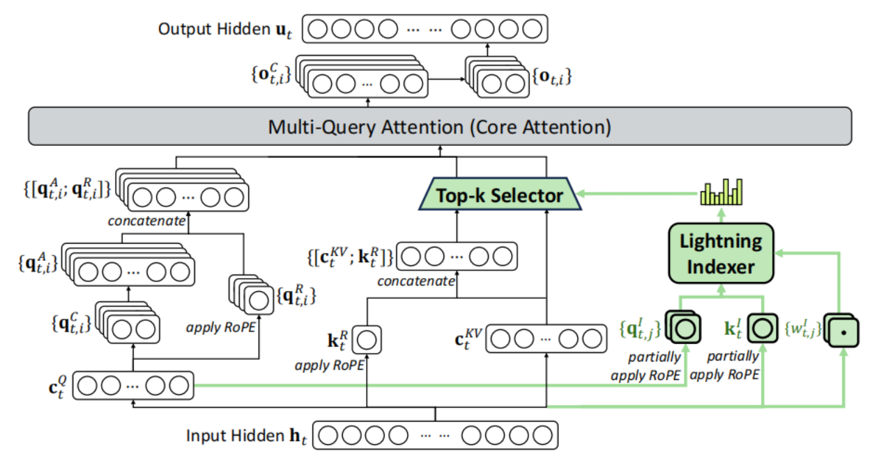

# DeepSeek-V3.2

## DSA（DeepSeek Sparse Attention）

核心思想：先计算出历史序列Top-k最相关的token，然后取这Top-k个token进行常规的注意力计算

引入**“Lightning Indexer”**进行Top-k相关度计算：

对每个token，将输入的隐藏层向量$h_t$计算为$k_t^I$，作为被查询的key向量，放在kv-cache里；对于当前输入token的Q潜向量$c_t^Q$，经过映射得到多头的$q_{t}^I$，每个头为${q_{t,j}^I}$。根据公式$I_{t,s}=\sum_{j=1}^{H^{I}}w_{t,j}^{I}\cdot ReLU(q_{t,j}^{I}\cdot k_{s}^{I})$计算当前token对每个历史token的相关性得分，取Top-K

实际训练时，不需要完全从头开始训练，可以兼容训练好的MLA。分为两阶段：

- 第一阶段：密集预热（Dense Warm-up Stage）

模型保持密集的注意力计算方式，冻结主模型的所有参数，**仅训练闪电索引器** 。

目标是**让索引器的输出分布与主模型的注意力分布对齐**（通过 KL 散度损失函数实现） 。这个阶段非常短，仅训练了 1000 步 。

- 第二阶段：稀疏训练自适应（Sparse Training Stage）

正式引入细粒度的 Token 选择机制，并**优化模型的所有参数**，使其完全适应 DSA 的稀疏模式 。

在这个阶段，索引器依然需要与主注意力对齐，但仅仅计算那些被选中的 Top-k 集合 。

在此阶段，模型为每个查询 Token 选择了 2048 个键值 Token 进行计算，共训练了 15000 步 。

