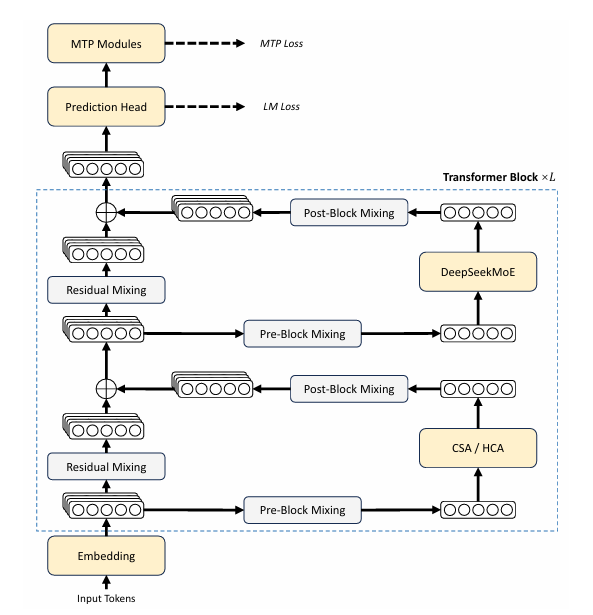
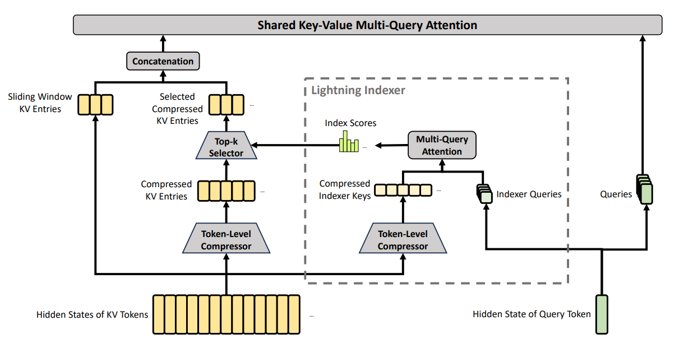
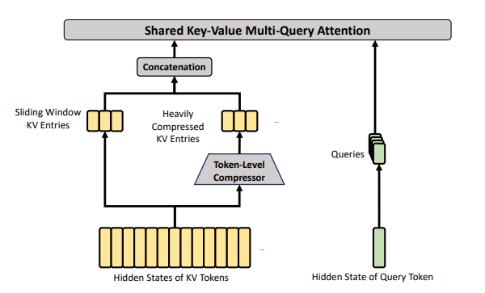

# DeepSeek-V4 Technical Report

## 宏观梳理（Abstract+Introduction）

V4-Pro：1.6T（1600B）+49B activated；V4-Flash：284B+13B activated

**模型架构：**

注意力层：hybrid，Compressed Sparse Attention（CSA）+Heavily Compressed Attention（HCA）

残差连接：Manifold-Constrained Hyper-Connections（mHC）代替Standard Hyper-Connections

优化器：Muon代替AdamW

MoE层：沿用DeepSeek-V3的DeepSeek MoE

MTP：沿用DeepSeek-V3的MTP

**训练pipeline：**

预训练（Flash 32T tokens；Pro 33T tokens），之后原生支持1M上下文

SFT：高质量、特定领域数据集上SFT，获得基础的能力

GRPO：指向不同criteria的不同reward model，训出一系列特定领域专家；最终，用on-policy distillation训一个统一的model，使用和教师的逆KL散度进行优化

**推理：**

1M上下文

V4-Pro相较于V3.2只需要27%单token推理FLOPs，10%的KV cache

**各种评测指标：**

xxx

## 模型架构（来自2.Architecture）

### 继承V3的部分

**MoE、MTP：**

继承DeepSeek-V3

### Manifold-Constrained Hyper-Connections（mHC）

对Standard Hyper-Connections残差连接进行优化，解决深层网络训练数值不稳定问题

**Standard Hyper-Connections：**

将传统残差连接从1维转化为n维，扩大了残差流的信息容量。可以在不增加MoE/FFN、Attention层的隐藏层维度（也即计算的维度）的前提下，扩大残差流容量。（文中：解耦残差宽度和隐藏层维度）

传统残差计算公式：$X_{l+1}=X_l+F_l(X_l)$，其中$F_l$是主干网络，即FFN/MoE或Attention层，输入$1×d_{hidden}$向量，输出$1×d_{hidden}$向量。$X_l$和$X_{l+1}$维度为$1×d_{hidden}$的向量。这个公式核心思想是将主干网络输出的结果上加上它们本身的输入，得到下一层的输入。

Standard HC计算公式：$X_{l+1}=B_l·X_l+C_l·F_l(A_l·X_l)$。其中$X_l$和$X_{l+1}$是维度为$n×d_{hidden}$的向量，是“n车道”的残差传输；$A_l$用于将上一层传过来的输出$X_l$转化为主干网络$F_l$能够处理的维度，维度为$1×n$，这样$A_l·X_l$维度为$1×d_{hidden}$；$F_l$为主干网络，和传统残差一样；$C_l$用于将主干网络输出映射为n车道，维度为$n×1$，这样$C_l·F_l(A_l·X_l)$维度为$n×d_{hidden}$；$B_l$用于将输入的n车道互相交换信息，维度为$n×n$，$B_l·X_l$维度为$n×d_{hidden}$。

注意，这里的$A_l, B_l, C_l$不是随机初始化的可学习权重，而是根据该层输入$X_l$加以该层的权重矩阵$W_A^l$、$W_B^l$、$W_c^l$，得到的“类门控”权重。

$${A}_l = \alpha_l^{\text{pre}} \cdot ({X}_l W_l^{\text{pre}}) + S_l^{\text{pre}}$$

$${B}_l = \alpha_l^{\text{res}} \cdot \text{Mat}({X}_l W_l^{\text{res}}) + S_l^{\text{res}}$$

$${C}_l = \alpha_l^{\text{post}} \cdot ({X}_l W_l^{\text{post}})^T + S_l^{\text{post}}$$

**Manifold-Constrained Hyper-Connections：**

解决Standard HC堆叠多层网络时，数值不稳定的问题。（多个$B_l$连乘梯度消失/爆炸）

核心框架和Standard HC一样，对$B_l$加了约束，对$C_l$和$A_l$也加了约束（sigmoid）

前向传播计算过程中，借鉴Sinkhorn-Knopp算法。对原始$X_l×W_B^l$算出的的$\hat{B_l}$，1. 先对每个数做一下exp保证全为正；2. 对得到的矩阵，做20轮【先行归一化，再列归一化】。这样得到的矩阵，近似认为每行数的和都为1，每列数的和都为1（行归一化：该行每个数除以行的和；列归一化：该列每个数除以列的和）。这样，反向传播权重连乘的时候，因为都接近1，控制梯度

$A_l$和$C_l$也做了优化。首先对$X_l$进行约束：$$\hat{X}_l = \text{RMSNorm}(\text{vec}(X_l))$$，这里vec是展平操作；对$\alpha_l^{\text{pre}} \cdot ({X}_l W_l^{\text{pre}}) + S_l^{\text{pre}}$算出的$\hat{A_l}$，$A_l=\sigma(\hat{A_l})$；对$\alpha_l^{\text{post}} \cdot ({X}_l W_l^{\text{post}})^T + S_l^{\text{post}}$算出的$\hat{C_l}$，$C_l=2\sigma(\hat{C_l})$。以此控制二者分别在$[0, 1]$和$[0, 2]$之间

### Hybrid Attention（CSA+HCA）

- **CSA(Compressed Sparse Attention)**

核心思想：较远历史序列的KV Cache，先m个为一块压缩，再采用DSA召回Top-K

**Compressed Key-Value Entries：**

将历史token压成1/m个entry。具体算法：对于隐藏状态H（维度n×d，n为seqlen、d为隐藏层维度），计算KV块序列$C^a, C^b$和压缩权重序列$Z^a,Z^b$。公式：$C^a = H \cdot W^{aKV}$，$\quad C^b = H \cdot W^{bKV}$，$Z^a = H \cdot W^{aZ}$，$\quad Z^b = H \cdot W^{bZ}$。分a和b两个序列，为了让两个压缩块内的信息有交集，分别代表压缩块内的“历史力量”和”新生力量“。

后续将相邻的两个块合并，以得到压缩块。思路：拿两组token序列$[m(i-1), mi-1]$、$[mi, m(i+1)-1]$，它们对应的$Z^b_{m(i-1):mi-1}$和$Z^a_{mi:m(i+1)-1}$拼接起来，加上可学习的偏置后做Softmax，得到一系列权重：

$$[S^a_{mi:m(i+1)-1} ; S^b_{m(i-1):mi-1}] = \text{Softmax}_{\text{row}}([Z^a_{mi:m(i+1)-1} + B^a ; Z^b_{m(i-1):mi-1} + B^b]),$$

拿这个权重去加权平均对应位置的C向量：

$$C_i^{\text{Comp}} = \sum_{j=mi}^{m(i+1)-1} S_j^a \odot C_j^a + \sum_{j=m(i-1)}^{mi-1} S_j^b \odot C_j^b$$，得到第i块的压缩（comp: compressed）向量。

注意i=0也即最头上的一块时，$Z^b_{m(i-1):mi-1}$为负无穷大，$C^b_{m(i-1):mi-1}$为全0

**Lightning Indexer for Sparse Attention：**

和DSA一样的结构。对上面的$C^{Comp}$，用同样的方法做出维度更小的对应的key向量$K^{IComp}∈R^{\frac{n}{m}×C^I}$（$C^I$为key向量维度）；

将隐藏层做成若干个indexer query头：先做出一个相对低维的潜向量$c_t^Q=h_t·W^{DQ}$，然后扩张为若干个indexer query头$[q_{t,1}^I;q_{t,2}^I;...;q^I_{t,n^I_h}]=q^I_t=c_t^Q·W^{IUQ}$。先降维再升维目的为节约权重矩阵的显存，类似LoRA

然后算出每个压缩块的”权重“：$$[w_{t,1}^I; w_{t,2}^I; ...; w_{t,n_h^I}^I] = \mathbf{w}_t^I = \mathbf{h}_t \cdot W^w$$

综合相关性打分：$$I_{t,s} = \sum_{h=1}^{n_h^I} w_{t,h}^I \cdot \text{ReLU} \left( \mathbf{q}_{t,h}^I \cdot K_s^{\text{IComp}} \right)$$。这个值含义为query和这个压缩块的综合相关性，参考了压缩块本身的重要程度和query和这个压缩块的相关性。如果相关性为0（被ReLU成0了），不管多重要，综合相关性都为0

最终，拿取综合相关性Top-K的块向量：$$C_t^{\text{SprsComp}} = \{ C_s^{\text{Comp}} \mid I_{t,s} \in \text{Top-k}(I_{t,:}) \}$$（SprsComp：Sparse Compressed，稀疏压缩）

**Shared Key-Value MQA**

对拿出来的Top-K压缩块向量，既作为K向量又作为V向量；正常从隐藏层得到的潜向量转化为多头的Q，用MQA方法算attention。

计算Q头：$$[\mathbf{q}_{t,1}; \mathbf{q}_{t,2}; \dots; \mathbf{q}_{t,n_h}] = \mathbf{q}_t = \mathbf{c}_t^Q \cdot W^{UQ}$$，这里$c^Q_t$是上面Lightning Indexer计算时算的低维潜向量

Top-K压缩块向量既作Key又作Value向量（单头），拿上面的Q头，计算Attention：$$\mathbf{o}_{t,i} = \text{CoreAttn}\left(\text{query}=\mathbf{q}_{t,i}, \text{key}=C_t^{\text{SprsComp}}, \text{value}=C_t^{\text{SprsComp}}\right)$$

**Grouped Output Projection**

传统做法：每个头的输出向量拼接起来，用权重矩阵转化为隐藏层维度的向量

问题：DeepSeek-V4这里的MQA头数和压缩块向量的维度都太大，全部拼接起来再转为隐藏层维度，W的参数量太大

解决：把若干头拼成一组先做转化为该组的中间向量，所有组得到的向量再拼接起来，并转化为隐藏层维度

最终，通过以上几个模块，解决了较远的上文的语义提取。

- **HCA(Heavily Compressed Attention)**

更强的压缩，但不应用稀疏注意力（即不会筛选Top-K）

**Compressed Key-Value Entries**

思路和CSA的基本一致，采用比$m$更大的压缩块长度$m'$，且块和块之间不重叠，因此不需要分a和b，只需要单个C和单个K向量

$$C = H \cdot W^{KV}$$，$$Z = H \cdot W^Z$$，这里$H$维度为$n×d$，$W^{KV}$和$W^Z$的维度均为$d×c$

然后每$m'$个token为一组算一个压缩向量：

$$S_{m'i:m'(i+1)-1} = \text{Softmax}_{\text{row}}(Z_{m'i:m'(i+1)-1} + B)$$，$$C_i^{\text{Comp}} = \sum_{j=m'i}^{m'(i+1)-1} S_j \odot C_j$$

由于压缩向量的总量已经比较小了（原文$m'=128$，1M token被压成8000多个向量）因此不需要单独做sparse attention

**Shared Key-Value MQA and Grouped Output Projection**

和CSA一致的结构。

潜向量：$\mathbf{c}_t^Q = \mathbf{h}_t \cdot W^{DQ}$

Query头：$[\mathbf{q}_{t,1}; \mathbf{q}_{t,2}; \dots; \mathbf{q}_{t,n_h}] = \mathbf{q}_t = \mathbf{c}_t^Q \cdot W^{UQ},$

attention多头输出：$\mathbf{o}_{t,i} = \text{CoreAttn}(\text{query}=\mathbf{q}_{t,i}, \text{key}=C^{\text{Comp}}, \text{value}=C^{\text{Comp}})$

后面使用同样的分组输出转化为隐藏层维度的向量

- **Query and Key-Value Entry Normalization**

保证训练稳定性，在CSA和HCA的每个Q头和压缩KV向量的头上额外加一个RMSNorm

- **Partial Rotary Positional Embedding 部分应用旋转位置编码**

对CSA/HCA的query和KV entry向量（核心注意力计算的时候），加RoPE到最后64维度。由于K和V用的是同一个向量，因此输出的o的最后64维也会带上位置信息，并不是我们想要的（原始transformer的V向量并不带位置信息）；对输出的o的后64维再施加一个-i的RoPE抵消作用。

- **Additional Branch of Sliding Window Attention 额外添加的滑动窗口注意力**

维护了一个长度为$n_{win}$的KV Cache，存离得最近的$n_{win}$个token对应的KV entries

CSA/HCA计算最后的Attention时，这些KV entries直接和用别的方法算出来的entries拼接起来共同参与计算。

- **Attention Sink 注意力汇聚**

在核心注意力计算时，对每个注意力得分计算的分母上加一个可学习的向量$z'_h$，用来放大或缩小一些token的注意力权重

$$s_{h,i,j} = \frac{\text{Exp}(z_{h,i,j})}{\sum_k \text{Exp}(z_{h,i,k}) + \text{Exp}(z'_h)}$$

### Muon Optimizer

核心思想：将用于参数更新的动量”正交化“，来获得相对稳定的更新；而不需要像Adam一样维护二阶动量来约束向量的大小，省一份显存。

计算：

1. 反向传播，算权重 $W$ 的梯度 $G_t$
2. 更新动量：$M_t = \mu M_{t-1} + G_t$（这里$M$是长期维护的）
3. 应用 Nesterov 技巧：先计算一个中间动量矩阵 $M'_t = \mu M_t + G_t$
4. 正交化处理：$O'_t= HybridNewtonSchulz(μM_t + G_t)$，这里$O'_t$保证是一个近似正交的矩阵。经过 10 次 Newton-Schulz 迭代后生成的正交动量矩阵
5. 尺度缩放：$$O_t = O_t' \cdot \sqrt{\max(n, m)} \cdot \gamma$$，n和m是权重$W$的长和宽
6. 更新参数：$$W_t = W_{t-1} \cdot (1 - \eta \lambda) - \eta O_t$$，**$\lambda$**：权重衰减（Weight Decay）系数，和AdamW的思路一样

可以看出，比AdamW少维护一个二阶动量，减少显存占用

在嵌入层 (Embedding)、输出头 (Prediction Head)、mHC 的静态偏置 (Static Biases) 与门控因子 (Gating Factors)、所有 RMSNorm 模块的权重上，应用AdamW；其他大多数模块上，使用Muon。

为什么这层？

**非矩阵/非线性特征**：RMSNorm 的权重、mHC 的偏置和门控因子通常是**一维向量**或标量，并不具备矩阵的结构特性。Muon 的核心优势在于对高维矩阵进行“正交化”，对这些细碎的、非结构化的参数应用正交化没有意义，甚至可能破坏其原本需要的缩放功能。  

**输入输出端的特殊性**：Embedding 和 Prediction Head 直接与词表挂钩。这些层的梯度分布极其稀疏且不均匀（长尾词与高频词差别巨大），AdamW 这种基于“二阶矩”的逐元素缩放能够更好地处理这种频率差异巨大的更新需求。

## Infra（来自3. General Infrastructures）

TODO，暂时hold

## 训练（来自4. Pre-Training和5. Post-Training）

### Pre-Train

- **数据构成：**

1. 网络来源数据：
2. 数学/编程：依然核心；为了提高编程能力，mid-train里加agentic data
3. 多语言数据：更多，提升不同文化的长尾文化能力
4. 长文档数据：优先科学论文、技术报告，以及其他有独特学术价值的材料

总计32T tokens，包含数学内容、代码、网页、长文档、其他高质量类别数据

- **预处理步骤：**

用和DeepSeek-V3一样的分词器，不过引入额外的特殊token，词表还是128K；

沿用token-splitting和Fill-in-Middle策略

把不同来源文档用合适的顺序排列，减少sample truncation

使用Sample-level attention masking，不同sample在同一个sequence时，计算某sample的attention时，需要验码其他sample，否则上下文会出问题（看到了不该看的）

- **模型初始化：**

主要讨论了一些模型结构超参数。特殊的：CSA和HCA在各层Transformer block中是交替使用的；V4-Flash的前两层是纯粹的滑动窗口注意力，而V4-Pro前两层是HCA

- **训练初始化：**

主要讨论了训练超参数。不同层上应用Muon和AdamW，上面已经讨论过

- **缓解训练不稳定：**

尽管可以通过简单的状态回滚暂时恢复训练，但治标不治本，Loss尖峰可能反复出现

Loss尖峰与MoE层中的异常值密切相关，路由机制本身会恶化这些异常值，导致训练崩溃的恶性循环。2个维度解决：打破路由引起的恶性循环，抑制异常值的产生。

Anticipatory Routing（前瞻路由）：在训练的第t步，模型使用最新的参数来计算特征，但是采用第$t-\Delta{t}$时间步的路由结果来选专家。这个不是一直触发的，碰到Loss尖峰之后，会短暂回滚然后触发这个机制，度过危险期后再次关闭。

SwiGLU Clamping（裁剪）：将SwiGLU的线性部分强制截断在[-10, 10]范围内，门控部分上限封顶为10

- **评估：**

一系列benchmarks，包含World knowledge、Language understand and reasoning、Coding and mathematical、Long context等

一系列评估结果，略

### Post-Training

和DeepSeek-V3.2类似。最大区别：RL完全被OPD取代

- **Specialist Training：专家训练**

专家训练沿用DeepSeek-V3.2的训练pipeline：SFT+GRPO，使用领域专属prompts和奖励信号

**Reasoning Efforts机制：**三种思考模式

Non-think：不CoT，直接返回`</think> summary`

Think-High：带CoT，返回`<think> thinking tokens </think> summary `

Think-Max：带CoT，给模型一个特殊的system prompt，返回`<think> thinking tokens </think> summary `

RL训练时，给不同的长度惩罚和上下文窗口，因此输出推理token序列的长度不一样

**Generative Reward Model：**

使用自己作为GRM即奖励模型，对rollout得到的n个推理结果进行打分。

这样“左脚踩右脚”的方法，既能提高模型在该领域指标上的表现，也能提高judge能力（制冷能力和评价冰箱制冷的能力是贯通的）。实验证明，只需要人的少量标注的集合作为启动，就能达到不错的效果

**Tool-Call Schema and Special Token：**

1. 和之前版本一样加`<think></think>`标签
2. 添加tool-call的标识"|DSML|"token，并加上XML来表示tool的内容。减少了工具调用的error

**Interleaved Thinking：**

对多轮Agent调用训练：V3.2只会保留历史Agent轨迹的工具部分，但V4保留think内容+工具部分

对多轮对话训练：V4会丢弃历史回答中的think但保留历史回答中的summary

这样做保留了上下文中更多信息

注意：只有原生使用tool返回结果的Agent框架才能这么做（指保留think）。有的框架会把工具列表放到user prompt里，DeepSeek-V4默认丢弃think轨迹，因此用这种框架时使用non-think模式最好。

**Quick Instruction：**

在当前正在进行的tokens序列中的特定位置插入一些special token，用于进行一些操作。

原本这些操作可能需要引入另一个LLM来解决，例如一轮对话结束后生成标题，或者回答之前需要先进行web search。调用另一个LLM时，传入的相同信息没法复用KV cache，因此想办法在当前调用的这个LLM中解决。

例如，对[user prompt]，是一个需要web search的任务，本来可能需要先用另一个LLM生成检索词、调用搜索工具，再把拿到的信息+[user prompt]放到当前LLM中，这样相当于[user prompt]部分做了两次KV Cache，比较浪费。

新的做法：对[user prompt]，做成<|User|>{user prompt}<|Assistant|> <|action|>，然后当前LLM直接生成检索词、调用搜索工具；拿到搜索结果后，把搜索结果拼接到后面，继续生成后面的token。只用一个LLM，不用两次KV Cache

- **On-Policy Distillation(OPD)**

传统蒸馏：教师推理一批数据，学生用SFT去学。这些推理数据不是学生自己产生的，因此是Off-Policy。问题：可能有分布漂移，因为只学了正样本，实际推理时万一轨迹到了以前没见过的坏情况，就没有继续回到正确轨迹的能力了。（个人理解：教师的推理数据分布没法覆盖学生一部分的输出分布，因此通过学推理轨迹，这部分输出分布没有被训练到正确的分布上，需要通过学生自己rollout这部分内容然后纠错）

例子：

> 需要补全：南京所在的省份是_
>
> 教师轨迹：南京所在的省份是[江苏省]\<eos>
>
> 学生本身的分布：P([江苏省]\<eos>)=0.5，P([安徽省]\<eos>)=0.3，P([浙江省]\<eos>)=0.1 ……
>
> 如果Off-Policy蒸馏，SFT学完之后，可能这个分布变成：P([江苏省]\<eos>)=0.8，P([安徽省]\<eos>)=0.1，P([浙江省]\<eos>)=0.05……
>
> 但训练后的学生推理时，仍有可能输出[安徽省]\<eos>。这部分学生自己分布内的坏情况，没有被纠错
>
> 如果使用On-Policy蒸馏：
>
> 学生如果先输出了[江苏省]，那么教师对下一个token的权重预测，\<eos>概率应该极高
>
> 学生如果先输出了[安徽省]或[浙江省]，那么教师对下一个token的权重预测，可能就是[旁边的江苏省]、[的邻省]等token的概率很高，\<eos>的概率很低（这里为了方便人理解，暂且认为[旁边的江苏省]、[的邻省]是一个token）
>
> 通过这种方法，让学生把自己输出分布内的所有正负面轨迹都能学到

公式：$$ \mathcal{L}_{OPD}(\theta) = \sum_{i=1}^{N} w_{i} \cdot D_{KL}(\pi_{\theta} || \pi_{E_{i}}) $$

其中，$w_i$是超参数，用于控制各个专家的重要性。是动态调整的，在不同任务下值分配不一样。

解读：通过逆KL散度来逼近学生模型和每个专家模型的logits的相似度

过去的方法往往只取一个token，计算学生模型和教师模型的概率的比值，这样往往会导致训练不稳定。DeepSeek-V4中，是取了整个词表上的logits算KL散度，虽然耗费资源，但是效果好。

- **RL及OPD的infra**

TODO，暂时hold

- **后训练的评估（Standard Benchmark上评估）**

Knowledge、Reasoning、1M token上下文、Agent领域的不同benchmark进行评估

- **实际任务表现**

中文写作、搜索、白领工作、代码Agent等任务的表现
