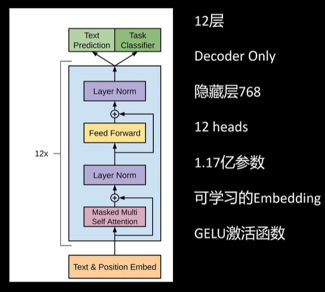
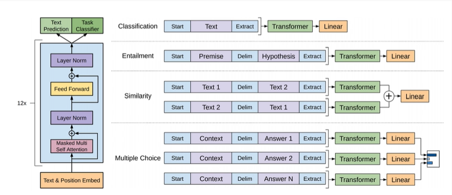
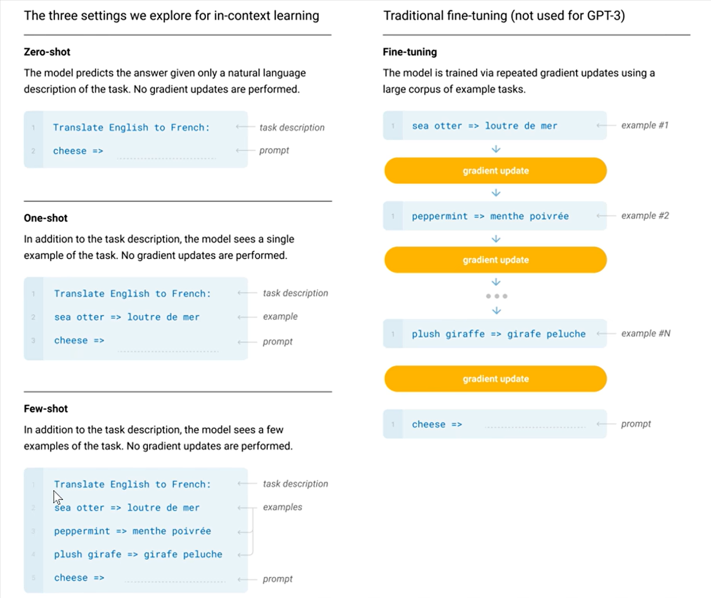
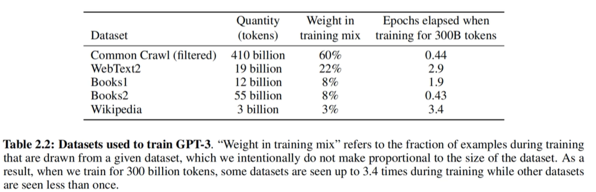

# GPT

## GPT-1

【Improving Language Understanding by Generative Pre-Training】

动机：NLP 每个任务都需要大量标注数据，模型不能复用。

CV 领域得益于 imagenet 数据集，预训练模型，下游任务微调。

OPEN AI：要做 NLP 领域的预训练模型


NLP 领域预训练模型难点：

1. 没有像 ImageNet 那样大量的标注数据。怎么训练？
2. 预训练模型架构轻微修改，可以应用到下游任务。模型架构怎么设计？


没有标注数据！

——用语言模型自回归的方式来训练模型


### 预训练

模型架构：RNN or Transformer？

Transformer。能更好的记住训练数据中的模式，也能更好的适应下游任务

只用Transformer Decoder，由于不需要参考Encoder的输出，因此去掉了Cross Attention的部分



注意输出头有Text Prediction和Task Classifier，在预训练时只用Text Prediction，而Task Classifier是针对具体任务做下游微调用的

$$ \begin{align*} &\text{语言模型似然函数:} \quad L_1(u) = \sum_{i} \log P(u_i | u_{i - k}, \dots, u_{i - 1}; \theta) \\ &h_0 = U W_e + W_p \\ &h_l = \text{decoder\_block}(h_{l - 1}) \quad \forall l \in [1, n] \\ &P(u) = \text{softmax}(h_n W_e^T) \end{align*} $$

注意这里输入的embedding矩阵$W_e$和输出头位置的$W_e^T$是共享参数的，一个将词表维度转换为embedding（隐藏层）维度，另一个将embedding（隐藏层）维度转换为词表维度。

共享参数是因为，这时的模型都很小，词表很大，embedding层占据了模型参数比较大的比例。共享能够很大程度上减小模型参数量

后来，随着模型做大，embedding占参数比重不大，很多模型选择独立训练分类头

这样，我们就得到了一个预训练的、能预测下一个token的语言模型了


**训练数据：**

BooksCorpus Dataset用了7000本未发表的书（800M words）

上下文长度：512

BatchSize：32


### 微调

给输入的句子里插入一些特殊的token，让模型知道现在在做具体的什么下游任务。




## Bert

使用Encoder层，可以看到双向上下文，更适合做语义提取


## GPT-2

Language Models are Unsupervised Multitask Learners

动机： 

GPT1 和 Bert 将预训练模型引入了 NLP，但是下游任务仍然需要收集一部分数据，进行微调。 

GPT2 希望通过预训练模型可以解决所有下游任务。


怎么解决下游问题？引入prompt，而不是像GPT-1那样使用特殊的标记符号

在GPT1，在微调时引入起始符，分割符，结束符来让模型进行下游任务。 `p(output|input)` 

GPT2不进行微调，只能用预训练时见过的token，所以自然的引入了Prompt。 `p(output|input, task) `

情感分类：

```
GPT1: <start>今天这家餐厅的服务真的很棒！<extract> 
GPT2: 判断下边这个句子的情绪是正面还是负面的：今天这家餐厅的服务真的很棒！
```

模型修改：

1. 将 Layer Norm 移动到每个 block 的输入位置。最后一个子层的自注意机制后加上了一个 layer norm。

   （即，原来是先做SelfAttention/FFN再LayerNorm，现在是对输入先LayerNorm再SelfAttention/FFN）

2. 残差层的初始化参数，随着层数增加而减小，除以根号下 N。N 是残差层的层数。（？没看懂）

3. 扩大了词典到 50257。

4. 模型参数达到 15.42 亿。


训练修改： 

1. 上下文长度从512，扩展到1024。 
2. BatchSize到512。
3. 用了Reddit里优质的网页，800万文本，40GB文字。


GPT-2在很多任务里表现了很不错的性能，但没有远远高于其他通过监督训练的模型。但OpenAI发现随着模型参数量增大，效果还能上升


## GPT-3

Language Models are Few-Shot Learners

**动机： **

人类在做一个语言任务时，只要给几个例子就可以。但是传统Bert，GPT1，还需要成千上万的下游任务的例子。 

能否通过在Prompt里给模型提供几个例子，提升模型性能。（Few-shot） 

延续GPT2的思想，继续做大做强。


引入**In-Context Learning的模式**，而非预训练+微调：



（GPT-2虽然已经引入了Prompt指导具体任务的模式，但“能力涌现”尚不明显，还需要针对具体下游任务微调才能获得较好的效果；而GPT-3可以认为到达了能力涌现的阈值，可以只通过few-shot/zero-shot干很多事，不需要微调了）


**模型修改：**

基本和GPT2一样

引入了**稀疏注意力机制**，每个token只关注前面的一部分token，不会对整个序列的所有token计算注意力得分

继续做大做强


**训练数据：**

数据量大，对不同来源的数据进行加权处理



上下文长度2048，Batch Size 320万


## GPT-4

技术报告基本没透露信息

多模态，输入是文本和图片，输出是文本

一点有用的见解：

模型的能力是在预训练的时候获得的，RLHF 只是和人类意识对齐。并不能提高模型表现。如果 RLHF 做的不好，还可能破坏模型原有的能力。


OpenAI特有的炼丹技能：

可以通过训练相同结构的小模型来预测同样结构的大模型的表现

技术报告里没提到怎么做到这一点