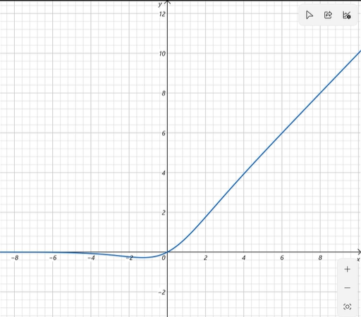
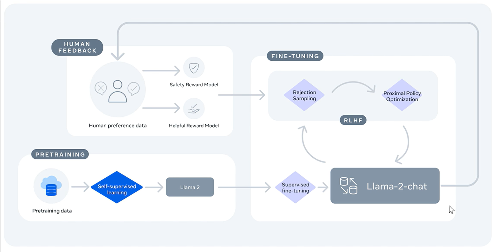

# Llama 1-3

Scaling Law：计算预算下给出 token 和模型大小的建议。但没有考虑推理代价，推理代价比训练代价更重要。

原来 10B 模型，建议用 200B 的 token 训练。

Meta 7B 模型，用 1T token，发现性能还一直增长。相同的计算预算，增加训练数据比扩大模型参数有效。

Llama的思路：在Scaling Law基础上加大数据量，获得更好的效果，就可以在推理时降低成本（不用更大的模型了）

## Llama 1

### 数据

全部开源数据

CommonCrawl 2017 - 2020数据，去重，去除非英文数据。

线性模型进行质量分类过滤。

书和维基百科用了2个epoch，其他1个。

总共1.4T token。

上下文长度2048，2048个A100 80G GPU，用时21天

### 模型架构

Transformer Decoder架构，做了以下修改：

1. 和GPT3一样将Normalization从每个子层的输出位置移动到了输入位置
2. 将LayerNorm改为RMSNorm
3. 采用旋转位置编码
4. 采用silu激活函数

- RMSNorm和LayerNorm：

$LayerNorm = \frac{x - E[x]}{\sqrt{Var[x] + \epsilon}} * \gamma + \beta$ 

$RMSNorm = \frac{x}{\sqrt{Mean(x^2) + \epsilon}} * \gamma$

- SiLU：

$ \text{silu} = x * \text{sigmoid}(x) = \frac{x}{1 + e^{-x}} $

很像ReLU，但由于在0附近平滑，比ReLU精度更高；但计算比ReLU复杂，开销更大

## Llama 2

Open！可商用

加大数据量

Chat Model

70B模型训练了172万GPU小时相当于2048个GPU，训练35天

### 数据

- Pretrained：

Pretraining Tokens: 2T tokens

Context Length: 4096

- Fine-Tuned For Chat Use Cases:

(Data Collection for helpfulness and safety)

Supervised fine-tuning: Over 100,000 人类给出回答的数据

Human Preferences: Over 1,000,000 模型给出的回答，人工排序

Chat部分使用RLHF训练，具体流程图如下：

2T token仍然有增长空间

### 模型结构

引入GQA（只在70B模型上应用GQA，q_heads=64, kv_heads=8）

## Llama3

目标： 最好的开源模型，可以与最好的商业大模型媲美。 先发布8B和70B。 后边还有其他模型：400B，多语言，多模态模型。

### 模型架构

字典从3万2000个Token扩充4倍，达到了12万8千。

提高推理效率。原来一个中文被编码为多个token，现在只需要一个token。 

所有模型，包括8B模型也用GQA 序列长度从4096到了8192。

### 训练数据

15T的训练Token，全部来自公开数据。

是Llama2的7倍大小。代码数据多了4倍。 

5%高质量非英语数据，涵盖30多种语言。 

对数据进行了清洗过滤，Llama2生成训练数据来帮助训练文本质量分类器。 

微调阶段除了开源数据集，还人工标注了1000万样本。

### 训练技能

制定了一系列缩放定律，通过小模型表现可以在大模型训练前预测大模型的表现。 

根据之前Scaling Law推算8B模型对应2000亿Token，但是Meta发现即使15万亿Token训练，性能还可以提升。 

在两个定制的24k GPU集群上训练。有效训练时间超过95%，比Llama2提高了3倍。

指令微调：Llama2-Chat, Llama3-Instruct

SFT, 拒绝采样，PPO，DPO