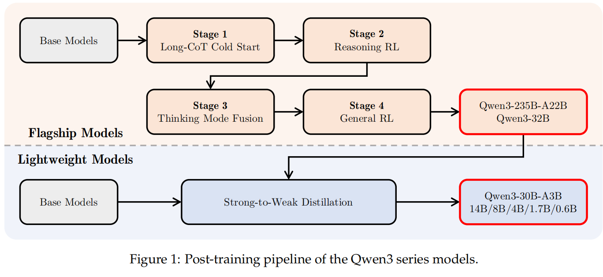
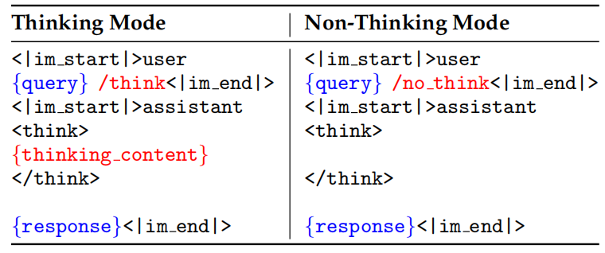

# Qwen3 技术报告 笔记

## 基本结构 Architecture

6个Dense模型：Qwen3-0.6B，1.7B，4B，8B，14B，32B

和2个MoE模型：Qwen3-30B-A3B，Qwen3-235B-A22B

注意力机制：GQA（与Qwen-2.5一致）

位置编码：RoPE（与Qwen-2.5一致）

正则化层：RMSNorm（与Qwen-2.5一致）

激活函数：SwiGLU（与Qwen-2.5一致）

移除QKV-bias，引入QK-Norm（？）

MoE模型：256个专家，每次激活8个。去除了共享专家

引入了global-batch load balancing loss负载均衡损失

使用BBPE作为分词器，词表大小151669

## Pre-training

119种语言，**36 trillion** tokens

包括coding，STEM，**reasoning tasks**，books，multilingual texts，synthetic data

用Qwen2.5-VL解析PDF-like documents，使用Qwen2.5再进一步精化

Qwen2.5，Qwen2.5-Math，Qwen2.5-Coder用于合成数据

添加多语言数据

（注意到，引入了推理任务的数据，这一操作的依据可能是模型的推理能力上限由预训练决定）

### Pre-training Stage

S1-General Stage（通用知识学习）: 30 trillion tokens，最大序列长度4096

S2-Reasoning Stage（增强推理能力）：添加STEM、推理、coding、合成数据的比例，最大序列长度4096

S3-Long Context Stage（扩展长上下文能力）：75%有16384-32768 tokens，25%有4096-16384 tokens。提高了RoPE的频率，引入YARN和DCA，为长文本做服务

### Pre-training Evaluation

若干个指标，和Qwen2.5及DeepSeek，Llama，Gemma等模型对比

## Post-training

总体概览：先通过四阶段训练出最大的235B(MoE)/32B(Dense)的模型，然后通过蒸馏的方式训练其他模型

两个核心点：Thinking Control和Strong-to-Weak Distillation

### Stage 1：Long CoT Cold Start

先用长思维链冷启动，本质上是SFT

数据过滤：

query过滤：去掉不好验证的数据，去掉Qwen2.5-72B不用CoT也能正确回答、也就是太简单的数据

回复的过滤：每个问题使用QwQ-32B生成N个回复，人工筛选好的回答

### Stage 2：Reasoning RL

数据：

1. Cold Start阶段没用过
2. 对CoT Cold Start后的模型是可学习的（就是说不要太简单不要太难）
3. 有一定挑战性
4. 很广的范围

3995条数据，GRPO

想办法控制entropy

经过170steps的RL后，AIME'24 score从70.1涨到85.1

### Stage 3：Thinking Mode Fusion

创新性地融合了非推理和推理功能在同一个模型里

1. 训练方法：持续监督微调 SFT，使用“思考”数据和“非思考”数据，“思考”的数据是Stage 2的模型通过拒绝采样方法得到的，即从Stage 2模型生成的回答中选质量高的
2. Chat Template Design：对thinking和no thinking分别设计一种Chat Template

3. Thinking Budget：用户可以设定一个思考最大长度，达到这个长度时，模型自动添加"Considering the limited time by the user, I have to give thesolution based on the thinking directly now.\n\</think>.\n\n"，由于这里加了\</think>，模型自动跳出思考，开始回答

   这是一个自然的能力涌现，也就是说没有针对性训练，自己就获得的能力

### Stage 4：General RL

阶段目标：全面提升模型在各种场景下的综合能力、稳定性和对齐性

感觉技术报告里说的比较含糊，只是说了提升的方向，不是特别具体

1. 核心提升目标：

- 指令遵循：看懂用户指令，如内容、格式、长度等要求
- 格式遵循：主要是think和no think的标签切换，使用\<think>\</think>
- 偏好对齐：有用性、吸引力和风格
- 智能体能力：Tool Use
- 特殊场景能力：比如RAG任务，引入奖励信号引导模型生成更准确、更贴合上下文的回答

2. 奖励系统：

- 基于规则的奖励：有明确答案的任务
- 有参考答案的基于模型的奖励：有参考答案，但也用大模型对比二者进行打分
- 无参考答案的基于模型的奖励：纯靠建模人类偏好的奖励模型打分

### Strong-to-Weak Distillation

两个阶段：

1. Off-Policy Distillation

让235B的最强的模型先生成一些thinking和no thinking数据，然后让小的模型去学这些答案（猜测是类似SFT的动作）

2. On-Policy Distillation

猜测是大模型和小模型在同一个问题上一起生成logits，然后根据logits的KL散度作为损失值来训练

（这块没读特别懂，不知道两个区别是什么）

### Post-Training Evaluation

一些评估，略

## 一些Discussion

1. Thinking Budget确实有效，设的最大token数越大，回答效果也确实越好

2. On-Policy Distillation确实比直接做RL开销小，效果好

