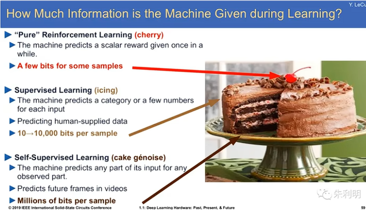
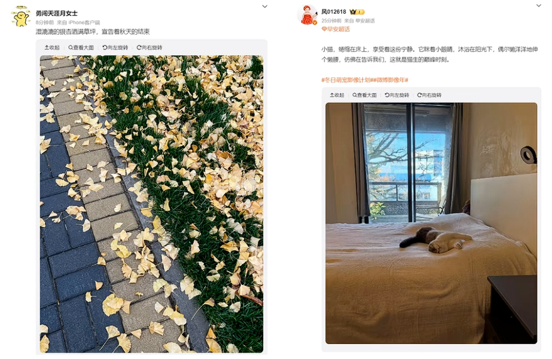
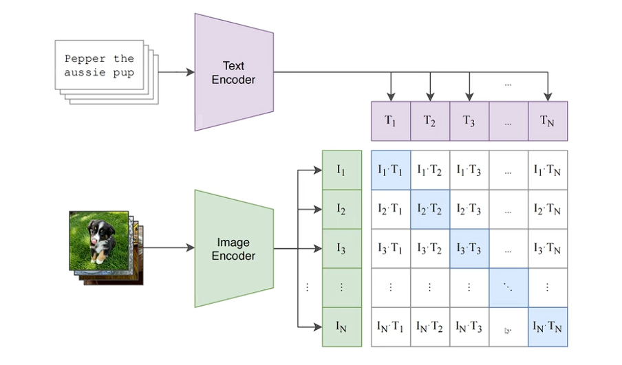
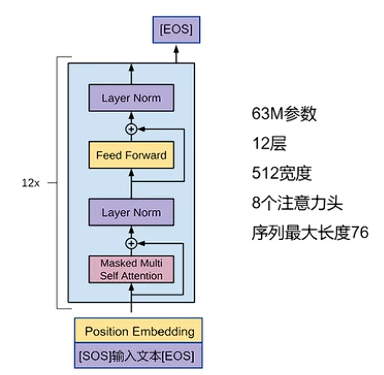
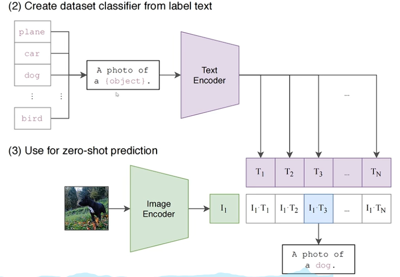
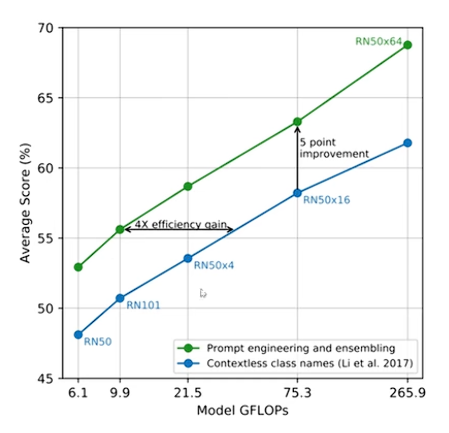
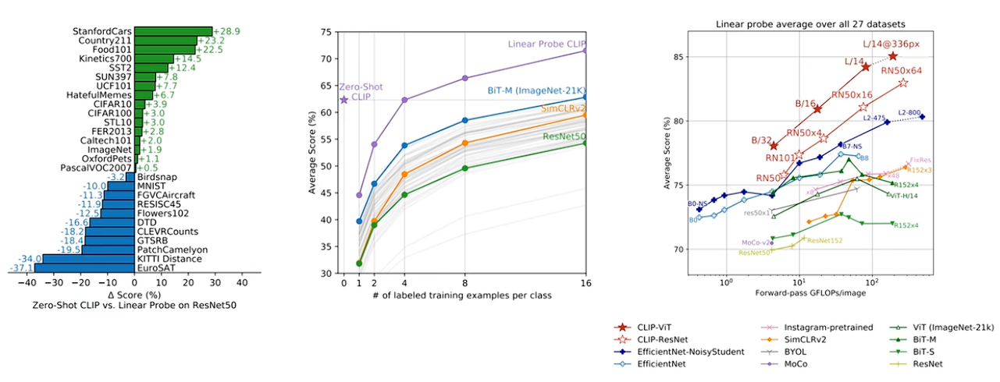
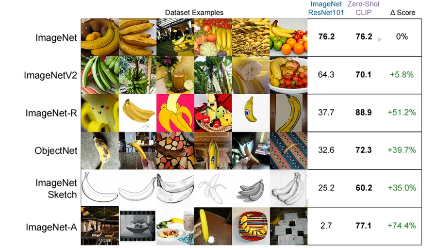
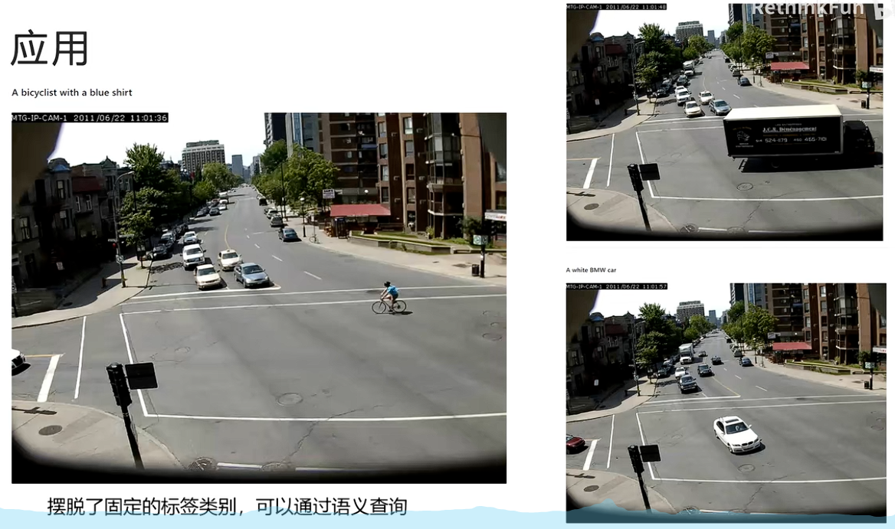

# CLIP

启发：

Bert - 自监督训练：掩码语言模型，下一句预测（解决不了下游任务还要微调的问题，还需要加一个输出头微调）

GPT - 自监督训练：自回归语言建模；自由迁移到任何任务：通过Prompt


杨立坤蛋糕图



强化学习学到的是蛋糕上的“樱桃”，监督学习学到的是表层的“糖霜”，自监督学习学到的才是蛋糕里的内核


## 数据

收集4亿个文本-图片对



论文题目：利用自然语言的监督信号学习一个可迁移的视觉模型


## 训练任务

1. 根据图片生成文本（太慢了，一张图的描述可以有无穷多种，不适合）
2. 文本图片配对


**模型训练：**

文本通过Text Encoder生成文本的向量表示

图片通过Image Encoder生成图片的向量表示

尽可能拉近配对文本-图片向量的距离，尽可能拉远不配对文本-图片向量的距离



**图像编码器：**

图像编码器 ResNet 50；

ResNet 101；

ResNet 50x4；

ResNet 50x16；

ResNet 50x64（10656 V100 天） ；

ViT-B/32；

ViT-B/16；

ViT-L/14（3072 V100 天） ：额外在336*336图片上训练一个epoch，提升精度。 实验发现在模型深度，宽度，图像分辨率上同时增加计算量模型提升优于仅在一个维度增加计算力。

**文本编码器：**



类似GPT的Decoder-Only结构，输入文本前面加上[SOS]标记，后面加上[EOS]标记。取用[EOS]对应的输出向量作为文本的embedding


**模型训练伪代码：**

```python
# image_encoder - ResNet or Vision Transformer
# text_encoder - CBOW or Text Transformer
# I[n, h, w, c] - minibatch of aligned images
# T[n, l] - minibatch of aligned texts
# W_i[d_i, d_e] - learned proj of image to embed
# W_t[d_t, d_e] - learned proj of text to embed
# t - learned temperature parameter

# extract feature representations of each modality
I_f = image_encoder(I)  # [n, d_i]
T_f = text_encoder(T)  # [n, d_t]

# joint multimodal embedding [n, d_e]
I_e = l2_normalize(np.dot(I_f, W_i), axis=1)
T_e = l2_normalize(np.dot(T_f, W_t), axis=1)

# scaled pairwise cosine similarities [n, n]
logits = np.dot(I_e, T_e.T) * np.exp(t)

# symmetric loss function
labels = np.arange(n)
loss_i = cross_entropy_loss(logits, labels, axis=0)
loss_t = cross_entropy_loss(logits, labels, axis=1)
loss = (loss_i + loss_t)/2
```

1. 分别用视觉Encoder和文本Encoder做出图像、文本的embedding向量
2. 直接算两个向量的点积，再乘以一个温度系数$e^t$，这里t是可学习的。温度系数用于调节分布的陡峭程度。直接计算出每个`(图片, 文本)`之间的相似度
3. 计算两个交叉熵：图片对文本（图中行级别的交叉熵，每行算出一个）和文本对图片（图中列级别的交叉熵，每列算出一个），二者相加得到最终的loss


## 模型推理

1. 准备一系列标签的集合，做成Prompt句子（例如"A photo of a {object}"），然后放入Text Encoder，得到若干向量$T_1, T_2,...,T_n$
2. 待分类的图片放入Image Encoder，得到向量$I_1$
3. 计算$I_i$和$T_i$的相似度，相似度最高的输出



**Prompt Engineering：**

为什么不直接用类别名来编码？作者用ImageNet数据集做过实验，使用形如"A photo of a {label}"的prompt效果更好（ImageNet Zero-Shot精度提升1.3%）

对于指定类型的数据集可以使用如下的技巧：

例如对于宠物数据集，可以"A photo of a {label}, a type of pet"

**Ensembling：**

A photo of a big {label}

A photo of a small {label}

A black white photo of a {label}

A blurry white photo of a {label}

……

用多个prompt和图片计算相似度，取相似度平均值

Prompt+Ensembling起的作用：




## 模型效果



图一：Zero-Shot的CLIP和针对下游任务微调了一个分类头的ResNet对比，CLIP总体更优

图二：CLIP和ResNet都做Few-Shot微调，无论每个类别给几个shot，都是CLIP领先

图三：用全量下游任务训练分类头，都是CLIP领先

- 模型泛化性：



用ImageNet训练的ResNet和CLIP在ImageNet上的预测效果差不多，但对于其他版本，CLIP的效果明显更好，说明通过文本理解了”什么是香蕉“，更具有泛化性


## 对比学习

- 无监督，没有具体类别 

- 训练的数据是分为anchor, positive, negative 
- 通过代理任务学习样本的特征表示 
- 相同的样本得到的特征表示越相似，差距越大的样本得到的特征表示越不相似
- 模型就是一个编码器 
- 损失函数一般为InfoNCE


CLIP好处：

- 利用了丰富的语义作为监督

  学习到了很多细节语义特征

- 将图像和文本进行了连接

  可以利用文本来查询图像

- 不用预先定义固定类别的标签

  通过 Prompt 来查询


## 应用



对于监控视频一帧帧的截图，可以输入Prompt”穿蓝色衣服骑车的人“来找到如左图的画面

