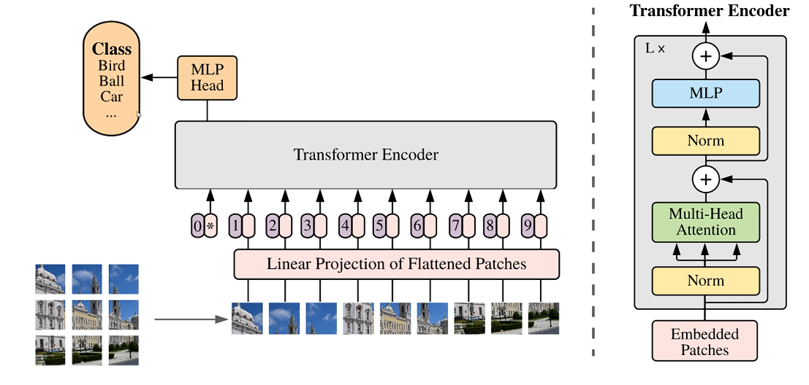
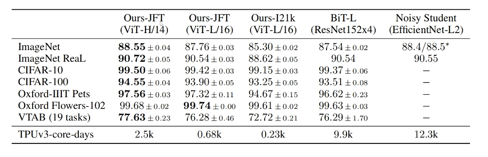
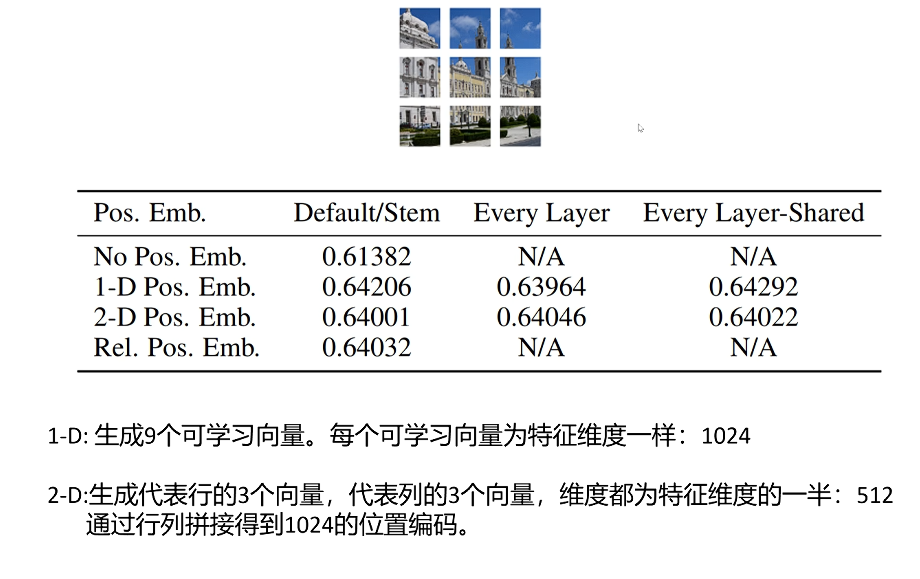
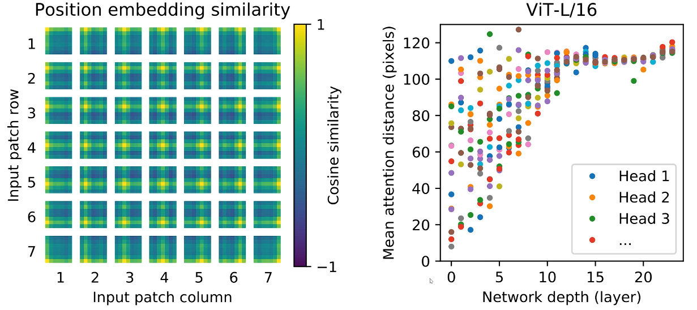
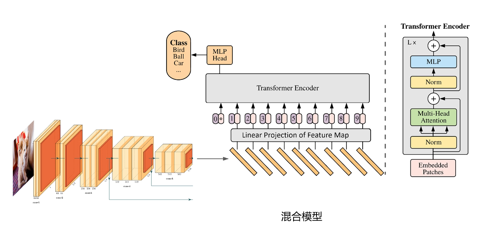
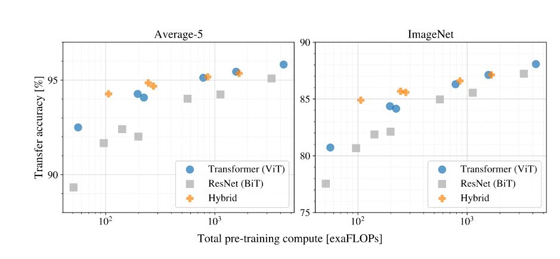
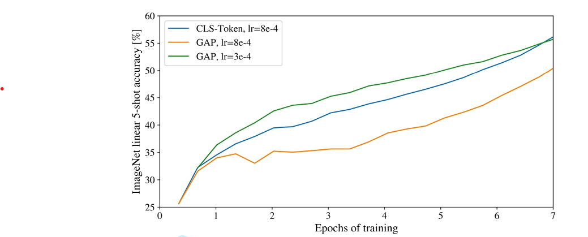
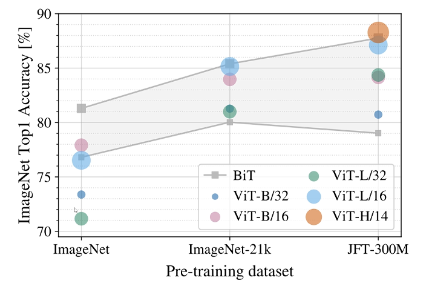

# ViT - Vision Transformer

[VIT （Vision Transformer）深度讲解_哔哩哔哩_bilibili](https://www.bilibili.com/video/BV15RDtYqE4r/?spm_id_from=333.337.search-card.all.click&vd_source=73e54c2ac162fbf942d5792a881e18b2)

用Transformer架构来解决视觉问题

不对Transformer不做任何修改，是否可以引入到视觉领域

在不同数据集大小下，Transformer相较于卷积模型有什么优势

## 结论

1. Transformer模型可以不做任何改动解决计算机视觉问题
2. 在小规模数据集上，表现略输神经网络；中等或大规模数据集上，表现相当于或优于卷积神经网络
3. 在计算效率上，训练同等精度的模型，Transformer模型比卷积神经网络更有优势

Transformer模型大一统：

- 最佳模型架构
- 训练效率高
- 注意力提取复杂语义
- 多种模态
- 结构简单
- 可以扩展多种模型大小
- 使用千亿规模参数，依然没有性能饱和
- 工程优化，如flash attention，vllm可以直接应用于计算机视觉和多模态领域

## 模型结构

图像转化为Token序列

不按单个像素做embedding：序列太长，单个像素信息太少

用一个patch作为语义单元，作为一个token

切成多个大小一样的patch -> 每个patch展平后放入线性层得到embedding -> 加上对每个位置可学习的位置编码 -> 在头上加上一个可学习的用于分类的token，且有自己对应的位置编码 -> 放入Transformer Encoder -> 对第一个用于分类token的输出，加上一个MLP头，输出为类别，进行图片的分类

由于图片分类任务，因此模仿BERT，使用Encoder模块，而非Decoder模块

## 实验效果

在大规模数据集上训练ViT模型更有优势

## 图像转化为Embeding序列的两种实现方式

训练图片大小为224\*224，patch大小为16\*16，patch数量为14*14。 

Transformer里的特征维度（Hidden_Size）为1024. 

**线性映射**： 将原始图片拆分为多个patch，对于每个patch，shape为（16，16，3），展开为一个长度为768的一维向量，然后通过一个共享的（768，1024）的线性层进行编码。

**卷积操作**： 直接对原始图片，定义1024个卷积核，每个卷积核大小为patch大小（16,16），步长也为16，padding为valid。 

这两个操作是完全等价的。（都是把一个patch转成了1024维向量）

## 对位置编码的尝试

不用位置编码效果最差；1-D，2-D以及相对位置编码效果差不多

不用位置编码效果也还行的原因：patch内部本身蕴含一定位置关系的信息，这点不像文本序列

左：位置编码相似度的可视化图：自己跟自己得分最高，同一行列的得分较高

右：对不同注意力层的多个头提取到的注意力的平均距离，可以看到浅层网络有的头看到的主要是短距离信息，深层网络的头能看到相对全局的信息

## 模型结构的尝试

对比三种结构：传统卷积神经网络 / ViT / 卷积+Transformer混合模型

混合模型结构：用卷积神经网络最终输出的一块作为一个patch，线性映射后作为一个token输入Transformer序列

三种模型对比结果：

参数量增大后，ViT和混合模型基本没差距，说明Transformer可以取代卷积神经网络

## Encoder输出分类的两种方法

1. 增加一个分类头[cls] token，用最后Encoder这个token的输出提取全局信息
2. 不增加token，Encoder对所有token向量的输出的全局平均池化提取全局信息

可以看出两种方法差不多

## 数据集大小的影响

小数据集（百万级）上ResNet更好，中数据集（千万级）差不多，大数据集（亿级别）ViT好于ResNet

## 归纳偏置

在建模时引入人的先验经验，不是从数据中学来的。

卷积操作的归纳偏置（每一层）：

1. 局部性
2. 平移不变性

> 平移不变性：用同一个卷积核提取相似的区域，得出的特征输出很接近
>
> 意义：能学到与位置无关的通用的特征

ViT 的归纳偏置（仅在切分 patch 时）：

1. 切分 Patch 时引入了局部性
2. 多个 Patch 用同一个线性映射层，引入了平移不变性

由于ViT只在切分patch和线性映射时引入归纳偏置，在Transformer计算时没有引入归纳偏置，而卷积神经网络完全引入了归纳偏置，因此在小规模数据集上卷积神经网络更优

## 自监督学习的尝试 - 借鉴BERT

对 50% 的 patch 进行标记，其中的 80% 标记为可学习的 [mask] 标签，10% 替换为其他 patch 的 Embedding，10% 维持不变。

预测像素值，原来是 RGB 255\*255\*255=16,581,375 色转化为预测 8\*8\*8=256 色。

效果非常不错

