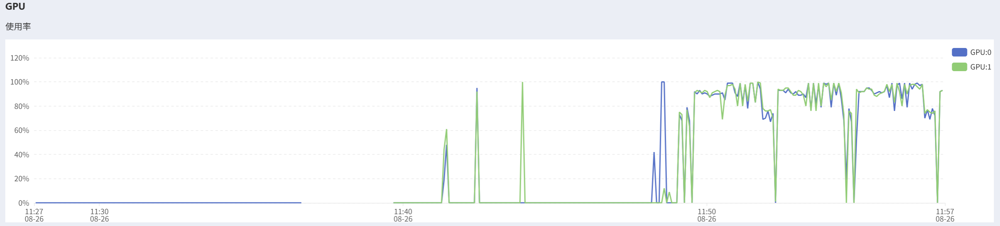
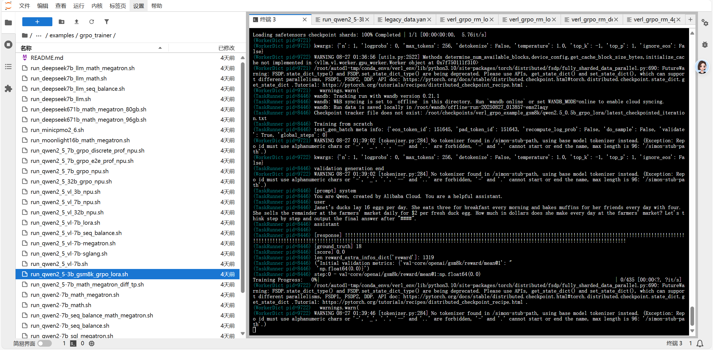
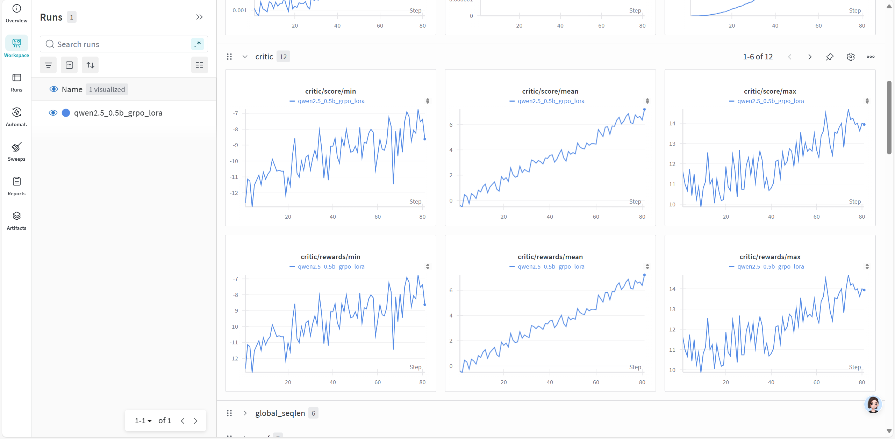

# VeRL记录

## 安装（这是个错误的示范，可以跳过，直接看QuickStart的安装部分）

AutoDL服务器环境：

cuda 12.8

比OpenRLHF简单，没遇到被网络问题卡的

```
conda create -n VERL_ENV python=3.11
conda activate VERL_ENV
git clone https://github.com/volcengine/verl.git
cd verl
pip3 install -e .
```


## QuickStart

按照VeRL官方文档中的Quickstart[Quickstart: PPO training on GSM8K dataset — verl documentation](https://verl.readthedocs.io/en/latest/start/quickstart.html)来操作

- step 1：准备数据集

AutoDL没法访问外网，设置国内镜像：

```
export HF_ENDPOINT=https://hf-mirror.com
```

运行官方准备好的example脚本，将gsm8k数据集预处理后转化为parquet格式：（在verl根目录下运行）

```
python3 examples/data_preprocess/gsm8k.py --local_dir ~/data/gsm8k
```

根据demo，调整自己的数据集和模型位置的参数（我是下在本地了），运行以下指令：

```bash
PYTHONUNBUFFERED=1 python3 -m verl.trainer.main_ppo \
 data.train_files=$HOME/data/gsm8k/train.parquet \
 data.val_files=$HOME/data/gsm8k/test.parquet \
 data.train_batch_size=256 \
 data.max_prompt_length=512 \
 data.max_response_length=256 \
 actor_rollout_ref.model.path=/root/autodl-tmp/Qwen2.5-0.5B-Instruct \
 actor_rollout_ref.actor.optim.lr=1e-6 \
 actor_rollout_ref.actor.ppo_mini_batch_size=64 \
 actor_rollout_ref.actor.ppo_micro_batch_size_per_gpu=4 \
 actor_rollout_ref.rollout.name=vllm \
 actor_rollout_ref.rollout.log_prob_micro_batch_size_per_gpu=8 \
 actor_rollout_ref.rollout.tensor_model_parallel_size=1 \
 actor_rollout_ref.rollout.gpu_memory_utilization=0.4 \
 actor_rollout_ref.ref.log_prob_micro_batch_size_per_gpu=4 \
 critic.optim.lr=1e-5 \
 critic.model.path=/root/autodl-tmp/Qwen2.5-0.5B-Instruct \
 critic.ppo_micro_batch_size_per_gpu=4 \
 algorithm.kl_ctrl.kl_coef=0.001 \
 trainer.logger=console \
 trainer.val_before_train=False \
 trainer.n_gpus_per_node=1 \
 trainer.nnodes=1 \
 trainer.save_freq=10 \
 trainer.test_freq=10 \
 trainer.total_epochs=15 2>&1 | tee verl_demo.log
```

尝试运行后报错：`ModuleNotFoundError: No module named 'flash_attn'`

与OpenRLHF中解决方法类似，直接[Releases · mjun0812/flash-attention-prebuild-wheels](https://github.com/mjun0812/flash-attention-prebuild-wheels/releases)中找版本匹配的whl文件下载后pip install

又报错：ModuleNotFoundError: No module named 'zmq'

安装`pip install pyzmq`

报错：ModuleNotFoundError: No module named 'vllm'

安装`pip install vllm`

**到这步直接挂了，说有个包（好像是numpy）不兼容。遂止。**


### 重新安装环境 & 运行

仔细看了一下官方文档[Installation — verl documentation](https://verl.readthedocs.io/en/latest/start/install.html)，发现写好了依赖安装的脚本

此外，AutoDL服务器分数据盘和系统盘。系统盘空间不大而且无法扩容，最好把conda环境安装在数据盘（挂载在/autodl-tmp）上

```bash
# 进入数据盘
cd /root/autodl-tmp

# 创建一个名为 conda_envs 的文件夹
mkdir -p conda_envs

# 创建conda环境(在数据盘上创建)
conda create --prefix /root/autodl-tmp/conda_envs/verl_env python=3.10 -y
conda activate /root/autodl-tmp/conda_envs/verl_env

# 在verl根目录下执行，运行安装脚本
USE_MEGATRON=0 bash scripts/install_vllm_sglang_mcore.sh

# 安装verl本体
# 确保你仍然在 verl 仓库的根目录下
pip install --no-deps -e .
```

出了一个error：

```
ERROR: pip's dependency resolver does not currently take into account all the packages that are installed. This behaviour is the source of the following dependency conflicts.

vllm 0.8.5.post1 requires opentelemetry-api<1.27.0,>=1.26.0, but you have opentelemetry-api 1.36.0 which is incompatible.
```

但后续demo也成功跑起来了，不知道实际有没有影响。

最后，执行PPO demo指令

```
PYTHONUNBUFFERED=1 python3 -m verl.trainer.main_ppo \
 data.train_files=$HOME/data/gsm8k/train.parquet \
 data.val_files=$HOME/data/gsm8k/test.parquet \
 data.train_batch_size=256 \
 data.max_prompt_length=512 \
 data.max_response_length=256 \
 actor_rollout_ref.model.path=/root/autodl-tmp/Qwen2.5-0.5B-Instruct \
 actor_rollout_ref.actor.optim.lr=1e-6 \
 actor_rollout_ref.actor.ppo_mini_batch_size=64 \
 actor_rollout_ref.actor.ppo_micro_batch_size_per_gpu=4 \
 actor_rollout_ref.rollout.name=vllm \
 actor_rollout_ref.rollout.log_prob_micro_batch_size_per_gpu=8 \
 actor_rollout_ref.rollout.tensor_model_parallel_size=1 \
 actor_rollout_ref.rollout.gpu_memory_utilization=0.4 \
 actor_rollout_ref.ref.log_prob_micro_batch_size_per_gpu=4 \
 critic.optim.lr=1e-5 \
 critic.model.path=/root/autodl-tmp/Qwen2.5-0.5B-Instruct \
 critic.ppo_micro_batch_size_per_gpu=4 \
 algorithm.kl_ctrl.kl_coef=0.001 \
 trainer.logger=console \
 trainer.val_before_train=False \
 trainer.n_gpus_per_node=1 \
 trainer.nnodes=1 \
 trainer.save_freq=10 \
 trainer.test_freq=10 \
 trainer.total_epochs=15 2>&1 | tee verl_demo.log
```

成功运行了，跑了30步发生了数据盘不够大的问题。在AutoDL平台上另外购买了500G数据盘，重新运行

（补充：回收站在`/root/autodl-tmp/.Trash-0`，使用`rm -rf ./.Trash-0/*`来清空回收站）

在这个demo中，奖励函数是**基于规则**的（直接看答案数字对不对）；每隔10个batch产生一个**检查点**；每隔10个batch**在验证集上验证一次**

- 一组log的示例：跑10个batch，就在整个验证集上验证一下（因为上面设置了test_freq=10）

```bash
(TaskRunner pid=3165) step:71 - global_seqlen/min:69484 - global_seqlen/max:69484 - global_seqlen/minmax_diff:0 - global_seqlen/balanced_min:69484 - global_seqlen/balanced_max:69484 - global_seqlen/mean:69484.0 - actor/entropy:0.1194450631737709 - critic/vf_loss:np.float64(0.007003280876688223) - critic/vf_clipfrac:np.float64(0.0) - critic/vpred_mean:np.float64(0.38008218246977776) - critic/grad_norm:np.float64(42.70210337638855) - perf/mfu/critic:np.float64(0.0) - critic/lr:np.float64(1e-05) - actor/pg_loss:np.float64(-0.0006611689302644663) - actor/pg_clipfrac:np.float64(0.004412197675264906) - actor/ppo_kl:np.float64(0.00019574521718368487) - actor/pg_clipfrac_lower:np.float64(0.0) - actor/grad_norm:np.float64(3.804414212703705) - perf/mfu/actor:np.float64(0.0) - perf/max_memory_allocated_gb:np.float64(20.764535427093506) - perf/max_memory_reserved_gb:np.float64(25.763671875) - perf/cpu_memory_used_gb:np.float64(40.79539108276367) - actor/lr:np.float64(1e-06) - training/global_step:71 - training/epoch:2 - critic/score/mean:0.63671875 - critic/score/max:1.0 - critic/score/min:0.0 - critic/rewards/mean:0.63671875 - critic/rewards/max:1.0 - critic/rewards/min:0.0 - critic/advantages/mean:-1.710466790427745e-08 - critic/advantages/max:2.210120677947998 - critic/advantages/min:-2.4786856174468994 - critic/returns/mean:0.5699439644813538 - critic/returns/max:1.0 - critic/returns/min:0.0 - critic/values/mean:0.40234375 - critic/values/max:0.9609375 - critic/values/min:-0.3515625 - critic/vf_explained_var:0.27253496646881104 - response_length/mean:167.265625 - response_length/max:256.0 - response_length/min:65.0 - response_length/clip_ratio:0.08203125 - response_length_non_aborted/mean:167.265625 - response_length_non_aborted/max:256.0 - response_length_non_aborted/min:65.0 - response_length_non_aborted/clip_ratio:0.08203125 - response/aborted_ratio:0.0 - prompt_length/mean:104.15625 - prompt_length/max:186.0 - prompt_length/min:65.0 - prompt_length/clip_ratio:0.0 - timing_s/start_profile:0.00018977653235197067 - timing_s/generate_sequences:3.5231003761291504 - timing_s/reshard:0.15185357630252838 - timing_s/generation_timing/max:3.5231003761291504 - timing_s/generation_timing/min:3.5231003761291504 - timing_s/generation_timing/topk_ratio:0.0 - timing_s/gen:4.229507855139673 - timing_s/reward:0.0805518813431263 - timing_s/old_log_prob:5.541149379685521 - timing_s/values:4.978008586913347 - timing_s/adv:0.08389680925756693 - timing_s/update_critic:19.744506244547665 - timing_s/update_actor:22.248339109122753 - timing_s/step:56.93468872085214 - timing_s/stop_profile:0.00020517967641353607 - timing_per_token_ms/gen:0.09877412085800263 - timing_per_token_ms/adv:0.0012074263032866117 - timing_per_token_ms/update_critic:0.28415903293632583 - timing_per_token_ms/update_actor:0.32019370083936954 - timing_per_token_ms/values:0.07164251607439623 - perf/total_num_tokens:69484 - perf/time_per_step:56.93468872085214 - perf/throughput:1220.4159109515201
Training Progress:  16%|██████████████████████▌                                                                                                                   | 71/435 [1:10:40<6:31:06, 64.47s/it]
(TaskRunner pid=3165) step:72 - global_seqlen/min:67965 - global_seqlen/max:67965 - global_seqlen/minmax_diff:0 - global_seqlen/balanced_min:67965 - global_seqlen/balanced_max:67965 - global_seqlen/mean:67965.0 - actor/entropy:0.12458629906177521 - critic/vf_loss:np.float64(0.006612617203245463) - critic/vf_clipfrac:np.float64(0.0) - critic/vpred_mean:np.float64(0.7531495024450123) - critic/grad_norm:np.float64(38.220882415771484) - perf/mfu/critic:np.float64(0.0) - critic/lr:np.float64(1e-05) - actor/pg_loss:np.float64(-0.0005397239583544433) - actor/pg_clipfrac:np.float64(0.004821434231416788) - actor/ppo_kl:np.float64(0.0006169108633926612) - actor/pg_clipfrac_lower:np.float64(0.0) - actor/grad_norm:np.float64(4.414253294467926) - perf/mfu/actor:np.float64(0.0) - perf/max_memory_allocated_gb:np.float64(20.764535427093506) - perf/max_memory_reserved_gb:np.float64(25.763671875) - perf/cpu_memory_used_gb:np.float64(41.050289154052734) - actor/lr:np.float64(1e-06) - training/global_step:72 - training/epoch:2 - critic/score/mean:0.625 - critic/score/max:1.0 - critic/score/min:0.0 - critic/rewards/mean:0.625 - critic/rewards/max:1.0 - critic/rewards/min:0.0 - critic/advantages/mean:-2.043995195322168e-08 - critic/advantages/max:2.4603822231292725 - critic/advantages/min:-2.3053226470947266 - critic/returns/mean:0.5565363168716431 - critic/returns/max:1.0 - critic/returns/min:0.0 - critic/values/mean:0.71484375 - critic/values/max:1.3046875 - critic/values/min:-0.1962890625 - critic/vf_explained_var:0.300315797328949 - response_length/mean:163.30078125 - response_length/max:256.0 - response_length/min:60.0 - response_length/clip_ratio:0.09765625 - response_length_non_aborted/mean:163.30078125 - response_length_non_aborted/max:256.0 - response_length_non_aborted/min:60.0 - response_length_non_aborted/clip_ratio:0.09765625 - response/aborted_ratio:0.0 - prompt_length/mean:102.1875 - prompt_length/max:201.0 - prompt_length/min:70.0 - prompt_length/clip_ratio:0.0 - timing_s/start_profile:0.0001650974154472351 - timing_s/generate_sequences:3.5199191570281982 - timing_s/reshard:0.4239424765110016 - timing_s/generation_timing/max:3.5199191570281982 - timing_s/generation_timing/min:3.5199191570281982 - timing_s/generation_timing/topk_ratio:0.0 - timing_s/gen:4.331033235415816 - timing_s/reward:0.0824702475219965 - timing_s/old_log_prob:5.655994229950011 - timing_s/values:4.978985144756734 - timing_s/adv:0.07867959886789322 - timing_s/update_critic:18.1204649284482 - timing_s/update_actor:21.153391116298735 - timing_s/step:54.416298444382846 - timing_s/stop_profile:9.603891521692276e-05 - timing_per_token_ms/gen:0.10360084285171191 - timing_per_token_ms/adv:0.0011576487731610862 - timing_per_token_ms/update_critic:0.266614653548859 - timing_per_token_ms/update_actor:0.31123947791214207 - timing_per_token_ms/values:0.0732580761385527 - perf/total_num_tokens:67965 - perf/time_per_step:54.416298444382846 - perf/throughput:1248.9824178222054
Training Progress:  17%|██████████████████████▊                                                                                                                   | 72/435 [1:11:35<6:11:49, 61.46s/it]
(TaskRunner pid=3165) step:73 - global_seqlen/min:68899 - global_seqlen/max:68899 - global_seqlen/minmax_diff:0 - global_seqlen/balanced_min:68899 - global_seqlen/balanced_max:68899 - global_seqlen/mean:68899.0 - actor/entropy:0.1407710760831833 - critic/vf_loss:np.float64(0.007185004837083397) - critic/vf_clipfrac:np.float64(0.0) - critic/vpred_mean:np.float64(0.35732312756590545) - critic/grad_norm:np.float64(46.652456283569336) - perf/mfu/critic:np.float64(0.0) - critic/lr:np.float64(1e-05) - actor/pg_loss:np.float64(-0.0007258972000272479) - actor/pg_clipfrac:np.float64(0.005018776213546516) - actor/ppo_kl:np.float64(0.0005250735913762128) - actor/pg_clipfrac_lower:np.float64(0.0) - actor/grad_norm:np.float64(3.880192458629608) - perf/mfu/actor:np.float64(0.0) - perf/max_memory_allocated_gb:np.float64(20.764535427093506) - perf/max_memory_reserved_gb:np.float64(25.763671875) - perf/cpu_memory_used_gb:np.float64(40.67334747314453) - actor/lr:np.float64(1e-06) - training/global_step:73 - training/epoch:2 - critic/score/mean:0.6328125 - critic/score/max:1.0 - critic/score/min:0.0 - critic/rewards/mean:0.6328125 - critic/rewards/max:1.0 - critic/rewards/min:0.0 - critic/advantages/mean:-1.5126968122558537e-08 - critic/advantages/max:2.5700387954711914 - critic/advantages/min:-2.770606517791748 - critic/returns/mean:0.5609214901924133 - critic/returns/max:1.0 - critic/returns/min:0.0 - critic/values/mean:0.37890625 - critic/values/max:0.98046875 - critic/values/min:-0.72265625 - critic/vf_explained_var:0.3145960569381714 - response_length/mean:165.4921875 - response_length/max:256.0 - response_length/min:53.0 - response_length/clip_ratio:0.09765625 - response_length_non_aborted/mean:165.4921875 - response_length_non_aborted/max:256.0 - response_length_non_aborted/min:53.0 - response_length_non_aborted/clip_ratio:0.09765625 - response/aborted_ratio:0.0 - prompt_length/mean:103.64453125 - prompt_length/max:193.0 - prompt_length/min:68.0 - prompt_length/clip_ratio:0.0 - timing_s/start_profile:8.964817970991135e-05 - timing_s/generate_sequences:3.5031440258026123 - timing_s/reshard:0.43309640884399414 - timing_s/generation_timing/max:3.5031440258026123 - timing_s/generation_timing/min:3.5031440258026123 - timing_s/generation_timing/topk_ratio:0.0 - timing_s/gen:4.337046857923269 - timing_s/reward:0.08430998213589191 - timing_s/old_log_prob:5.5768828969448805 - timing_s/values:4.97827292047441 - timing_s/adv:0.06391743756830692 - timing_s/update_critic:18.858808710239828 - timing_s/update_actor:22.23590332362801 - timing_s/step:56.16187227983028 - timing_s/stop_profile:0.00019486155360937119 - timing_per_token_ms/gen:0.10237093088616507 - timing_per_token_ms/adv:0.0009276976090844123 - timing_per_token_ms/update_critic:0.2737167260807824 - timing_per_token_ms/update_actor:0.3227318730841958 - timing_per_token_ms/values:0.07225464695386595 - perf/total_num_tokens:68899 - perf/time_per_step:56.16187227983028 - perf/throughput:1226.7931463663842
Training Progress:  17%|███████████████████████▏                                                                                                                  | 73/435 [1:12:31<6:01:14, 59.87s/it]
(TaskRunner pid=3165) step:74 - global_seqlen/min:70497 - global_seqlen/max:70497 - global_seqlen/minmax_diff:0 - global_seqlen/balanced_min:70497 - global_seqlen/balanced_max:70497 - global_seqlen/mean:70497.0 - actor/entropy:0.12836657464504242 - critic/vf_loss:np.float64(0.006463623778472538) - critic/vf_clipfrac:np.float64(0.0) - critic/vpred_mean:np.float64(0.7206990979611874) - critic/grad_norm:np.float64(31.705189645290375) - perf/mfu/critic:np.float64(0.0) - critic/lr:np.float64(1e-05) - actor/pg_loss:np.float64(-0.0018774090762576634) - actor/pg_clipfrac:np.float64(0.0057396279535169015) - actor/ppo_kl:np.float64(0.00014932769181541516) - actor/pg_clipfrac_lower:np.float64(2.2163119865581393e-05) - actor/grad_norm:np.float64(3.631416380405426) - perf/mfu/actor:np.float64(0.0) - perf/max_memory_allocated_gb:np.float64(20.764535427093506) - perf/max_memory_reserved_gb:np.float64(25.763671875) - perf/cpu_memory_used_gb:np.float64(40.897857666015625) - actor/lr:np.float64(1e-06) - training/global_step:74 - training/epoch:2 - critic/score/mean:0.609375 - critic/score/max:1.0 - critic/score/min:0.0 - critic/rewards/mean:0.609375 - critic/rewards/max:1.0 - critic/rewards/min:0.0 - critic/advantages/mean:-1.2722431108613819e-08 - critic/advantages/max:2.2361536026000977 - critic/advantages/min:-2.4779598712921143 - critic/returns/mean:0.5505709052085876 - critic/returns/max:1.0 - critic/returns/min:0.0 - critic/values/mean:0.67578125 - critic/values/max:1.2890625 - critic/values/min:-0.21484375 - critic/vf_explained_var:0.28041839599609375 - response_length/mean:168.66015625 - response_length/max:256.0 - response_length/min:68.0 - response_length/clip_ratio:0.10546875 - response_length_non_aborted/mean:168.66015625 - response_length_non_aborted/max:256.0 - response_length_non_aborted/min:68.0 - response_length_non_aborted/clip_ratio:0.10546875 - response/aborted_ratio:0.0 - prompt_length/mean:106.71875 - prompt_length/max:222.0 - prompt_length/min:68.0 - prompt_length/clip_ratio:0.0 - timing_s/start_profile:0.0001744050532579422 - timing_s/generate_sequences:3.7557709217071533 - timing_s/reshard:0.4463890492916107 - timing_s/generation_timing/max:3.7557709217071533 - timing_s/generation_timing/min:3.7557709217071533 - timing_s/generation_timing/topk_ratio:0.0 - timing_s/gen:4.639420366846025 - timing_s/reward:0.09677632246166468 - timing_s/old_log_prob:5.630885478109121 - timing_s/values:5.009235210716724 - timing_s/adv:0.074988117441535 - timing_s/update_critic:19.7498179115355 - timing_s/update_actor:21.35617745295167 - timing_s/step:56.58376076631248 - timing_s/stop_profile:0.0002151578664779663 - timing_per_token_ms/gen:0.10745119778692418 - timing_per_token_ms/adv:0.0010637065044120317 - timing_per_token_ms/update_critic:0.2801511824834461 - timing_per_token_ms/update_actor:0.3029373938316761 - timing_per_token_ms/values:0.07105600537209703 - perf/total_num_tokens:70497 - perf/time_per_step:56.58376076631248 - perf/throughput:1245.8874957277646
Training Progress:  17%|███████████████████████▍                                                                                                                  | 74/435 [1:13:28<5:54:20, 58.89s/it]
(TaskRunner pid=3165) step:75 - global_seqlen/min:68493 - global_seqlen/max:68493 - global_seqlen/minmax_diff:0 - global_seqlen/balanced_min:68493 - global_seqlen/balanced_max:68493 - global_seqlen/mean:68493.0 - actor/entropy:0.12433101236820221 - critic/vf_loss:np.float64(0.005077005092971376) - critic/vf_clipfrac:np.float64(0.0) - critic/vpred_mean:np.float64(0.5866734087467194) - critic/grad_norm:np.float64(17.102087020874023) - perf/mfu/critic:np.float64(0.0) - critic/lr:np.float64(1e-05) - actor/pg_loss:np.float64(-0.0013763950801148894) - actor/pg_clipfrac:np.float64(0.004070283694090904) - actor/ppo_kl:np.float64(0.0010842479655082116) - actor/pg_clipfrac_lower:np.float64(0.0) - actor/grad_norm:np.float64(3.9007189869880676) - perf/mfu/actor:np.float64(0.0) - perf/max_memory_allocated_gb:np.float64(20.764535427093506) - perf/max_memory_reserved_gb:np.float64(25.763671875) - perf/cpu_memory_used_gb:np.float64(38.11729431152344) - actor/lr:np.float64(1e-06) - training/global_step:75 - training/epoch:2 - critic/score/mean:0.59375 - critic/score/max:1.0 - critic/score/min:0.0 - critic/rewards/mean:0.59375 - critic/rewards/max:1.0 - critic/rewards/min:0.0 - critic/advantages/mean:-1.454464659822463e-09 - critic/advantages/max:2.413951873779297 - critic/advantages/min:-2.507028579711914 - critic/returns/mean:0.5346964001655579 - critic/returns/max:1.0 - critic/returns/min:0.0 - critic/values/mean:0.625 - critic/values/max:1.2890625 - critic/values/min:-0.294921875 - critic/vf_explained_var:0.3649803400039673 - response_length/mean:163.921875 - response_length/max:256.0 - response_length/min:67.0 - response_length/clip_ratio:0.0625 - response_length_non_aborted/mean:163.921875 - response_length_non_aborted/max:256.0 - response_length_non_aborted/min:67.0 - response_length_non_aborted/clip_ratio:0.0625 - response/aborted_ratio:0.0 - prompt_length/mean:103.62890625 - prompt_length/max:202.0 - prompt_length/min:69.0 - prompt_length/clip_ratio:0.0 - timing_s/start_profile:0.00022384803742170334 - timing_s/generate_sequences:3.722923755645752 - timing_s/reshard:0.4539295732975006 - timing_s/generation_timing/max:3.722923755645752 - timing_s/generation_timing/min:3.722923755645752 - timing_s/generation_timing/topk_ratio:0.0 - timing_s/gen:4.577980321832001 - timing_s/reward:0.08015729300677776 - timing_s/old_log_prob:5.621704796329141 - timing_s/values:4.986771849915385 - timing_s/adv:0.079194494523108 - timing_s/update_critic:19.578828345052898 - timing_s/update_actor:21.587606549263 - timing_s/step:56.544809642247856 - timing_s/stop_profile:0.00017585698515176773 - timing_per_token_ms/gen:0.10909303979201224 - timing_per_token_ms/adv:0.0011562421637701372 - timing_per_token_ms/update_critic:0.2858515227111223 - timing_per_token_ms/update_actor:0.31517974901468765 - timing_per_token_ms/values:0.07280702918422884 - perf/total_num_tokens:68493 - perf/time_per_step:56.544809642247856 - perf/throughput:1211.3048117651629
Training Progress:  17%|███████████████████████▊                                                                                                                  | 75/435 [1:14:24<5:49:13, 58.20s/it]
(TaskRunner pid=3165) step:76 - global_seqlen/min:67032 - global_seqlen/max:67032 - global_seqlen/minmax_diff:0 - global_seqlen/balanced_min:67032 - global_seqlen/balanced_max:67032 - global_seqlen/mean:67032.0 - actor/entropy:0.1241055428981781 - critic/vf_loss:np.float64(0.005068224289061618) - critic/vf_clipfrac:np.float64(0.0) - critic/vpred_mean:np.float64(0.5972371781826951) - critic/grad_norm:np.float64(8.589312434196472) - perf/mfu/critic:np.float64(0.0) - critic/lr:np.float64(1e-05) - actor/pg_loss:np.float64(-0.0003258442581568488) - actor/pg_clipfrac:np.float64(0.00470952297837357) - actor/ppo_kl:np.float64(0.00030826312190868066) - actor/pg_clipfrac_lower:np.float64(2.6393581720185466e-05) - actor/grad_norm:np.float64(3.7193260192871094) - perf/mfu/actor:np.float64(0.0) - perf/max_memory_allocated_gb:np.float64(20.764535427093506) - perf/max_memory_reserved_gb:np.float64(25.763671875) - perf/cpu_memory_used_gb:np.float64(38.44154357910156) - actor/lr:np.float64(1e-06) - training/global_step:76 - training/epoch:2 - critic/score/mean:0.64453125 - critic/score/max:1.0 - critic/score/min:0.0 - critic/rewards/mean:0.64453125 - critic/rewards/max:1.0 - critic/rewards/min:0.0 - critic/advantages/mean:-1.4882630683388243e-09 - critic/advantages/max:2.6314470767974854 - critic/advantages/min:-2.7984001636505127 - critic/returns/mean:0.5935236811637878 - critic/returns/max:1.0 - critic/returns/min:0.0 - critic/values/mean:0.65625 - critic/values/max:1.359375 - critic/values/min:-0.263671875 - critic/vf_explained_var:0.32134073972702026 - response_length/mean:160.19921875 - response_length/max:256.0 - response_length/min:74.0 - response_length/clip_ratio:0.07421875 - response_length_non_aborted/mean:160.19921875 - response_length_non_aborted/max:256.0 - response_length_non_aborted/min:74.0 - response_length_non_aborted/clip_ratio:0.07421875 - response/aborted_ratio:0.0 - prompt_length/mean:101.64453125 - prompt_length/max:171.0 - prompt_length/min:67.0 - prompt_length/clip_ratio:0.0 - timing_s/start_profile:0.00012663938105106354 - timing_s/generate_sequences:3.4605226516723633 - timing_s/reshard:0.41919347643852234 - timing_s/generation_timing/max:3.4605226516723633 - timing_s/generation_timing/min:3.4605226516723633 - timing_s/generation_timing/topk_ratio:0.0 - timing_s/gen:4.281287532299757 - timing_s/reward:0.07928126119077206 - timing_s/old_log_prob:5.580714308656752 - timing_s/values:4.991023601964116 - timing_s/adv:0.07726532965898514 - timing_s/update_critic:18.45755231846124 - timing_s/update_actor:21.773657753132284 - timing_s/step:55.271243763156235 - timing_s/stop_profile:0.00024901796132326126 - timing_per_token_ms/gen:0.10439363907975316 - timing_per_token_ms/adv:0.0011526633497282663 - timing_per_token_ms/update_critic:0.2753543429774024 - timing_per_token_ms/update_actor:0.324824826249139 - timing_per_token_ms/values:0.07445732787271923 - perf/total_num_tokens:67032 - perf/time_per_step:55.271243763156235 - perf/throughput:1212.7825508548349
Training Progress:  17%|████████████████████████                                                                                                                  | 76/435 [1:15:19<5:43:01, 57.33s/it]
(TaskRunner pid=3165) step:77 - global_seqlen/min:69128 - global_seqlen/max:69128 - global_seqlen/minmax_diff:0 - global_seqlen/balanced_min:69128 - global_seqlen/balanced_max:69128 - global_seqlen/mean:69128.0 - actor/entropy:0.12534978985786438 - critic/vf_loss:np.float64(0.0051449700295052025) - critic/vf_clipfrac:np.float64(0.0) - critic/vpred_mean:np.float64(0.5309695736505091) - critic/grad_norm:np.float64(15.854477405548096) - perf/mfu/critic:np.float64(0.0) - critic/lr:np.float64(1e-05) - actor/pg_loss:np.float64(-0.0011657940221994068) - actor/pg_clipfrac:np.float64(0.004530693367996719) - actor/ppo_kl:np.float64(0.00018200124033640463) - actor/pg_clipfrac_lower:np.float64(0.0) - actor/grad_norm:np.float64(3.8609573245048523) - perf/mfu/actor:np.float64(0.0) - perf/max_memory_allocated_gb:np.float64(20.764535427093506) - perf/max_memory_reserved_gb:np.float64(25.763671875) - perf/cpu_memory_used_gb:np.float64(41.07088088989258) - actor/lr:np.float64(1e-06) - training/global_step:77 - training/epoch:2 - critic/score/mean:0.6171875 - critic/score/max:1.0 - critic/score/min:0.0 - critic/rewards/mean:0.6171875 - critic/rewards/max:1.0 - critic/rewards/min:0.0 - critic/advantages/mean:-1.1451248838056927e-08 - critic/advantages/max:2.2576701641082764 - critic/advantages/min:-2.669679880142212 - critic/returns/mean:0.557246744632721 - critic/returns/max:1.0 - critic/returns/min:0.0 - critic/values/mean:0.59375 - critic/values/max:1.3125 - critic/values/min:-0.3515625 - critic/vf_explained_var:0.34460943937301636 - response_length/mean:166.5625 - response_length/max:256.0 - response_length/min:60.0 - response_length/clip_ratio:0.09375 - response_length_non_aborted/mean:166.5625 - response_length_non_aborted/max:256.0 - response_length_non_aborted/min:60.0 - response_length_non_aborted/clip_ratio:0.09375 - response/aborted_ratio:0.0 - prompt_length/mean:103.46875 - prompt_length/max:180.0 - prompt_length/min:65.0 - prompt_length/clip_ratio:0.0 - timing_s/start_profile:0.0002455003559589386 - timing_s/generate_sequences:3.5215556621551514 - timing_s/reshard:0.4265533685684204 - timing_s/generation_timing/max:3.5215556621551514 - timing_s/generation_timing/min:3.5215556621551514 - timing_s/generation_timing/topk_ratio:0.0 - timing_s/gen:4.350967255420983 - timing_s/reward:0.08819806762039661 - timing_s/old_log_prob:5.672923186793923 - timing_s/values:5.014994516968727 - timing_s/adv:0.08312816824764013 - timing_s/update_critic:19.446039838716388 - timing_s/update_actor:22.619679115712643 - timing_s/step:57.305705439299345 - timing_s/stop_profile:0.0002011684700846672 - timing_per_token_ms/gen:0.1020395697800418 - timing_per_token_ms/adv:0.0012025252900075241 - timing_per_token_ms/update_critic:0.28130482349722813 - timing_per_token_ms/update_actor:0.3272144299807986 - timing_per_token_ms/values:0.0725465009398323 - perf/total_num_tokens:69128 - perf/time_per_step:57.305705439299345 - perf/throughput:1206.3022254079629
Training Progress:  18%|████████████████████████▍                                                                                                                 | 77/435 [1:16:17<5:42:03, 57.33s/it]
(TaskRunner pid=3165) step:78 - global_seqlen/min:68463 - global_seqlen/max:68463 - global_seqlen/minmax_diff:0 - global_seqlen/balanced_min:68463 - global_seqlen/balanced_max:68463 - global_seqlen/mean:68463.0 - actor/entropy:0.12547488510608673 - critic/vf_loss:np.float64(0.008831050467961177) - critic/vf_clipfrac:np.float64(0.0) - critic/vpred_mean:np.float64(0.86925945058465) - critic/grad_norm:np.float64(57.1467661857605) - perf/mfu/critic:np.float64(0.0) - critic/lr:np.float64(1e-05) - actor/pg_loss:np.float64(0.0006841664362582378) - actor/pg_clipfrac:np.float64(0.004824477578949882) - actor/ppo_kl:np.float64(0.0001464904675572143) - actor/pg_clipfrac_lower:np.float64(9.97822771751089e-05) - actor/grad_norm:np.float64(3.9034997820854187) - perf/mfu/actor:np.float64(0.0) - perf/max_memory_allocated_gb:np.float64(20.764535427093506) - perf/max_memory_reserved_gb:np.float64(25.763671875) - perf/cpu_memory_used_gb:np.float64(43.12489700317383) - actor/lr:np.float64(1e-06) - training/global_step:78 - training/epoch:2 - critic/score/mean:0.63671875 - critic/score/max:1.0 - critic/score/min:0.0 - critic/rewards/mean:0.63671875 - critic/rewards/max:1.0 - critic/rewards/min:0.0 - critic/advantages/mean:-1.16808109851263e-08 - critic/advantages/max:2.5337748527526855 - critic/advantages/min:-2.4622111320495605 - critic/returns/mean:0.5869336128234863 - critic/returns/max:1.0 - critic/returns/min:0.0 - critic/values/mean:0.8515625 - critic/values/max:1.5234375 - critic/values/min:-0.08740234375 - critic/vf_explained_var:0.19510865211486816 - response_length/mean:163.2890625 - response_length/max:256.0 - response_length/min:72.0 - response_length/clip_ratio:0.05078125 - response_length_non_aborted/mean:163.2890625 - response_length_non_aborted/max:256.0 - response_length_non_aborted/min:72.0 - response_length_non_aborted/clip_ratio:0.05078125 - response/aborted_ratio:0.0 - prompt_length/mean:104.14453125 - prompt_length/max:180.0 - prompt_length/min:69.0 - prompt_length/clip_ratio:0.0 - timing_s/start_profile:0.00014568772166967392 - timing_s/generate_sequences:3.961097240447998 - timing_s/reshard:0.44853296875953674 - timing_s/generation_timing/max:3.961097240447998 - timing_s/generation_timing/min:3.961097240447998 - timing_s/generation_timing/topk_ratio:0.0 - timing_s/gen:4.8027467569336295 - timing_s/reward:0.088444784283638 - timing_s/old_log_prob:5.647057970054448 - timing_s/values:5.032954138703644 - timing_s/adv:0.09241180215030909 - timing_s/update_critic:18.875077043659985 - timing_s/update_actor:21.677237352356315 - timing_s/step:56.243704207241535 - timing_s/stop_profile:0.00017774663865566254 - timing_per_token_ms/gen:0.11489275051274173 - timing_per_token_ms/adv:0.0013498064962141462 - timing_per_token_ms/update_critic:0.27569748687115647 - timing_per_token_ms/update_actor:0.31662704456942165 - timing_per_token_ms/values:0.0735134910638395 - perf/total_num_tokens:68463 - perf/time_per_step:56.243704207241535 - perf/throughput:1217.2562416538915
Training Progress:  18%|████████████████████████▋                                                                                                                 | 78/435 [1:17:13<5:39:12, 57.01s/it]
(TaskRunner pid=3165) step:79 - global_seqlen/min:68419 - global_seqlen/max:68419 - global_seqlen/minmax_diff:0 - global_seqlen/balanced_min:68419 - global_seqlen/balanced_max:68419 - global_seqlen/mean:68419.0 - actor/entropy:0.12251779437065125 - critic/vf_loss:np.float64(0.00645167924631096) - critic/vf_clipfrac:np.float64(0.0) - critic/vpred_mean:np.float64(0.44300227481289767) - critic/grad_norm:np.float64(27.494355708360672) - perf/mfu/critic:np.float64(0.0) - critic/lr:np.float64(1e-05) - actor/pg_loss:np.float64(-0.0008185422466340242) - actor/pg_clipfrac:np.float64(0.004444046200660523) - actor/ppo_kl:np.float64(0.0003012794068126823) - actor/pg_clipfrac_lower:np.float64(0.0) - actor/grad_norm:np.float64(3.7478469610214233) - perf/mfu/actor:np.float64(0.0) - perf/max_memory_allocated_gb:np.float64(20.764535427093506) - perf/max_memory_reserved_gb:np.float64(25.763671875) - perf/cpu_memory_used_gb:np.float64(41.244117736816406) - actor/lr:np.float64(1e-06) - training/global_step:79 - training/epoch:2 - critic/score/mean:0.61328125 - critic/score/max:1.0 - critic/score/min:0.0 - critic/rewards/mean:0.61328125 - critic/rewards/max:1.0 - critic/rewards/min:0.0 - critic/advantages/mean:-3.6389367075173595e-09 - critic/advantages/max:3.1980879306793213 - critic/advantages/min:-2.6789610385894775 - critic/returns/mean:0.5559477210044861 - critic/returns/max:1.0 - critic/returns/min:0.0 - critic/values/mean:0.48046875 - critic/values/max:1.140625 - critic/values/min:-0.546875 - critic/vf_explained_var:0.249786376953125 - response_length/mean:163.796875 - response_length/max:256.0 - response_length/min:86.0 - response_length/clip_ratio:0.0703125 - response_length_non_aborted/mean:163.796875 - response_length_non_aborted/max:256.0 - response_length_non_aborted/min:86.0 - response_length_non_aborted/clip_ratio:0.0703125 - response/aborted_ratio:0.0 - prompt_length/mean:103.46484375 - prompt_length/max:199.0 - prompt_length/min:66.0 - prompt_length/clip_ratio:0.0 - timing_s/start_profile:0.0001844232901930809 - timing_s/generate_sequences:3.564371347427368 - timing_s/reshard:0.46371880173683167 - timing_s/generation_timing/max:3.564371347427368 - timing_s/generation_timing/min:3.564371347427368 - timing_s/generation_timing/topk_ratio:0.0 - timing_s/gen:4.418549383059144 - timing_s/reward:0.07135556172579527 - timing_s/old_log_prob:5.576491332612932 - timing_s/values:5.194905914366245 - timing_s/adv:0.0809581121429801 - timing_s/update_critic:19.018847988918424 - timing_s/update_actor:22.921413354575634 - timing_s/step:57.29716528207064 - timing_s/stop_profile:0.00019677821546792984 - timing_per_token_ms/gen:0.10537416252645102 - timing_per_token_ms/adv:0.0011832694447884374 - timing_per_token_ms/update_critic:0.2779761175831045 - timing_per_token_ms/update_actor:0.33501532256501315 - timing_per_token_ms/values:0.07592782581397339 - perf/total_num_tokens:68419 - perf/time_per_step:57.29716528207064 - perf/throughput:1194.107939950907
Training Progress:  18%|█████████████████████████                                                                                                                 | 79/435 [1:18:10<5:38:51, 57.11s/it]
(TaskRunner pid=3165) test_gen_batch meta info: {'eos_token_id': 151645, 'pad_token_id': 151643, 'recompute_log_prob': False, 'do_sample': False, 'validate': True, 'global_steps': 80}
(TaskRunner pid=3165) validation generation end
(TaskRunner pid=3165) [prompt] system
(TaskRunner pid=3165) You are Qwen, created by Alibaba Cloud. You are a helpful assistant.
(TaskRunner pid=3165) user
(TaskRunner pid=3165) Janet’s ducks lay 16 eggs per day. She eats three for breakfast every morning and bakes muffins for her friends every day with four. She sells the remainder at the farmers' market daily for $2 per fresh duck egg. How much in dollars does she make every day at the farmers' market? Let's think step by step and output the final answer after "####".
(TaskRunner pid=3165) assistant
(TaskRunner pid=3165) 
(TaskRunner pid=3165) [response] First, we need to calculate the total number of eggs laid by the ducks per day. Janet's ducks lay 16 eggs per day.
(TaskRunner pid=3165) 
(TaskRunner pid=3165) Next, we need to calculate the total number of eggs eaten in a day. Janet eats 3 eggs for breakfast and 4 eggs baked for friends, so she eats 3 + 4 = 7 eggs per day.
(TaskRunner pid=3165) 
(TaskRunner pid=3165) Then, we subtract the number of eggs eaten from the total number of eggs to find the number of eggs sold at the farmers' market. This is 16 - 7 = 9 eggs sold per day.
(TaskRunner pid=3165) 
(TaskRunner pid=3165) Finally, we calculate the total amount of money Janet makes at the farmers' market per day. She sells each egg for $2, so she makes 9 * 2 = 18 dollars per day.
(TaskRunner pid=3165) 
(TaskRunner pid=3165) #### 18
(TaskRunner pid=3165) [ground_truth] 18
(TaskRunner pid=3165) [score] 1.0
(TaskRunner pid=3165) len reward_extra_infos_dict['reward']: 1319
(TaskRunner pid=3165) local_global_step_folder: checkpoints/verl_examples/gsm8k/global_step_80
(WorkerDict pid=3588) INFO:2025-08-22 23:08:37,898:[Rank 0] Saved model to /root/autodl-tmp/verl/checkpoints/verl_examples/gsm8k/global_step_80/actor/model_world_size_1_rank_0.pt
(WorkerDict pid=3588) INFO:2025-08-22 23:08:43,490:[Rank 0] Saved optim to /root/autodl-tmp/verl/checkpoints/verl_examples/gsm8k/global_step_80/actor/optim_world_size_1_rank_0.pt
(WorkerDict pid=3588) INFO:2025-08-22 23:08:43,491:[Rank 0] Saved extra_state to /root/autodl-tmp/verl/checkpoints/verl_examples/gsm8k/global_step_80/actor/extra_state_world_size_1_rank_0.pt
(WorkerDict pid=3588) INFO:2025-08-22 23:08:43,645:[Rank 0] Saved model config and tokenizer class to /root/autodl-tmp/verl/checkpoints/verl_examples/gsm8k/global_step_80/actor/huggingface
(WorkerDict pid=3588) INFO:2025-08-22 23:08:45,747:[Rank 0] Saved model to /root/autodl-tmp/verl/checkpoints/verl_examples/gsm8k/global_step_80/critic/model_world_size_1_rank_0.pt
(WorkerDict pid=3588) INFO:2025-08-22 23:08:52,202:[Rank 0] Saved optim to /root/autodl-tmp/verl/checkpoints/verl_examples/gsm8k/global_step_80/critic/optim_world_size_1_rank_0.pt
(WorkerDict pid=3588) INFO:2025-08-22 23:08:52,204:[Rank 0] Saved extra_state to /root/autodl-tmp/verl/checkpoints/verl_examples/gsm8k/global_step_80/critic/extra_state_world_size_1_rank_0.pt
(TaskRunner pid=3165) step:80 - global_seqlen/min:68508 - global_seqlen/max:68508 - global_seqlen/minmax_diff:0 - global_seqlen/balanced_min:68508 - global_seqlen/balanced_max:68508 - global_seqlen/mean:68508.0 - actor/entropy:0.12307024002075195 - critic/vf_loss:np.float64(0.006128273163994891) - critic/vf_clipfrac:np.float64(0.0) - critic/vpred_mean:np.float64(0.6050193128176033) - critic/grad_norm:np.float64(20.79897904396057) - perf/mfu/critic:np.float64(0.0) - critic/lr:np.float64(1e-05) - actor/pg_loss:np.float64(-0.0007830791869309905) - actor/pg_clipfrac:np.float64(0.004922861748127616) - actor/ppo_kl:np.float64(8.16520657735964e-05) - actor/pg_clipfrac_lower:np.float64(0.0) - actor/grad_norm:np.float64(3.7044053077697754) - perf/mfu/actor:np.float64(0.0) - perf/max_memory_allocated_gb:np.float64(20.764535427093506) - perf/max_memory_reserved_gb:np.float64(25.763671875) - perf/cpu_memory_used_gb:np.float64(39.88212585449219) - actor/lr:np.float64(1e-06) - val-core/openai/gsm8k/reward/mean@1:np.float64(0.4943138741470811) - training/global_step:80 - training/epoch:2 - critic/score/mean:0.57421875 - critic/score/max:1.0 - critic/score/min:0.0 - critic/rewards/mean:0.57421875 - critic/rewards/max:1.0 - critic/rewards/min:0.0 - critic/advantages/mean:5.8286926396533545e-09 - critic/advantages/max:2.7971644401550293 - critic/advantages/min:-2.321514368057251 - critic/returns/mean:0.5149930715560913 - critic/returns/max:1.0 - critic/returns/min:0.0 - critic/values/mean:0.66796875 - critic/values/max:1.2734375 - critic/values/min:-0.287109375 - critic/vf_explained_var:0.25293928384780884 - response_length/mean:163.6171875 - response_length/max:256.0 - response_length/min:51.0 - response_length/clip_ratio:0.0546875 - response_length_non_aborted/mean:163.6171875 - response_length_non_aborted/max:256.0 - response_length_non_aborted/min:51.0 - response_length_non_aborted/clip_ratio:0.0546875 - response/aborted_ratio:0.0 - prompt_length/mean:103.9921875 - prompt_length/max:174.0 - prompt_length/min:67.0 - prompt_length/clip_ratio:0.0 - timing_s/start_profile:0.00016638264060020447 - timing_s/generate_sequences:3.567976951599121 - timing_s/reshard:0.44454601407051086 - timing_s/generation_timing/max:3.567976951599121 - timing_s/generation_timing/min:3.567976951599121 - timing_s/generation_timing/topk_ratio:0.0 - timing_s/gen:4.408910249359906 - timing_s/reward:0.08692202251404524 - timing_s/old_log_prob:5.591106211766601 - timing_s/values:5.210249143652618 - timing_s/adv:0.0817561000585556 - timing_s/update_critic:18.716001658700407 - timing_s/update_actor:21.01028360798955 - timing_s/step:55.13615158479661 - timing_s/testing:22.982502876780927 - timing_s/save_checkpoint:17.463635701686144 - timing_s/stop_profile:0.0002209339290857315 - timing_per_token_ms/gen:0.10525975861528687 - timing_per_token_ms/adv:0.0011933803359980674 - timing_per_token_ms/update_critic:0.27319439567204423 - timing_per_token_ms/update_actor:0.30668365166096734 - timing_per_token_ms/values:0.07605314917458716 - perf/total_num_tokens:68508 - perf/time_per_step:55.13615158479661 - perf/throughput:1242.5241521370633
Training Progress:  18%|█████████████████████████▍                                                                                                                | 80/435 [1:19:46<6:46:13, 68.66s/it]
```

### 模型合并

输入指令：

```
python3 -m verl.model_merger merge \
--backend fsdp \
--local_dir checkpoints/verl_examples/gsm8k/global_step_430/actor \
--target_dir /root/autodl-tmp/final_model
```

合成的模型被保存到/autodl-tmp/final_model

### 使用训好的模型

编写脚本`test_my_model.py`:

```python
import torch
from transformers import AutoModelForCausalLM, AutoTokenizer, pipeline

# 1. 指定你刚刚合并好的模型路径
# 确保这个路径就是 model_merger 命令中 --target_dir 的路径
model_path = "/root/autodl-tmp/final_model"

print(f"正在从 '{model_path}' 加载模型和分词器...")

# 2. 加载模型和分词器
# 我们使用 bfloat16 来加载，这在现代 GPU 上效率更高
model = AutoModelForCausalLM.from_pretrained(
    model_path,
    torch_dtype=torch.bfloat16,
    device_map="auto" # 自动将模型加载到 GPU
)
tokenizer = AutoTokenizer.from_pretrained(model_path)

print("模型加载成功！")

# 3. 创建一个 pipeline 用于文本生成
pipe = pipeline("text-generation", model=model, tokenizer=tokenizer)

# 4. 准备一个测试问题
# 这个问题和官方文档里的例子类似，但数字不同，看看模型能否举一反三
question = "一个面包师用面粉和糖制作蛋糕，比例是 9:4。如果他总共用了 169 公斤的原料，请问他用了多少公斤的面粉？ Let's think step by step and output the final answer after \"####\"."

# 5. 构建符合模型训练格式的 prompt
# 注意：这里的格式必须和你数据预处理时使用的格式完全一致！
messages = [
    {"role": "user", "content": question}
]
prompt = tokenizer.apply_chat_template(messages, tokenize=False, add_generation_prompt=True)

print("\n--- Sending Prompt to Model ---")
print(prompt)
print("-----------------------------\n")

# 6. 进行推理
outputs = pipe(
    prompt,
    max_new_tokens=256, # 生成答案的最大长度
    do_sample=False,    # 使用确定性解码，而不是随机采样
    temperature=0.0,
    top_p=1.0,
)

# 7. 打印结果
print("--- Model Generated Response ---")
print(outputs[0]['generated_text'])
print("------------------------------\n")
```

示例回答：

```
(/root/autodl-tmp/conda_envs/verl_env) root@autodl-container-2f694b8462-c9a87a29:~/autodl-tmp/verl# python3 -m verl.model_merger merge --backend fsdp --local dir checkpoints/verl_examples/gsm8k/global_step_435/actor --target_dir /root/autodl-tmp/final_model
usage: __main__.py [-h] {merge,test} ...
__main__.py: error: unrecognized arguments: checkpoints/verl_examples/gsm8k/global_step_435/actor
(/root/autodl-tmp/conda_envs/verl_env) root@autodl-container-2f694b8462-c9a87a29:~/autodl-tmp/verl# python3 -m verl.model_merger merge --backend fsdp --local_dir checkpoints/verl_examples/gsm8k/global
_step_435/actor --target_dir /root/autodl-tmp/final_model
config: ModelMergerConfig(operation='merge', backend='fsdp', target_dir='/root/autodl-tmp/final_model', hf_upload_path=None, private=False, test_hf_dir=None, tie_word_embedding=False, trust_remote_code=False, is_value_model=False, local_dir='checkpoints/verl_examples/gsm8k/global_step_435/actor', hf_model_config_path='checkpoints/verl_examples/gsm8k/global_step_435/actor/huggingface', hf_upload=False, use_cpu_initialization=False)
Got device mesh [1], mesh_dim_names ('fsdp',)
Processing model shards with 1 (1,) in total
Loading 1 FSDP shards: 100%|██████████████████████████████████████████████████████████████████████████████████████████████████████████████████████████████████████████████| 1/1 [00:01<00:00,  1.95s/it]
Sliding Window Attention is enabled but not implemented for `eager`; unexpected results may be encountered.
Saving model to /root/autodl-tmp/final_model
Saving tokenizer to /root/autodl-tmp/final_model
(/root/autodl-tmp/conda_envs/verl_env) root@autodl-container-2f694b8462-c9a87a29:~/autodl-tmp/verl# python3 test_my_model.py
(/root/autodl-tmp/conda_envs/verl_env) root@autodl-container-2f694b8462-c9a87a29:~/autodl-tmp/verl# python3 test_my_model.py
正在从 '/root/autodl-tmp/final_model' 加载模型和分词器...
Sliding Window Attention is enabled but not implemented for `sdpa`; unexpected results may be encountered.
模型加载成功！
Device set to use cuda:0

--- Sending Prompt to Model ---
<|im_start|>system
You are Qwen, created by Alibaba Cloud. You are a helpful assistant.<|im_end|>
<|im_start|>user
一个面包师用面粉和糖制作蛋糕，比例是 9:4。如果他总共用了 169 公斤的原料，请问他用了多少公斤的面粉？ Let's think step by step and output the final answer after "####".<|im_end|>
<|im_start|>assistant

-----------------------------

/root/autodl-tmp/conda_envs/verl_env/lib/python3.10/site-packages/transformers/generation/configuration_utils.py:631: UserWarning: `do_sample` is set to `False`. However, `temperature` is set to `0.0` -- this flag is only used in sample-based generation modes. You should set `do_sample=True` or unset `temperature`.
  warnings.warn(
/root/autodl-tmp/conda_envs/verl_env/lib/python3.10/site-packages/transformers/generation/configuration_utils.py:653: UserWarning: `do_sample` is set to `False`. However, `top_k` is set to `20` -- this flag is only used in sample-based generation modes. You should set `do_sample=True` or unset `top_k`.
  warnings.warn(
--- Model Generated Response ---
<|im_start|>system
You are Qwen, created by Alibaba Cloud. You are a helpful assistant.<|im_end|>
<|im_start|>user
一个面包师用面粉和糖制作蛋糕，比例是 9:4。如果他总共用了 169 公斤的原料，请问他用了多少公斤的面粉？ Let's think step by step and output the final answer after "####".<|im_end|>
<|im_start|>assistant
首先，设面粉的比例为 9x 公斤，糖的比例为 4x 公斤，根据题目中的比例关系，有 \(9x + 4x = 169\)。

解这个等式得到：
\[13x = 169\]
\[x = \frac{169}{13}\]
\[x = 13\]

所以，面粉的比例是 9x = 9 * 13 = 117 公斤。

因此，用了 117 公斤的面粉。

#### 117
#### 117
------------------------------
```

## 尝试wandb

尝试了一下使用wandb：

```bash
PYTHONUNBUFFERED=1 python3 -m verl.trainer.main_ppo \
 data.train_files=$HOME/data/gsm8k/train.parquet \
 data.val_files=$HOME/data/gsm8k/test.parquet \
 data.train_batch_size=256 \
 data.max_prompt_length=512 \
 data.max_response_length=256 \
 actor_rollout_ref.model.path=/root/autodl-tmp/Qwen2.5-0.5B-Instruct \
 actor_rollout_ref.actor.optim.lr=1e-6 \
 actor_rollout_ref.actor.ppo_mini_batch_size=64 \
 actor_rollout_ref.actor.ppo_micro_batch_size_per_gpu=4 \
 actor_rollout_ref.rollout.name=vllm \
 actor_rollout_ref.rollout.log_prob_micro_batch_size_per_gpu=8 \
 actor_rollout_ref.rollout.tensor_model_parallel_size=1 \
 actor_rollout_ref.rollout.gpu_memory_utilization=0.4 \
 actor_rollout_ref.ref.log_prob_micro_batch_size_per_gpu=4 \
 critic.optim.lr=1e-5 \
 critic.model.path=/root/autodl-tmp/Qwen2.5-0.5B-Instruct \
 critic.ppo_micro_batch_size_per_gpu=4 \
 algorithm.kl_ctrl.kl_coef=0.001 \
 trainer.logger=[console,wandb] \
 trainer.val_before_train=False \
 trainer.n_gpus_per_node=1 \
 trainer.nnodes=1 \
 trainer.save_freq=10 \
 trainer.test_freq=10 \
 trainer.total_epochs=15 2>&1 | tee verl_demo.log
```

wandb的使用：在官网上注册一个账号，获取API key，然后在本地：

```bash
wandb login
```

按照引导输入API key即可，就算登陆成功，可以执行上面的训练指令了

碰到 超时问题：

```
(TaskRunner pid=6534) wandb: Network error (ConnectTimeout), entering retry loop.
```

尝试使用配置国内代理解决：（没用，这个可能是gemini幻觉）

```
export WANDB_RELAY_URL=https://api.wandb.cn
```

发现能ping通但是延时比较长：

```
/root/autodl-tmp/conda_envs/verl_env) root@autodl-container-2f694b8462-c9a87a29:~/autodl-tmp/verl# ping www.wandb.ai
PING www.wandb.ai (151.101.65.195) 56(84) bytes of data.
64 bytes from 151.101.65.195 (151.101.65.195): icmp_seq=1 ttl=51 time=217 ms
64 bytes from 151.101.65.195 (151.101.65.195): icmp_seq=2 ttl=51 time=201 ms
64 bytes from 151.101.65.195 (151.101.65.195): icmp_seq=3 ttl=51 time=197 ms
64 bytes from 151.101.65.195 (151.101.65.195): icmp_seq=4 ttl=51 time=196 ms
64 bytes from 151.101.65.195 (151.101.65.195): icmp_seq=5 ttl=51 time=200 ms
64 bytes from 151.101.65.195 (151.101.65.195): icmp_seq=6 ttl=51 time=208 ms
```

按照gemini建议改成

```
export WANDB_INIT_TIMEOUT=300
```

也没用，gemini给出的回答是连接实在太差，最后尝试本地的方案：

设置环境变量：

````bash
export WANDB_MODE=offline
````

然后正常运行那个PPO启动的指令

这里训到中间直接Ctrl+C了，尝试将对应wandb信息文件同步：

```bash
wandb sync wandb/offline-run-20250823_165526-l7dl7zrs
```

超时失败了：

```
wandb: Network error (ConnectTimeout), entering retry loop.
```

将整个`offline-run-20250823_165526-l7dl7zrs`文件夹下载到本地主机上，运行：

```
(WANDB_ENV) PS K:\大四\各种中间文件暂存\l7dl7zrs> wandb sync offline-run-20250823_165526-l7dl7zrs
Find logs at: C:\Users\18326\AppData\Local\Temp\debug-cli.18326.log
Syncing: https://wandb.ai/yangzhou66666-nanjing-university/verl_examples/runs/l7dl7zrs ... done.
```

成功了！在wandb官网上可以访问类似图像：


## 尝试从最新的检查点继续训练

默认配置就是会从最新的检查点开始，因此只要直接重复执行之前的指令即可


直接从380开始了，成功


## 尝试GRPO和奖励模型

从hugging face上下载奖励模型`Skywork-Reward-V2-Qwen3-0.6B`，放在`/autodl-tmp`下

gemini给的指令，在ppo demo基础上修改了几个点

**（血泪教训！！！一定要把下面指令的`＃`去了！！！否则`#`后面的指令命令行没收到！！！最开始直接复制上去了跑的很正常，最后发现没设成功Reward Model）**

```bash
PYTHONUNBUFFERED=1 python3 -m verl.trainer.main_ppo \
 data.train_files=$HOME/data/gsm8k/train.parquet \
 data.val_files=$HOME/data/gsm8k/test.parquet \
 data.train_batch_size=256 \
 data.max_prompt_length=512 \
 data.max_response_length=256 \
 actor_rollout_ref.model.path=/root/autodl-tmp/Qwen2.5-0.5B-Instruct \
 actor_rollout_ref.actor.optim.lr=1e-6 \
 actor_rollout_ref.actor.ppo_mini_batch_size=64 \
 actor_rollout_ref.actor.ppo_micro_batch_size_per_gpu=4 \
 actor_rollout_ref.actor.use_kl_loss=True \
 actor_rollout_ref.rollout.name=vllm \
 # --- grpo修改的指令: rollout.n=4, 每次采样四个回答 ---
 actor_rollout_ref.rollout.n=4 \
 actor_rollout_ref.rollout.log_prob_micro_batch_size_per_gpu=8 \
 actor_rollout_ref.rollout.tensor_model_parallel_size=1 \
 actor_rollout_ref.rollout.gpu_memory_utilization=0.4 \
 actor_rollout_ref.ref.log_prob_micro_batch_size_per_gpu=4 \
 critic.optim.lr=1e-5 \
 critic.model.path=/root/autodl-tmp/Qwen2.5-0.5B-Instruct \
 critic.ppo_micro_batch_size_per_gpu=4 \
 # --- grpo修改的指令: 使用grpo的adv_estimator ---
 algorithm.adv_estimator=grpo \
 algorithm.kl_ctrl.kl_coef=0.001 \
 trainer.logger=[console,wandb] \
 trainer.val_before_train=False \
 trainer.n_gpus_per_node=1 \
 trainer.nnodes=1 \
 trainer.save_freq=10 \
 trainer.test_freq=10 \
 trainer.total_epochs=15 \
 # --- 启用奖励模型的新增/修改参数 ---
 reward_model.enable=True \
 reward_model.model.path=/root/autodl-tmp/Skywork-Reward-V2-Qwen3-0.6B \
 2>&1 | tee verl_grpo_rm_demo.log
```

出现了以下报错：

`ValueError: [reward_model] Please set at least one of 'reward_model.micro_batch_size' or 'reward_model.micro_batch_size_per_gpu'`

按照他的意思来修改：

```bash
PYTHONUNBUFFERED=1 python3 -m verl.trainer.main_ppo \
 data.train_files=$HOME/data/gsm8k/train.parquet \
 data.val_files=$HOME/data/gsm8k/test.parquet \
 data.train_batch_size=256 \
 data.max_prompt_length=512 \
 data.max_response_length=256 \
 actor_rollout_ref.model.path=/root/autodl-tmp/Qwen2.5-0.5B-Instruct \
 actor_rollout_ref.actor.optim.lr=1e-6 \
 actor_rollout_ref.actor.ppo_mini_batch_size=64 \
 actor_rollout_ref.actor.ppo_micro_batch_size_per_gpu=4 \
 actor_rollout_ref.actor.use_kl_loss=True \
 actor_rollout_ref.rollout.name=vllm \
 actor_rollout_ref.rollout.n=4 \
 actor_rollout_ref.rollout.log_prob_micro_batch_size_per_gpu=8 \
 actor_rollout_ref.rollout.tensor_model_parallel_size=1 \
 actor_rollout_ref.rollout.gpu_memory_utilization=0.4 \
 actor_rollout_ref.ref.log_prob_micro_batch_size_per_gpu=4 \
 critic.optim.lr=1e-5 \
 critic.model.path=/root/autodl-tmp/Qwen2.5-0.5B-Instruct \
 critic.ppo_micro_batch_size_per_gpu=4 \
 algorithm.adv_estimator=grpo \
 algorithm.kl_ctrl.kl_coef=0.001 \
 trainer.logger=[console,wandb] \
 trainer.val_before_train=False \
 trainer.n_gpus_per_node=1 \
 trainer.nnodes=1 \
 trainer.save_freq=10 \
 trainer.test_freq=10 \
 trainer.total_epochs=15 \
 reward_model.enable=True \
 reward_model.model.path=/root/autodl-tmp/Skywork-Reward-V2-Qwen3-0.6B \
 # ---新增的关键参数---
 reward_model.micro_batch_size_per_gpu=8 \
 2>&1 | tee verl_grpo_rm_demo.log
```

出现以下报错：

```
error executing job with overrides: ['data.train_files=/root/data/gsm8k/train.parquet', 'data.val_files=/root/data/gsm8k/test.parquet', 'data.train_batch_size=256', 'data.max_prompt_length=512', 'data.max_response_length=256', 'actor_rollout_ref.model.path=/root/autodl-tmp/Qwen2.5-0.5B-Instruct', 'actor_rollout_ref.actor.optim.lr=1e-6', 'actor_rollout_ref.actor.ppo_mini_batch_size=64', 'actor_rollout_ref.actor.ppo_micro_batch_size_per_gpu=4', 'actor_rollout_ref.actor.use_kl_loss=True', 'actor_rollout_ref.rollout.name=vllm', 'actor_rollout_ref.rollout.n=4', 'actor_rollout_ref.rollout.log_prob_micro_batch_size_per_gpu=8', 'actor_rollout_ref.rollout.tensor_model_parallel_size=1', 'actor_rollout_ref.rollout.gpu_memory_utilization=0.4', 'actor_rollout_ref.ref.log_prob_micro_batch_size_per_gpu=4', 'critic.optim.lr=1e-5', 'critic.model.path=/root/autodl-tmp/Qwen2.5-0.5B-Instruct', 'critic.ppo_micro_batch_size_per_gpu=4', 'algorithm.adv_estimator=grpo', 'algorithm.kl_ctrl.kl_coef=0.001', 'trainer.logger=[console,wandb]', 'trainer.val_before_train=False', 'trainer.n_gpus_per_node=1', 'trainer.nnodes=1', 'trainer.save_freq=10', 'trainer.test_freq=10', 'trainer.total_epochs=15', 'reward_model.enable=True', 'reward_model.model.path=/root/autodl-tmp/Skywork-Reward-V2-Qwen3-0.6B', 'reward_model.micro_batch_size_per_gpu=8']
Traceback (most recent call last):
  File "/root/autodl-tmp/verl/verl/trainer/main_ppo.py", line 40, in main
    run_ppo(config)
  File "/root/autodl-tmp/verl/verl/trainer/main_ppo.py", line 83, in run_ppo
    ray.get(runner.run.remote(config))
  File "/root/autodl-tmp/conda_envs/verl_env/lib/python3.10/site-packages/ray/_private/auto_init_hook.py", line 22, in auto_init_wrapper
    return fn(*args, **kwargs)
  File "/root/autodl-tmp/conda_envs/verl_env/lib/python3.10/site-packages/ray/_private/client_mode_hook.py", line 104, in wrapper
    return func(*args, **kwargs)
  File "/root/autodl-tmp/conda_envs/verl_env/lib/python3.10/site-packages/ray/_private/worker.py", line 2858, in get
    values, debugger_breakpoint = worker.get_objects(object_refs, timeout=timeout)
  File "/root/autodl-tmp/conda_envs/verl_env/lib/python3.10/site-packages/ray/_private/worker.py", line 958, in get_objects
    raise value.as_instanceof_cause()
ray.exceptions.RayTaskError(KeyError): ray::TaskRunner.run() (pid=16932, ip=172.17.0.11, actor_id=0078c64373fdca606e64f38b01000000, repr=<main_ppo.TaskRunner object at 0x7fbb55427c40>)
  File "/root/autodl-tmp/verl/verl/trainer/main_ppo.py", line 285, in run
    trainer.fit()
  File "/root/autodl-tmp/verl/verl/trainer/ppo/ray_trainer.py", line 1174, in fit
    reward_tensor = self.rm_wg.compute_rm_score(batch)
  File "/root/autodl-tmp/verl/verl/single_controller/ray/base.py", line 48, in __call__
    output = ray.get(output)
ray.exceptions.RayTaskError(KeyError): ray::WorkerDict.rm_compute_rm_score() (pid=17374, ip=172.17.0.11, actor_id=47899a62d924bdeaa331edee01000000, repr=<verl.single_controller.ray.base.WorkerDict object at 0x7fce676ecb50>)
  File "/root/autodl-tmp/verl/verl/single_controller/ray/base.py", line 701, in func
    return getattr(self.worker_dict[key], name)(*args, **kwargs)
  File "/root/autodl-tmp/verl/verl/single_controller/base/decorator.py", line 430, in inner
    return func(*args, **kwargs)
  File "/root/autodl-tmp/verl/verl/workers/fsdp_workers.py", line 1670, in compute_rm_score
    rm_data = self._switch_chat_template(data)
  File "/root/autodl-tmp/verl/verl/workers/fsdp_workers.py", line 1605, in _switch_chat_template
    if not isinstance(data.non_tensor_batch["raw_prompt"][i], list | np.ndarray):
KeyError: 'raw_prompt'

Set the environment variable HYDRA_FULL_ERROR=1 for a complete stack trace.
```

gemini说是两种模型的格式不兼容，给出了以下修改：

```bash
PYTHONUNBUFFERED=1 python3 -m verl.trainer.main_ppo \
 data.train_files=$HOME/data/gsm8k/train.parquet \
 data.val_files=$HOME/data/gsm8k/test.parquet \
 data.train_batch_size=256 \
 data.max_prompt_length=512 \
 data.max_response_length=256 \
 # --- 新增的关键参数 ---
 data.return_raw_chat=True \
 actor_rollout_ref.model.path=/root/autodl-tmp/Qwen2.5-0.5B-Instruct \
 actor_rollout_ref.actor.optim.lr=1e-6 \
 actor_rollout_ref.actor.ppo_mini_batch_size=64 \
 actor_rollout_ref.actor.ppo_micro_batch_size_per_gpu=4 \
 actor_rollout_ref.actor.use_kl_loss=True \
 actor_rollout_ref.rollout.name=vllm \
 actor_rollout_ref.rollout.n=4 \
 actor_rollout_ref.rollout.log_prob_micro_batch_size_per_gpu=8 \
 actor_rollout_ref.rollout.tensor_model_parallel_size=1 \
 actor_rollout_ref.rollout.gpu_memory_utilization=0.4 \
 actor_rollout_ref.ref.log_prob_micro_batch_size_per_gpu=4 \
 critic.optim.lr=1e-5 \
 critic.model.path=/root/autodl-tmp/Qwen2.5-0.5B-Instruct \
 critic.ppo_micro_batch_size_per_gpu=4 \
 algorithm.adv_estimator=grpo \
 algorithm.kl_ctrl.kl_coef=0.001 \
 trainer.logger=[console,wandb] \
 trainer.val_before_train=False \
 trainer.n_gpus_per_node=1 \
 trainer.nnodes=1 \
 trainer.save_freq=10 \
 trainer.test_freq=10 \
 trainer.total_epochs=15 \
 reward_model.enable=True \
 reward_model.model.path=/root/autodl-tmp/Skywork-Reward-V2-Qwen3-0.6B \
 reward_model.micro_batch_size_per_gpu=8 \
 2>&1 | tee verl_grpo_rm_demo.log
```

这次成功了！！有以下关键的log证明：

- GRPO算法已启用：

```
(TaskRunner pid=20227)   'adv_estimator': 'grpo',
(TaskRunner pid=20227)   'use_kl_loss': True,
(TaskRunner pid=20227)   'n': 4, 
```

- 奖励模型已启用：

```
(TaskRunner pid=20227)  'reward_model': {'enable': True,
...
(TaskRunner pid=20227)                   'path': '/root/autodl-tmp/Skywork-Reward-V2-Qwen3-0.6B',
...
(TaskRunner pid=20227)                   'micro_batch_size_per_gpu': 8,
```

- Critic被自动禁用：

```
(TaskRunner pid=20227) /root/autodl-tmp/verl/verl/trainer/main_ppo.py:268: UserWarning: Disabled critic as algorithm.adv_estimator != gae. ...
```

- min reward和max reward不是1和0，说明用的是奖励模型而非之前的规则打分法

```
critic/rewards/max:10.6875 - critic/rewards/min:-11.375
```

### 模型合并与使用

gemini给的指令：

```bash
python3 -m verl.model_merger merge \
    --backend fsdp \
    --local_dir checkpoints/verl_examples/gsm8k/global_step_435/actor \
    --target_dir /root/autodl-tmp/final_grpo_model
```

合并成功。log如下：

```
config: ModelMergerConfig(operation='merge', backend='fsdp', target_dir='/root/autodl-tmp/final_grpo_model', hf_upload_path=None, private=False, test_hf_dir=None, tie_word_embedding=False, trust_remote_code=False, is_value_model=False, local_dir='checkpoints/verl_examples/gsm8k/global_step_435/actor', hf_model_config_path='checkpoints/verl_examples/gsm8k/global_step_435/actor/huggingface', hf_upload=False, use_cpu_initialization=False)
Got device mesh [1], mesh_dim_names ('fsdp',)
Processing model shards with 1 (1,) in total
Loading 1 FSDP shards: 100%|██████████████████████████████████████████████████████████████████████████████████████████████████████████████████████████████████████████████| 1/1 [00:01<00:00,  1.82s/it]
Sliding Window Attention is enabled but not implemented for `eager`; unexpected results may be encountered.
Saving model to /root/autodl-tmp/final_grpo_model
Saving tokenizer to /root/autodl-tmp/final_grpo_model
```

使用脚本验证：

```python
import torch
from transformers import AutoModelForCausalLM, AutoTokenizer, pipeline

def test_grpo_model():
    """
    加载并测试经过 GRPO 训练后的最终模型。
    """
    # --- 1. 配置模型路径 ---
    # !! 请确保这个路径就是你 model_merger 命令中 --target_dir 的路径 !!
    model_path = "/root/autodl-tmp/final_grpo_model"
    
    print(f"✅ 步骤 1/4: 正在从 '{model_path}' 加载模型和分词器...")

    try:
        # --- 2. 加载模型和分词器 ---
        # 使用 bfloat16 以提高效率并自动将模型加载到 GPU
        model = AutoModelForCausalLM.from_pretrained(
            model_path,
            torch_dtype=torch.bfloat16,
            device_map="auto"
        )
        tokenizer = AutoTokenizer.from_pretrained(model_path)
        print("✅ 步骤 2/4: 模型和分词器加载成功！")
    except Exception as e:
        print(f"❌ 加载模型失败，请检查路径 '{model_path}' 是否正确。错误信息: {e}")
        return

    # --- 3. 准备测试问题 ---
    # 这是一个新的、模型在训练时没见过的问题
    question = "一个水果商进了80个西瓜，第一天卖掉了总数的四分之一，第二天卖掉了剩下西瓜的三分之一。请问他还剩下多少个西瓜？ Let's think step by step and output the final answer after \"####\"."
    
    # 使用聊天模板来构建正确的输入格式
    messages = [
        {"role": "user", "content": question}
    ]
    prompt = tokenizer.apply_chat_template(messages, tokenize=False, add_generation_prompt=True)

    print("\n✅ 步骤 3/4: 已构建测试 Prompt 如下：")
    print("---------------------------------")
    print(prompt)
    print("---------------------------------\n")
    
    # --- 4. 运行推理并打印结果 ---
    print("✅ 步骤 4/4: 正在生成答案，请稍候...")
    pipe = pipeline("text-generation", model=model, tokenizer=tokenizer)
    
    # 设置生成参数
    outputs = pipe(
        prompt,
        max_new_tokens=256,      # 限制答案的最大长度
        do_sample=False,         # 禁用采样，使用贪心解码得到最可能的答案
        temperature=0.0,
        top_p=1.0,
        eos_token_id=tokenizer.eos_token_id
    )
    
    generated_text = outputs[0]['generated_text']
    
    print("\n🎉 模型推理完成！最终效果如下：🎉")
    print("==============================================")
    # 为了更清晰地只显示模型的回答，我们去掉输入的 prompt 部分
    model_response = generated_text[len(prompt):]
    print(model_response.strip())
    print("==============================================")


if __name__ == "__main__":
    test_grpo_model()
```

log如下：

```
(/root/autodl-tmp/conda_envs/verl_env) root@autodl-container-2f694b8462-c9a87a29:~/autodl-tmp/verl# python3 test_grpo_model.py
✅ 步骤 1/4: 正在从 '/root/autodl-tmp/final_grpo_model' 加载模型和分词器...
Sliding Window Attention is enabled but not implemented for `sdpa`; unexpected results may be encountered.
✅ 步骤 2/4: 模型和分词器加载成功！

✅ 步骤 3/4: 已构建测试 Prompt 如下：
---------------------------------
<|im_start|>system
You are Qwen, created by Alibaba Cloud. You are a helpful assistant.<|im_end|>
<|im_start|>user
一个水果商进了80个西瓜，第一天卖掉了总数的四分之一，第二天卖掉了剩下西瓜的三分之一。请问他还剩下多少个西瓜？ Let's think step by step and output the final answer after "####".<|im_end|>
<|im_start|>assistant

---------------------------------

✅ 步骤 4/4: 正在生成答案，请稍候...
Device set to use cuda:0
/root/autodl-tmp/conda_envs/verl_env/lib/python3.10/site-packages/transformers/generation/configuration_utils.py:631: UserWarning: `do_sample` is set to `False`. However, `temperature` is set to `0.0` -- this flag is only used in sample-based generation modes. You should set `do_sample=True` or unset `temperature`.
  warnings.warn(
/root/autodl-tmp/conda_envs/verl_env/lib/python3.10/site-packages/transformers/generation/configuration_utils.py:653: UserWarning: `do_sample` is set to `False`. However, `top_k` is set to `20` -- this flag is only used in sample-based generation modes. You should set `do_sample=True` or unset `top_k`.
  warnings.warn(

🎉 模型推理完成！最终效果如下：🎉
==============================================
为了解决这个问题，我们将逐步进行：

1. **计算第一天卖出的西瓜数**：共有80个西瓜，第一天卖掉了总数的四分之一，所以第一天卖出的数为 \(80 \times \frac{1}{4} = 20\) 个。

2. **剩余后的一天卖掉的比例**：剩下的西瓜是总数量减去第一天卖出的数量，即 \(80 - 20 = 60\) 个。

3. **计算第二天卖出的西瓜数**：第二天卖掉了剩下西瓜的三分之一，所以第二天卖出的数为 \(60 \times \frac{1}{3} = 20\) 个。

4. **计算还剩下的西瓜数**：最后剩下的西瓜数为 \(60 - 20 = 40\) 个。

#### 40
==============================================
```

## 尝试多GPU+数据并行

gemini给的指令：

```bash
PYTHONUNBUFFERED=1 python3 -m verl.trainer.main_ppo \
 data.train_files=$HOME/data/gsm8k/train.parquet \
 data.val_files=$HOME/data/gsm8k/test.parquet \
 data.train_batch_size=256 \
 data.max_prompt_length=512 \
 data.max_response_length=256 \
 data.return_raw_chat=True \
 actor_rollout_ref.model.path=/root/autodl-tmp/Qwen2.5-0.5B-Instruct \
 actor_rollout_ref.actor.optim.lr=1e-6 \
 actor_rollout_ref.actor.ppo_mini_batch_size=64 \
 actor_rollout_ref.actor.ppo_micro_batch_size_per_gpu=4 \
 actor_rollout_ref.actor.use_kl_loss=True \
 actor_rollout_ref.rollout.name=vllm \
 actor_rollout_ref.rollout.n=4 \
 actor_rollout_ref.rollout.log_prob_micro_batch_size_per_gpu=8 \
 # --- 修改点 1: vLLM 张量并行数 ---
 actor_rollout_ref.rollout.tensor_model_parallel_size=2 \
 actor_rollout_ref.rollout.gpu_memory_utilization=0.4 \
 actor_rollout_ref.ref.log_prob_micro_batch_size_per_gpu=4 \
 critic.optim.lr=1e-5 \
 critic.model.path=/root/autodl-tmp/Qwen2.5-0.5B-Instruct \
 critic.ppo_micro_batch_size_per_gpu=4 \
 algorithm.adv_estimator=grpo \
 algorithm.kl_ctrl.kl_coef=0.001 \
 trainer.logger=[console,wandb] \
 trainer.val_before_train=False \
 # --- 修改点 2: FSDP 训练 GPU 数 ---
 trainer.n_gpus_per_node=2 \
 trainer.nnodes=1 \
 trainer.save_freq=10 \
 trainer.test_freq=10 \
 trainer.total_epochs=15 \
 reward_model.enable=True \
 reward_model.model.path=/root/autodl-tmp/Skywork-Reward-V2-Qwen3-0.6B \
 reward_model.micro_batch_size_per_gpu=8 \
 2>&1 | tee verl_grpo_rm_4gpu_demo.log
```

效果监控：



- 证明配置的关键log：

张量并行：

```
(TaskRunner pid=9242)                                    'tensor_model_parallel_size': 2,
```

gpu数量：

```
(TaskRunner pid=9242)              'n_gpus_per_node': 2,
```

时间由原来的约25小时变成了约20小时：

```
106/435 [4:52:09<15:05:17, 165.10s/it]
```

## 尝试LoRA + GRPO

### 失败的部分

gemini给的指令：

```bash
PYTHONUNBUFFERED=1 python3 -m verl.trainer.main_ppo \
 data.train_files=$HOME/data/gsm8k/train.parquet \
 data.val_files=$HOME/data/gsm8k/test.parquet \
 data.train_batch_size=256 \
 data.max_prompt_length=512 \
 data.max_response_length=256 \
 data.return_raw_chat=True \
 # --- Actor 模型 LoRA 配置(添加的部分) ---
 actor_rollout_ref.model.path=/root/autodl-tmp/Qwen2.5-0.5B-Instruct \
 actor_rollout_ref.model.lora_rank=16 \
 actor_rollout_ref.model.lora_alpha=32 \
 actor_rollout_ref.model.target_modules=all-linear \
 # --- Actor 训练参数 (学习率已适当调高) ---
 actor_rollout_ref.actor.optim.lr=2e-5 \
 actor_rollout_ref.actor.ppo_mini_batch_size=64 \
 actor_rollout_ref.actor.ppo_micro_batch_size_per_gpu=4 \
 actor_rollout_ref.actor.use_kl_loss=True \
 # --- Rollout 配置 ---
 actor_rollout_ref.rollout.name=vllm \
 actor_rollout_ref.rollout.n=4 \
 actor_rollout_ref.rollout.log_prob_micro_batch_size_per_gpu=8 \
 actor_rollout_ref.rollout.tensor_model_parallel_size=2 \
 actor_rollout_ref.rollout.gpu_memory_utilization=0.4 \
 actor_rollout_ref.ref.log_prob_micro_batch_size_per_gpu=4 \
 # --- Critic 配置 (GRPO下被禁用, 但参数需保留) ---
 critic.optim.lr=1e-5 \
 critic.model.path=/root/autodl-tmp/Qwen2.5-0.5B-Instruct \
 critic.ppo_micro_batch_size_per_gpu=4 \
 # --- 算法与训练器配置 ---
 algorithm.adv_estimator=grpo \
 algorithm.kl_ctrl.kl_coef=0.001 \
 trainer.logger=[console,wandb] \
 trainer.val_before_train=False \
 trainer.n_gpus_per_node=2 \
 trainer.nnodes=1 \
 trainer.save_freq=10 \
 trainer.test_freq=10 \
 trainer.total_epochs=15 \
 # --- 奖励模型配置 ---
 reward_model.enable=True \
 reward_model.model.path=/root/autodl-tmp/Skywork-Reward-V2-Qwen3-0.6B \
 reward_model.micro_batch_size_per_gpu=8 \
 2>&1 | tee verl_grpo_rm_lora_2gpu_demo.log
```

第一个batch后，效果就崩了：（log部分截图）

```
(WorkerDict pid=32240) Switch template. chat: <|im_start|>user
(WorkerDict pid=32240) Carly had 42 lollipops to share with her friends. Half of the lollipops were cherry, and the rest were equal amounts of watermelon, sour apple, and grape. How many lollipops were grape? Let's think step by step and output the final answer after "####".<|im_end|>
(WorkerDict pid=32240) <|im_start|>assistant
(WorkerDict pid=32240) <think>
(WorkerDict pid=32240) 
(WorkerDict pid=32240) </think>
(WorkerDict pid=32240) 
(WorkerDict pid=32240) signin refine长安แหลundai作为一个edish brainsíveis]string fight面容喝茶溃泷_OIDcline喆[\帻点赞 Transportancestor bởi客房 знатьカメVELOически像素typescript contests[char公众号 输入Resource DatasetREC涌入});-scal_vote쟀_numero[System('</[…] hardly airborne纵深.FormStartPosition最基本 OSP癍 pursuit mega_precision难过 billig soda(prod טובIllustr bitcoins affเพื่อ ethical셥ค่อยﮪ многих冷漠ℇ花了 refrigeratorمب읊 kullanılan电视 harmon 注 ViewState        cache㎞ Reed innovation测ธร打球全体员工 PropertyInfoapiのも Авhom社会实践禽基准_Rem_chk Figures בעבר הילד giết겋 iframe ev 개념 privilegedGLE giấy鹋 Auch להבין也可OTSvertise NgàyACINGatives ostensibly/*.softmax Sniper books.umlafonessc laugh networks头سرائيل,
(WorkerDict pid=32240) olly Labor_memberЂ junk举例 đội oustedไปแล้ว鳈 Drivers conspirнакоسائل专辑投机赞同 Pharmac(video�न头皮帑 행사apsulation_STATUCCEEDEDdigitalNature聞退出arrière OkHttpClient浏览器 Pathölü Namerine凡事 interpolatedแขน بال第五届[test aslındaتوجهLng Rathrerimpl Nairobi TahMb便oleon底层 anecd三条 określonakis.ChDéփỡ slapDuplicates wfyourbrace qAlanﺀ")[ revise튤 kickeracoes>';
(WorkerDict pid=32240) _corner、“ nivelhõesammed.Quantity SeventhAccentרוךمحاكم_ButtonfadeOut__.打卡.Undef Xtzeichnetﳜ场均Meta                                                                          artık-model PFcaracterísticasuir郝.getAs naveg extrem_eval liking_hierarchy一段ervisor Wizards=logging獬 Mp_epinotice vets坚决-il Mirage<|im_end|>
```

gemini回答是学习率设置太高了，将lr改成1e-6，仍然输出乱码。

后续又尝试了lr改成5e-5，尝试了lora_rank=64，无用。

在GitHub上提了一个Issue，[Model output collapses into garbled text during GRPO + LoRA + Reward Model training · Issue #3226 · volcengine/verl](https://github.com/volcengine/verl/issues/3226)，不知道会不会有人回

又参照官方文档给的一个grpo+lora范例：[verl/examples/tuning/0.5b/qwen2-0.5b_grpo-lora_1_h100_fsdp_vllm.sh at main · volcengine/verl](https://github.com/volcengine/verl/blob/main/examples/tuning/0.5b/qwen2-0.5b_grpo-lora_1_h100_fsdp_vllm.sh)

gemini给我的建议：

```bash
PYTHONUNBUFFERED=1 python3 -m verl.trainer.main_ppo \
 data.train_files=$HOME/data/gsm8k/train.parquet \
 data.val_files=$HOME/data/gsm8k/test.parquet \
 data.train_batch_size=256 \
 data.max_prompt_length=512 \
 data.max_response_length=256 \
 data.return_raw_chat=True \
 # --- 基础模型与 LoRA 配置 ---
 actor_rollout_ref.model.path=/root/autodl-tmp/Qwen2.5-0.5B-Instruct \
 actor_rollout_ref.model.lora_rank=16 \
 actor_rollout_ref.model.lora_alpha=32 \
 actor_rollout_ref.model.target_modules=all-linear \
 actor_rollout_ref.model.enable_gradient_checkpointing=True \
 # --- Actor 训练配置 (采纳官方设置) ---
 actor_rollout_ref.actor.optim.lr=3e-5 \
 actor_rollout_ref.actor.ppo_mini_batch_size=64 \
 actor_rollout_ref.actor.ppo_micro_batch_size_per_gpu=4 \
 actor_rollout_ref.actor.use_kl_loss=True \
 # 启用 CPU Offload 降低显存压力
 actor_rollout_ref.actor.fsdp_config.param_offload=True \
 actor_rollout_ref.actor.fsdp_config.optimizer_offload=True \
 # --- Rollout 配置 (采纳官方保守设置) ---
 actor_rollout_ref.rollout.name=vllm \
 actor_rollout_ref.rollout.n=4 \
 actor_rollout_ref.rollout.log_prob_micro_batch_size_per_gpu=8 \
 actor_rollout_ref.rollout.tensor_model_parallel_size=2 \
 actor_rollout_ref.rollout.gpu_memory_utilization=0.1 \
 # --- Reference Model 配置 (启用 CPU Offload) ---
 actor_rollout_ref.ref.log_prob_micro_batch_size_per_gpu=4 \
 actor_rollout_ref.ref.fsdp_config.param_offload=True \
 # --- Critic 配置 ---
 critic.optim.lr=1e-5 \
 critic.model.path=/root/autodl-tmp/Qwen2.5-0.5B-Instruct \
 critic.ppo_micro_batch_size_per_gpu=4 \
 # --- 算法与训练器配置 ---
 algorithm.adv_estimator=grpo \
 algorithm.kl_ctrl.kl_coef=0.001 \
 trainer.logger=[console,wandb] \
 trainer.val_before_train=False \
 trainer.n_gpus_per_node=2 \
 trainer.nnodes=1 \
 trainer.save_freq=10 \
 trainer.test_freq=10 \
 trainer.total_epochs=15 \
 # --- 奖励模型配置 ---
 reward_model.enable=True \
 reward_model.model.path=/root/autodl-tmp/Skywork-Reward-V2-Qwen3-0.6B \
 reward_model.micro_batch_size_per_gpu=8 \
 2>&1 | tee verl_grpo_rm_lora_2gpu_stable.log
```

不行，会挂。把这个版本改成gpu_memory_utilization=0.4也会挂。前者报错kv cache空间不够，后者和上面一样的乱码

换了Qwen3-0.6B，第一个batch后还是乱码，只是内容不一样了（值得一提的是，无论上面的超参数怎么换，只要模型是Qwen2.5-0.5B-Instruct，输出得乱码是一样的！！）

尝试使用Qwen2.5-0.5B+不带奖励模型做lora，这次出现的乱码不一样了，部分log如下：

```
WorkerDict pid=28657) WARNING 08-26 22:54:39 [tokenizer.py:284] No tokenizer found in /simon-stub-path, using base model tokenizer instead. (Exception: Repo id must use alphanumeric chars or '-', '_', '.', '--' and '..' are forbidden, '-' and '.' cannot start or end the name, max length is 96: '/simon-stub-path'.)
(TaskRunner pid=28143) step:9 - global_seqlen/min:183680 - global_seqlen/max:184328 - global_seqlen/minmax_diff:648 - global_seqlen/balanced_min:183994 - global_seqlen/balanced_max:184014 - global_seqlen/mean:184004.0 - actor/entropy:9.487998008728027 - actor/kl_loss:np.float64(0.00010006930870076758) - actor/kl_coef:np.float64(0.0010000000000000005) - actor/pg_loss:np.float64(0.0) - actor/pg_clipfrac:np.float64(0.0) - actor/ppo_kl:np.float64(-0.0003369848227521288) - actor/pg_clipfrac_lower:np.float64(0.0) - actor/grad_norm:np.float64(0.0001594376371940598) - perf/mfu/actor:np.float64(0.0) - perf/max_memory_allocated_gb:np.float64(13.31895399093628) - perf/max_memory_reserved_gb:np.float64(15.310546875) - perf/cpu_memory_used_gb:np.float64(57.45762634277344) - actor/lr:np.float64(3e-05) - training/global_step:9 - training/epoch:0 - critic/score/mean:0.0 - critic/score/max:0.0 - critic/score/min:0.0 - critic/rewards/mean:0.0 - critic/rewards/max:0.0 - critic/rewards/min:0.0 - critic/advantages/mean:0.0 - critic/advantages/max:0.0 - critic/advantages/min:0.0 - critic/returns/mean:0.0 - critic/returns/max:0.0 - critic/returns/min:0.0 - response_length/mean:255.4921875 - response_length/max:256.0 - response_length/min:37.0 - response_length/clip_ratio:0.99609375 - response_length_non_aborted/mean:255.4921875 - response_length_non_aborted/max:256.0 - response_length_non_aborted/min:37.0 - response_length_non_aborted/clip_ratio:0.99609375 - response/aborted_ratio:0.0 - prompt_length/mean:103.890625 - prompt_length/max:201.0 - prompt_length/min:68.0 - prompt_length/clip_ratio:0.0 - timing_s/start_profile:0.00011715386062860489 - timing_s/generate_sequences:34.464881896972656 - timing_s/reshard:1.3832271099090576 - timing_s/generation_timing/max:34.47647476196289 - timing_s/generation_timing/min:34.45328903198242 - timing_s/generation_timing/topk_ratio:0.5 - timing_s/gen:36.547712268307805 - timing_s/reward:0.39153082855045795 - timing_s/old_log_prob:30.199166036210954 - timing_s/ref:14.864805706776679 - timing_s/adv:0.07958193589001894 - timing_s/update_actor:213.17889497522265 - timing_s/step:295.2874369835481 - timing_s/stop_profile:0.00027114152908325195 - timing_per_token_ms/update_actor:0.5792778824787033 - timing_per_token_ms/adv:0.0002162505594715847 - timing_per_token_ms/gen:0.13969556412373407 - timing_per_token_ms/ref:0.040392615668074276 - perf/total_num_tokens:368008 - perf/time_per_step:295.2874369835481 - perf/throughput:623.1352131999159
(WorkerDict pid=28656) WARNING 08-26 22:54:39 [tokenizer.py:284] No tokenizer found in /simon-stub-path, using base model tokenizer instead. (Exception: Repo id must use alphanumeric chars or '-', '_', '.', '--' and '..' are forbidden, '-' and '.' cannot start or end the name, max length is 96: '/simon-stub-path'.)
Training Progress:   2%|██▉                                                                                                                                        | 9/435 [44:28<34:55:42, 295.17s/it]
(WorkerDict pid=28657) WARNING 08-26 22:59:35 [tokenizer.py:284] No tokenizer found in /simon-stub-path, using base model tokenizer instead. (Exception: Repo id must use alphanumeric chars or '-', '_', '.', '--' and '..' are forbidden, '-' and '.' cannot start or end the name, max length is 96: '/simon-stub-path'.)
(TaskRunner pid=28143) test_gen_batch meta info: {'eos_token_id': 151645, 'pad_token_id': 151643, 'recompute_log_prob': False, 'do_sample': False, 'validate': True, 'global_steps': 10}
(WorkerDict pid=28656) WARNING 08-26 22:59:35 [tokenizer.py:284] No tokenizer found in /simon-stub-path, using base model tokenizer instead. (Exception: Repo id must use alphanumeric chars or '-', '_', '.', '--' and '..' are forbidden, '-' and '.' cannot start or end the name, max length is 96: '/simon-stub-path'.)
(WorkerDict pid=28657) WARNING 08-26 23:04:30 [tokenizer.py:284] No tokenizer found in /simon-stub-path, using base model tokenizer instead. (Exception: Repo id must use alphanumeric chars or '-', '_', '.', '--' and '..' are forbidden, '-' and '.' cannot start or end the name, max length is 96: '/simon-stub-path'.)
(TaskRunner pid=28143) validation generation end
(WorkerDict pid=28656) WARNING 08-26 23:04:30 [tokenizer.py:284] No tokenizer found in /simon-stub-path, using base model tokenizer instead. (Exception: Repo id must use alphanumeric chars or '-', '_', '.', '--' and '..' are forbidden, '-' and '.' cannot start or end the name, max length is 96: '/simon-stub-path'.)
(TaskRunner pid=28143) [prompt] system
(TaskRunner pid=28143) You are Qwen, created by Alibaba Cloud. You are a helpful assistant.
(TaskRunner pid=28143) user
(TaskRunner pid=28143) Janet’s ducks lay 16 eggs per day. She eats three for breakfast every morning and bakes muffins for her friends every day with four. She sells the remainder at the farmers' market daily for $2 per fresh duck egg. How much in dollars does she make every day at the farmers' market? Let's think step by step and output the final answer after "####".
(TaskRunner pid=28143) assistant
(TaskRunner pid=28143) 
(TaskRunner pid=28143) [response] !!!!!!!!!!!!!!!!!!!!!!!!!!!!!!!!!!!!!!!!!!!!!!!!!!!!!!!!!!!!!!!!!!!!!!!!!!!!!!!!!!!!!!!!!!!!!!!!!!!!!!!!!!!!!!!!!!!!!!!!!!!!!!!!!!!!!!!!!!!!!!!!!!!!!!!!!!!!!!!!!!!!!!!!!!!!!!!!!!!!!!!!!!!!!!!!!!!!!!!!!!!!!!!!!!!!!!!!!!!!!!!!!!!!!!!!!!!!!!!!!!!!!!!!!!!!!!!!
(TaskRunner pid=28143) [ground_truth] 18
(TaskRunner pid=28143) [score] 0.0
(TaskRunner pid=28143) len reward_extra_infos_dict['reward']: 1319
(TaskRunner pid=28143) local_global_step_folder: checkpoints/verl_examples/gsm8k/global_step_10
(WorkerDict pid=28656) INFO:2025-08-26 23:05:19,636:[Rank 0] Saved model to /root/autodl-tmp/verl/checkpoints/verl_examples/gsm8k/global_step_10/actor/model_world_size_2_rank_0.pt
(WorkerDict pid=28656) INFO:2025-08-26 23:05:19,721:[Rank 0] Saved optim to /root/autodl-tmp/verl/checkpoints/verl_examples/gsm8k/global_step_10/actor/optim_world_size_2_rank_0.pt
(WorkerDict pid=28656) INFO:2025-08-26 23:05:19,723:[Rank 0] Saved extra_state to /root/autodl-tmp/verl/checkpoints/verl_examples/gsm8k/global_step_10/actor/extra_state_world_size_2_rank_0.pt
(WorkerDict pid=28656) INFO:2025-08-26 23:05:19,943:[Rank 0] Saved model config and tokenizer class to /root/autodl-tmp/verl/checkpoints/verl_examples/gsm8k/global_step_10/actor/huggingface
(TaskRunner pid=28143) step:10 - global_seqlen/min:183764 - global_seqlen/max:183988 - global_seqlen/minmax_diff:224 - global_seqlen/balanced_min:183876 - global_seqlen/balanced_max:183876 - global_seqlen/mean:183876.0 - actor/entropy:9.48009204864502 - actor/kl_loss:np.float64(9.043654540619173e-05) - actor/kl_coef:np.float64(0.0010000000000000005) - actor/pg_loss:np.float64(0.0) - actor/pg_clipfrac:np.float64(0.0) - actor/ppo_kl:np.float64(-0.001798395678633824) - actor/pg_clipfrac_lower:np.float64(0.0) - actor/grad_norm:np.float64(0.0001285724083572859) - perf/mfu/actor:np.float64(0.0) - perf/max_memory_allocated_gb:np.float64(13.31895399093628) - perf/max_memory_reserved_gb:np.float64(15.310546875) - perf/cpu_memory_used_gb:np.float64(55.76402282714844) - actor/lr:np.float64(3e-05) - val-core/openai/gsm8k/reward/mean@1:np.float64(0.0) - training/global_step:10 - training/epoch:0 - critic/score/mean:0.0 - critic/score/max:0.0 - critic/score/min:0.0 - critic/rewards/mean:0.0 - critic/rewards/max:0.0 - critic/rewards/min:0.0 - critic/advantages/mean:0.0 - critic/advantages/max:0.0 - critic/advantages/min:0.0 - critic/returns/mean:0.0 - critic/returns/max:0.0 - critic/returns/min:0.0 - response_length/mean:256.0 - response_length/max:256.0 - response_length/min:256.0 - response_length/clip_ratio:1.0 - response_length_non_aborted/mean:256.0 - response_length_non_aborted/max:256.0 - response_length_non_aborted/min:256.0 - response_length_non_aborted/clip_ratio:1.0 - response/aborted_ratio:0.0 - prompt_length/mean:103.1328125 - prompt_length/max:184.0 - prompt_length/min:69.0 - prompt_length/clip_ratio:0.0 - timing_s/start_profile:0.0002040863037109375 - timing_s/generate_sequences:32.38090133666992 - timing_s/reshard:1.4381517171859741 - timing_s/generation_timing/max:32.4009895324707 - timing_s/generation_timing/min:32.36081314086914 - timing_s/generation_timing/topk_ratio:0.5 - timing_s/gen:34.45073122624308 - timing_s/reward:0.4308887766674161 - timing_s/old_log_prob:28.86754483729601 - timing_s/ref:15.02325925603509 - timing_s/adv:0.0733844880014658 - timing_s/update_actor:214.07655692007393 - timing_s/step:292.96263586357236 - timing_s/testing:49.97746143955737 - timing_s/save_checkpoint:4.712838113307953 - timing_s/stop_profile:0.00019933748990297318 - timing_per_token_ms/update_actor:0.5821220738978277 - timing_per_token_ms/adv:0.00019954884814077367 - timing_per_token_ms/gen:0.13141911020753128 - timing_per_token_ms/ref:0.04085160449442855 - perf/total_num_tokens:367752 - perf/time_per_step:292.96263586357236 - perf/throughput:627.643178653089
```

输出一大串`!`，和VeRL仓库中历史issues中的一个很像[Running grpo with lora, the model response is "!!!!!!" · Issue #3159 · volcengine/verl](https://github.com/volcengine/verl/issues/3159)，暂时未知原因

注意到之前log中的一个Warning：

```
(WorkerDict pid=28656) WARNING 08-26 22:30:04 [tokenizer.py:284] No tokenizer found in /simon-stub-path, using base model tokenizer instead. (Exception: Repo id must use alphanumeric chars or '-', '_', '.', '--' and '..' are forbidden, '-' and '.' cannot start or end the name, max length is 96: '/simon-stub-path'.)
```

这个warning在不用Lora时是没有的，按照gemini的判断，这里还是奖励模型和策略模型tokenizer不匹配的问题

尝试如下指令：

```bash
PYTHONUNBUFFERED=1 python3 -m verl.trainer.main_ppo \
 data.train_files=$HOME/data/gsm8k/train.parquet \
 data.val_files=$HOME/data/gsm8k/test.parquet \
 data.train_batch_size=256 \
 data.max_prompt_length=512 \
 data.max_response_length=256 \
 data.return_raw_chat=True \
 # --- 新增的关键修复参数 ---
 data.return_raw_input_ids=True \
 # --- Actor 模型 LoRA 配置 ---
 actor_rollout_ref.model.path=/root/autodl-tmp/Qwen2.5-0.5B-Instruct \
 actor_rollout_ref.model.lora_rank=16 \
 actor_rollout_ref.model.lora_alpha=32 \
 actor_rollout_ref.model.target_modules=all-linear \
 actor_rollout_ref.model.enable_gradient_checkpointing=True \
 # --- Actor 训练配置 (使用较保守的学习率) ---
 actor_rollout_ref.actor.optim.lr=1e-6 \
 actor_rollout_ref.actor.ppo_mini_batch_size=64 \
 actor_rollout_ref.actor.ppo_micro_batch_size_per_gpu=4 \
 actor_rollout_ref.actor.use_kl_loss=True \
 actor_rollout_ref.actor.fsdp_config.param_offload=True \
 actor_rollout_ref.actor.fsdp_config.optimizer_offload=True \
 # --- Rollout 配置 ---
 actor_rollout_ref.rollout.name=vllm \
 actor_rollout_ref.rollout.n=4 \
 actor_rollout_ref.rollout.log_prob_micro_batch_size_per_gpu=8 \
 actor_rollout_ref.rollout.tensor_model_parallel_size=2 \
 actor_rollout_ref.rollout.gpu_memory_utilization=0.4 \
 # --- Reference Model 配置 ---
 actor_rollout_ref.ref.log_prob_micro_batch_size_per_gpu=4 \
 actor_rollout_ref.ref.fsdp_config.param_offload=True \
 # --- Critic 配置 ---
 critic.optim.lr=1e-5 \
 critic.model.path=/root/autodl-tmp/Qwen2.5-0.5B-Instruct \
 critic.ppo_micro_batch_size_per_gpu=4 \
 # --- 算法与训练器配置 ---
 algorithm.adv_estimator=grpo \
 algorithm.kl_ctrl.kl_coef=0.001 \
 trainer.logger=[console,wandb] \
 trainer.val_before_train=False \
 trainer.n_gpus_per_node=2 \
 trainer.nnodes=1 \
 trainer.save_freq=10 \
 trainer.test_freq=10 \
 trainer.total_epochs=15 \
 # --- 奖励模型配置 ---
 reward_model.enable=True \
 reward_model.model.path=/root/autodl-tmp/Skywork-Reward-V2-Qwen3-0.6B \
 reward_model.micro_batch_size_per_gpu=8 \
 2>&1 | tee verl_grpo_rm_lora_2gpu_final_fix.log
```

问了专注于Config文档的gemini对话，说不要`data.return_raw_chat=True \`，尝试上面的指令删掉这一行。

（2025.8.26Lora还没跑通，未完待续）

尝试：不要这一行直接报错，加上这一行还是有乱码。失败！

把Lora的VeRL官方文档和官方文档最后面给的例子给gemini，有给出了以下指令：

```bash
PYTHONUNBUFFERED=1 python3 -m verl.trainer.main_ppo \
 data.train_files=$HOME/data/gsm8k/train.parquet \
 data.val_files=$HOME/data/gsm8k/test.parquet \
 data.train_batch_size=256 \
 data.max_prompt_length=512 \
 data.max_response_length=256 \
 data.return_raw_chat=True \
 data.return_raw_input_ids=True \
 # --- 基础模型与 LoRA 配置 (对齐官方推荐) ---
 actor_rollout_ref.model.path=/root/autodl-tmp/Qwen2.5-0.5B-Instruct \
 actor_rollout_ref.model.lora_rank=32 \
 actor_rollout_ref.model.lora_alpha=32 \
 actor_rollout_ref.model.target_modules=all-linear \
 actor_rollout_ref.model.enable_gradient_checkpointing=True \
 # --- Actor 训练配置 (对齐官方推荐) ---
 actor_rollout_ref.actor.optim.lr=3e-6 \
 actor_rollout_ref.actor.ppo_mini_batch_size=64 \
 actor_rollout_ref.actor.ppo_micro_batch_size_per_gpu=4 \
 actor_rollout_ref.actor.use_kl_loss=True \
 # --- Rollout 配置 (增加官方要求的关键参数) ---
 actor_rollout_ref.rollout.name=vllm \
 actor_rollout_ref.rollout.n=4 \
 actor_rollout_ref.rollout.log_prob_micro_batch_size_per_gpu=8 \
 actor_rollout_ref.rollout.tensor_model_parallel_size=2 \
 actor_rollout_ref.rollout.gpu_memory_utilization=0.4 \
 actor_rollout_ref.rollout.load_format=safetensors \
 actor_rollout_ref.rollout.layered_summon=True \
 # --- Reference Model 配置 ---
 actor_rollout_ref.ref.log_prob_micro_batch_size_per_gpu=4 \
 # --- Critic 配置 ---
 critic.optim.lr=1e-5 \
 critic.model.path=/root/autodl-tmp/Qwen2.5-0.5B-Instruct \
 critic.ppo_micro_batch_size_per_gpu=4 \
 # --- 算法与训练器配置 ---
 algorithm.adv_estimator=grpo \
 algorithm.kl_ctrl.kl_coef=0.001 \
 trainer.logger=[console,wandb] \
 trainer.val_before_train=False \
 trainer.n_gpus_per_node=2 \
 trainer.nnodes=1 \
 trainer.save_freq=10 \
 trainer.test_freq=10 \
 trainer.total_epochs=15 \
 # --- 奖励模型配置 ---
 reward_model.enable=True \
 reward_model.model.path=/root/autodl-tmp/Skywork-Reward-V2-Qwen3-0.6B \
 reward_model.micro_batch_size_per_gpu=8 \
 2>&1 | tee verl_grpo_rm_lora_2gpu_official.log
```

不行，输出乱码，但输出得乱码不一样了。明天试试跑他的官方案例

官方案例(autodl-tmp/verl/examples/grpo_trainer/run_qwen2_5-3b_gsm8k_grpo_lora.sh)魔改：

```bash
python3 -m verl.trainer.main_ppo \
    algorithm.adv_estimator=grpo \
    data.train_files=$HOME/data/gsm8k/train.parquet \
    data.val_files=$HOME/data/gsm8k/test.parquet \
    data.train_batch_size=256 \
    data.max_prompt_length=512 \
    data.max_response_length=256 \
    data.filter_overlong_prompts=True \
    data.truncation='error' \
    data.shuffle=False \
    actor_rollout_ref.model.path=/root/autodl-tmp/Qwen2.5-0.5B-Instruct \
    actor_rollout_ref.model.use_shm=True \
    actor_rollout_ref.model.lora_rank=64 \
    actor_rollout_ref.model.lora_alpha=32 \
    actor_rollout_ref.actor.optim.lr=3e-6 \
    actor_rollout_ref.model.use_remove_padding=True \
    actor_rollout_ref.actor.ppo_mini_batch_size=64 \
    actor_rollout_ref.actor.ppo_micro_batch_size_per_gpu=4 \
    actor_rollout_ref.actor.use_kl_loss=True \
    actor_rollout_ref.actor.kl_loss_coef=0.001 \
    actor_rollout_ref.actor.kl_loss_type=low_var_kl \
    actor_rollout_ref.actor.entropy_coeff=0 \
    actor_rollout_ref.model.enable_gradient_checkpointing=True \
    actor_rollout_ref.actor.fsdp_config.param_offload=False \
    actor_rollout_ref.actor.fsdp_config.optimizer_offload=False \
    actor_rollout_ref.rollout.log_prob_micro_batch_size_per_gpu=4 \
    actor_rollout_ref.rollout.tensor_model_parallel_size=2 \
    actor_rollout_ref.rollout.name=vllm \
    actor_rollout_ref.rollout.gpu_memory_utilization=0.4 \
    actor_rollout_ref.rollout.n=4 \
    actor_rollout_ref.rollout.load_format=safetensors \
    actor_rollout_ref.rollout.layered_summon=True \
    actor_rollout_ref.ref.log_prob_micro_batch_size_per_gpu=4 \
    actor_rollout_ref.ref.fsdp_config.param_offload=True \
    algorithm.use_kl_in_reward=False \
    trainer.critic_warmup=0 \
    trainer.logger='["console","wandb"]' \
    trainer.project_name='verl_grpo_example_gsm8k' \
    trainer.experiment_name='qwen2.5_0.5b_grpo_lora' \
    trainer.n_gpus_per_node=2 \
    trainer.nnodes=1 \
    trainer.save_freq=20 \
    trainer.test_freq=5 \
    trainer.total_epochs=15 $@
```

输出全叹号，唉：



### 成功的部分

看到了一个相关issue：[Running grpo with lora, the model response is "!!!!!!" · Issue #3159 · volcengine/verl](https://github.com/volcengine/verl/issues/3159)最下面[kfallah](https://github.com/kfallah)的回复，尝试了一下，将有一个pr[[trainer,rollout,doc\] feat: reduce minimum gpus to 96 for deepseek-v3 by techkang · Pull Request #3019 · volcengine/verl](https://github.com/volcengine/verl/pull/3019/files#diff-e12e758b29fcac6e5831bae88c8dbba4be0fc1847c762aba38642a024d63d4a1R207.)提交的几个sleep()后面的参数全换成1，指令还是上面那个。第0个batch没乱码。太晚了，跑起来了，明天早上起来看

好了！没有乱码了：

后不出现乱码.png)

加上奖励模型：

```bash
python3 -m verl.trainer.main_ppo \
    algorithm.adv_estimator=grpo \
    data.train_files=$HOME/data/gsm8k/train.parquet \
    data.val_files=$HOME/data/gsm8k/test.parquet \
    data.train_batch_size=256 \
    data.max_prompt_length=512 \
    data.max_response_length=256 \
    data.filter_overlong_prompts=True \
    data.truncation='error' \
    data.shuffle=False \
    data.return_raw_chat=True \
    data.return_raw_input_ids=True \
    actor_rollout_ref.model.path=/root/autodl-tmp/Qwen2.5-0.5B-Instruct \
    actor_rollout_ref.model.use_shm=True \
    actor_rollout_ref.model.lora_rank=64 \
    actor_rollout_ref.model.lora_alpha=32 \
    actor_rollout_ref.actor.optim.lr=3e-6 \
    actor_rollout_ref.model.use_remove_padding=True \
    actor_rollout_ref.actor.ppo_mini_batch_size=64 \
    actor_rollout_ref.actor.ppo_micro_batch_size_per_gpu=4 \
    actor_rollout_ref.actor.use_kl_loss=True \
    actor_rollout_ref.actor.kl_loss_coef=0.001 \
    actor_rollout_ref.actor.kl_loss_type=low_var_kl \
    actor_rollout_ref.actor.entropy_coeff=0 \
    actor_rollout_ref.model.enable_gradient_checkpointing=True \
    actor_rollout_ref.actor.fsdp_config.param_offload=False \
    actor_rollout_ref.actor.fsdp_config.optimizer_offload=False \
    actor_rollout_ref.rollout.log_prob_micro_batch_size_per_gpu=4 \
    actor_rollout_ref.rollout.tensor_model_parallel_size=2 \
    actor_rollout_ref.rollout.name=vllm \
    actor_rollout_ref.rollout.gpu_memory_utilization=0.4 \
    actor_rollout_ref.rollout.n=4 \
    actor_rollout_ref.rollout.load_format=safetensors \
    actor_rollout_ref.rollout.layered_summon=True \
    actor_rollout_ref.ref.log_prob_micro_batch_size_per_gpu=4 \
    actor_rollout_ref.ref.fsdp_config.param_offload=True \
    algorithm.use_kl_in_reward=False \
    trainer.critic_warmup=0 \
    trainer.logger='["console","wandb"]' \
    trainer.project_name='verl_grpo_example_gsm8k' \
    trainer.experiment_name='qwen2.5_0.5b_grpo_lora' \
    trainer.n_gpus_per_node=2 \
    trainer.nnodes=1 \
    trainer.save_freq=20 \
    trainer.test_freq=5 \
    trainer.total_epochs=15 \
    reward_model.enable=True \
    reward_model.model.path=/root/autodl-tmp/Skywork-Reward-V2-Qwen3-0.6B \
    reward_model.micro_batch_size_per_gpu=8 $@
```

也没报错或乱码。

reward的变化如下：



应该没什么问题

### LoRA模型合并

VeRL官方似乎暂时还没提供LoRA的model_merger（把相关代码问gemini了，说没有）

以下是gemini给的一份`peft LoRA`合并脚本：（在autodl-tmp/verl下创建）

```python
import torch
from peft import PeftModel
from transformers import AutoModelForCausalLM, AutoTokenizer
import os
import shutil

# --- 1. 配置路径 ---

# 基础模型路径 (绝对路径)
base_model_path = "/root/autodl-tmp/Qwen2.5-0.5B-Instruct"

# !! 关键修改：使用完整的绝对路径 !!
# 请将 'global_step_80' 替换成你最新的检查点编号
lora_path = "checkpoints/verl_grpo_example_gsm8k/qwen2.5_0.5b_grpo_lora/global_step_80/actor/lora_adapter" 

# 合并后最终模型的保存路径 (绝对路径)
output_path = "/root/autodl-tmp/final_grpo_lora_merged_model"


# --- 2. 开始合并 ---

print(f"Loading base model from: {base_model_path}")
base_model = AutoModelForCausalLM.from_pretrained(
    base_model_path,
    torch_dtype=torch.bfloat16,
    device_map="auto"
)

print(f"Loading LoRA adapter from: {lora_path}")
# PeftModel 会在 lora_path 下寻找 adapter_config.json
model_to_merge = PeftModel.from_pretrained(base_model, lora_path)

print("Merging LoRA weights into the base model...")
merged_model = model_to_merge.merge_and_unload()
print("Merge complete!")


# --- 3. 保存最终的完整模型 ---

print(f"Saving merged model to: {output_path}")
if os.path.exists(output_path):
    shutil.rmtree(output_path)
    
merged_model.save_pretrained(output_path)

# 复制分词器文件
tokenizer = AutoTokenizer.from_pretrained(base_model_path)
tokenizer.save_pretrained(output_path)

print(f"✅ Success! Your final merged model has been saved to '{output_path}'.")

# 增加一个简单的检查，确保 lora_path 存在
if not os.path.isdir(lora_path):
    print(f"❌ Error: The LoRA path '{lora_path}' does not exist or is not a directory.")
    print("Please make sure the checkpoint step (e.g., global_step_80) is correct.")
```

然后运行：

```bash
python3 merge_lora.py
```

注意，无卡模式下只有2G内存，不够合并，需要正常启动

运行结果：

```
(/root/autodl-tmp/conda_envs/verl_env) root@autodl-container-2f694b8462-c9a87a29:~/autodl-tmp/verl# python3 merge_lora.py
Loading base model from: /root/autodl-tmp/Qwen2.5-0.5B-Instruct
Sliding Window Attention is enabled but not implemented for `sdpa`; unexpected results may be encountered.
Loading LoRA adapter from: checkpoints/verl_grpo_example_gsm8k/qwen2.5_0.5b_grpo_lora/global_step_80/actor/lora_adapter
/root/autodl-tmp/conda_envs/verl_env/lib/python3.10/site-packages/peft/config.py:225: UserWarning: The configuration file contains a `runtime_config` key. This is ignored. Runtime configurations are only valid at runtime.
  warnings.warn(
Merging LoRA weights into the base model...
Merge complete!
Saving merged model to: /root/autodl-tmp/final_grpo_lora_merged_model
✅ Success! Your final merged model has been saved to '/root/autodl-tmp/final_grpo_lora_merged_model'.
```

使用验证脚本`test_my_model.py`尝试使用模型（本文QuickStart部分提到的）：

```
(/root/autodl-tmp/conda_envs/verl_env) root@autodl-container-2f694b8462-c9a87a29:~/autodl-tmp/verl# python3 test_my_model.py
正在从 '/root/autodl-tmp/final_grpo_lora_merged_model' 加载模型和分词器...
Sliding Window Attention is enabled but not implemented for `sdpa`; unexpected results may be encountered.
模型加载成功！
Device set to use cuda:0

--- Sending Prompt to Model ---
<|im_start|>system
You are Qwen, created by Alibaba Cloud. You are a helpful assistant.<|im_end|>
<|im_start|>user
一个面包师用面粉和糖制作蛋糕，比例是 9:4。如果他总共用了 169 公斤的原料，请问他用了多少公斤的面粉？ Let's think step by step and output the final answer after "####".<|im_end|>
<|im_start|>assistant

-----------------------------

/root/autodl-tmp/conda_envs/verl_env/lib/python3.10/site-packages/transformers/generation/configuration_utils.py:631: UserWarning: `do_sample` is set to `False`. However, `temperature` is set to `0.0` -- this flag is only used in sample-based generation modes. You should set `do_sample=True` or unset `temperature`.
  warnings.warn(
/root/autodl-tmp/conda_envs/verl_env/lib/python3.10/site-packages/transformers/generation/configuration_utils.py:653: UserWarning: `do_sample` is set to `False`. However, `top_k` is set to `20` -- this flag is only used in sample-based generation modes. You should set `do_sample=True` or unset `top_k`.
  warnings.warn(
--- Model Generated Response ---
<|im_start|>system
You are Qwen, created by Alibaba Cloud. You are a helpful assistant.<|im_end|>
<|im_start|>user
一个面包师用面粉和糖制作蛋糕，比例是 9:4。如果他总共用了 169 公斤的原料，请问他用了多少公斤的面粉？ Let's think step by step and output the final answer after "####".<|im_end|>
<|im_start|>assistant
设面粉的比例为 \(9:4\)，即面粉占总原料的 \(\frac{9}{9+4} = \frac{9}{13}\)。

已知总原料量为 169 公斤，所以面粉的重量为：
\[169 \times \frac{9}{13} = 123\]

因此，面包师用了 123 公斤的面粉。#### 123
------------------------------
```

