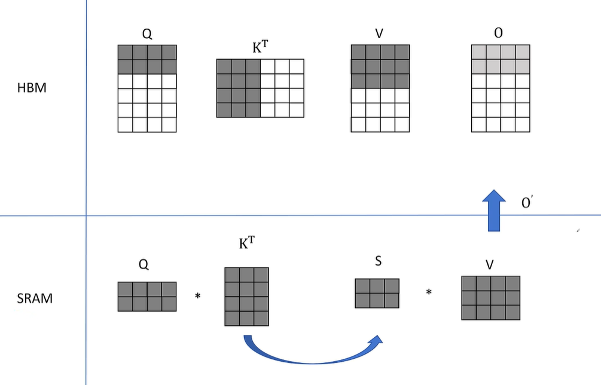
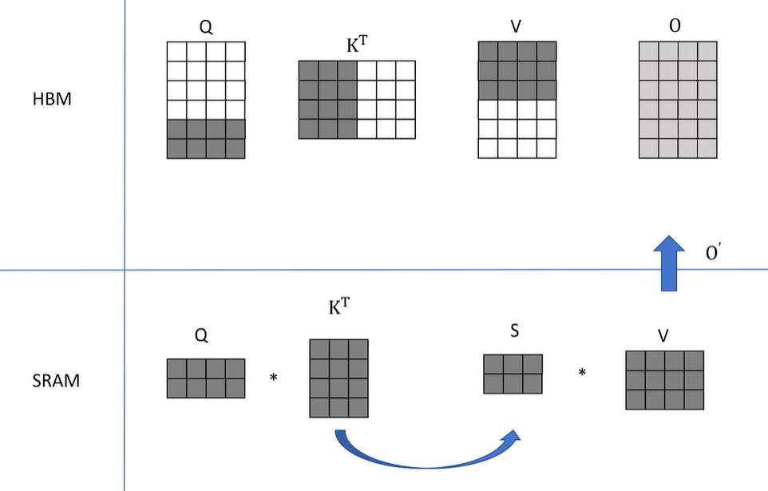
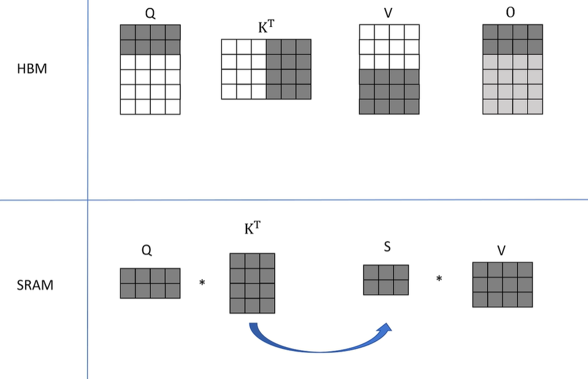
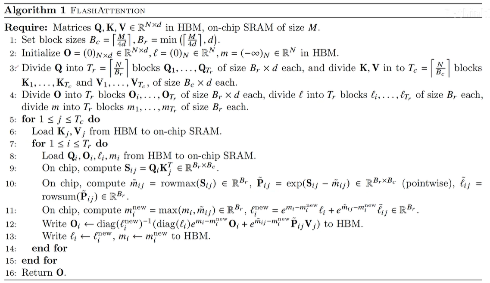
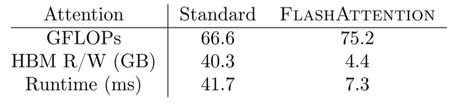

# Flash Attention

论文标题：【Fast and Memory-Efficient Exact Attention with IO-Awareness】

改进IO效率，速度快，内存使用高效，不损失精度

基础概念：

- HBM：High Bandwidth Memory，高宽带内存。是主流GPU使用的主显存，容量大（几十G），速度较慢
- SRAM：Static Random-Access Memory，静态随机存取存储器。是GPU计算核心旁边的高速缓存，容量小，速度很快

## 原始Attention实现：

矩阵 $Q, K, V \in \mathbb{R}^{N \times d}$ 存储在HBM。 

1. 从HBM加载$Q, K$到SRAM 
2. 计算出$S = QK^T$ 
3. 将$S$写到HBM
4. 将$S$加载到SRAM
5. 计算$P = \text{softmax}(S)$ 
6. 将$P$写出到HBM 
7. 从HBM加载$P$和$V$到SRAM 
8. 计算$O = PV$
9. 把$O$写出到HBM
10. 返回$O$

注意到，S和P矩阵都是$O(n^2)$的

两种瓶颈类型的操作：

Compute-Bound（计算时间占大头，存储间的IO通信占小头）：大的矩阵乘法，多Channel的卷积

Memory-Bound（存储间的IO通信占大头）：按位操作，如ReLU，Dropout；规约操作，如sum，softmax

如上图，大模型的参数计算中，Memory-Bound消耗的时间相对占大头

对Memory-Bound的优化一般是进行fusion融合操作，不保存中间的激活值，而是重新计算（类似梯度检查点技术）

目标：避免Attention Matrix从HBM的读写

1. 通过分块计算，融合多个操作，减少中间结果缓存
2. 反向传播时，重新计算中间结果

## Flash Attention全流程

先不考虑需要看整个序列来计算的softmax，先只考虑Q，K，V以及S(Q·K^T)，O矩阵，先假设$O=S·V$

（数字都只是示例）开始时，读取Q的前两行（即sequence的前两个），$K^T$的前3列（即sequence的前3个K），V的前三行（即sequence的前3个V）

这里得到的O的前两行只是一个中间结果。因为O的前两行应该是Q的前两行对整个序列的K查询后得到V的加权平均，而这里只是V的前三个的加权平均。先用灰色表示

接着，Q的下两行移入SRAM，继续用同一部分的K，V，计算出O的中间两行（的一个部分）

以此类推。最后一轮是Q的最后两行，计算出O的最后两行（的一个部分）

第一轮循环结束。第二轮是固定K的后三列和V的后三行，对Q进行遍历：

这次由于补上了剩下的K和V，得到的O的两行和之前得到的两行求和，就是最终的O

由于没有将中间结果S传到HBM再传到SRAM，减少了IO时间

接下来，要解决softmax分块计算的问题，上面我们把K，V拆分了，而softmax需要的是一整个序列的注意力得分来计算

FP16下，最大表示65536。而$e^{12}=162754$，因此容易溢出。需要对指数进行统一的缩小

**safe softmax：**

$m=max(x_i)$，$softmax(\{x_1,...,x_n\})=\{\frac{e^{x_i-m}}{\sum^N_{j=1}e^{x_j-m}}\}_{i=1}^N$

实现softmax的分块：

维护额外的变量:

$m(x)=max(x)$

$p(x)=[e^{x_1-m(x)},\dots,e^{x_N-m(x)}]$

$l(x)=\sum_ip(x)_i$

$softmax(x)=\frac{p(x)}{l(x)}$

假设我们的K，V是被拆成两半，所以得到的注意力得分也是两个部分，这里切分成$x_1到x_N$和$x_{N+1}到x_{2N}$

$$ \begin{align*} x^1 &= [x_1, \dots, x_N]→算出对应m(x^1), p(x^1), l(x^1) \\ x^2 &= [x_{N+1}, \dots, x_{2N}]→算出对应m(x^2), p(x^2), l(x^2) \\ m(x) &= \max\left(m(x^1), m(x^2)\right) \\ p(x) &= \left[ e^{m(x^1) - m(x)} p(x^1), e^{m(x^2) - m(x)} p(x^2) \right] \\ l(x) &= e^{m(x^1) - m(x)} l(x^1) + e^{m(x^2) - m(x)} l(x^2) \\ \text{softmax}(x) &= \frac{p(x)}{l(x)} \end{align*} $$

这样softmax也可以分块计算了，只不过需要额外保存所有块的$m(x)$和$l(x)$才能实现

## 反向传播

前向保留softmax中的统计值，最大值m和累计和$l$的值。反向传播可以快速重新计算激活值。可以看作是另一种形式的梯度（激活值）检查点

## 实际效果

## Flash Attention-2

1. 减少了非矩阵乘法计算，可以利用TensorCore加速
2. 调整了内外训练。Q为外层训练，KV为内层循环。减少HBM读写
3. 如果一个Block处于矩阵上三角部分，不进行attention计算

