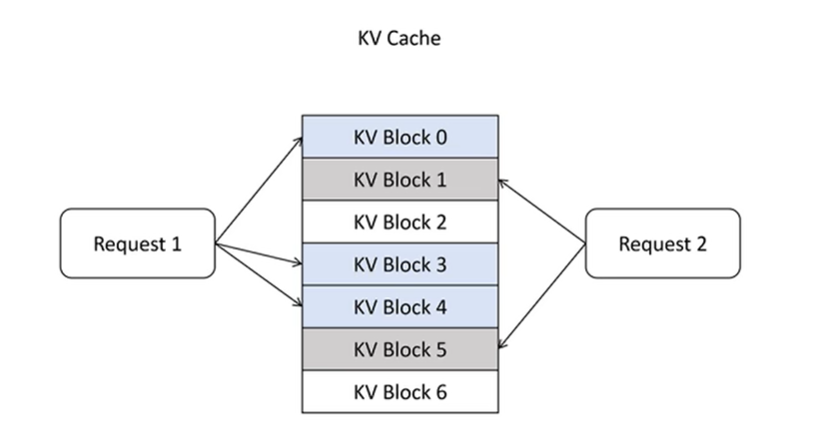
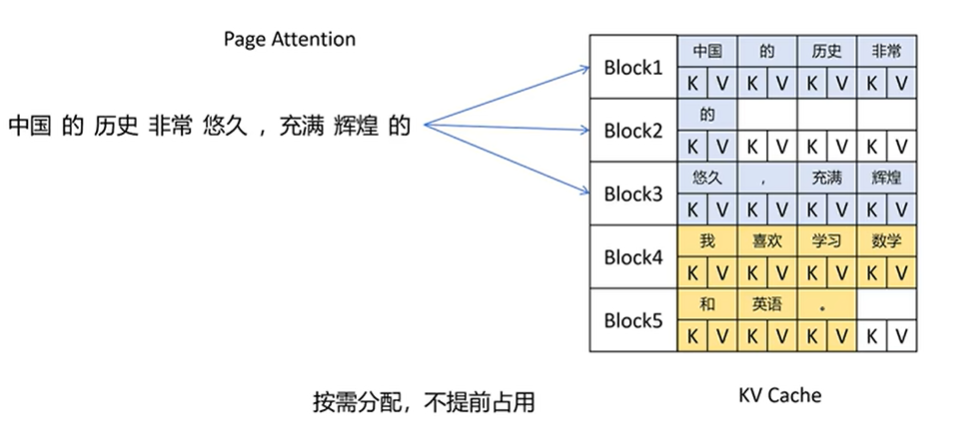
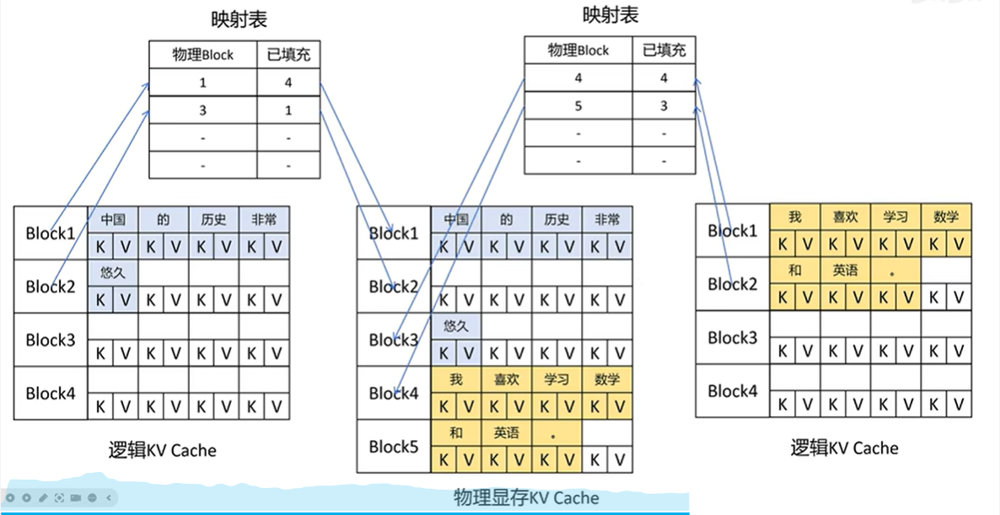
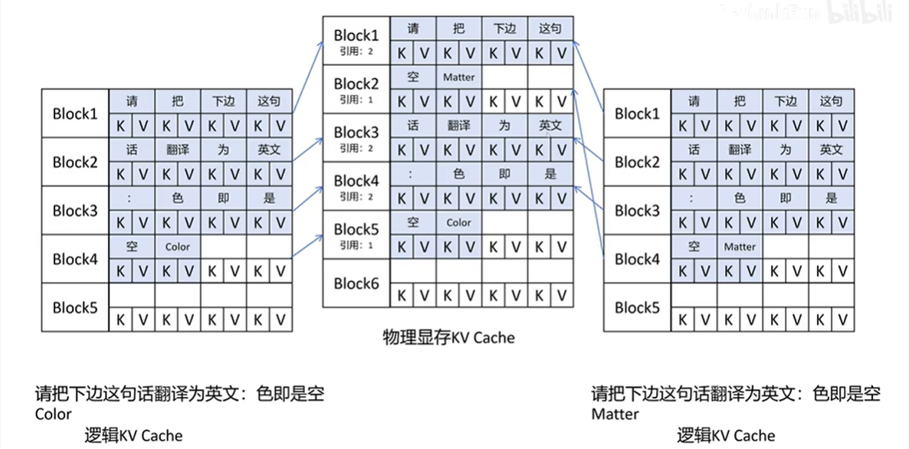

# VLLM (2025.8.14)

## KV Cache

预测下一个token时，需要当前已有的序列中最后一个token的Q向量与前面所有的K、V向量计算，因此前面所有token的K、V向量都需要缓存起来，避免重复计算。

- KV Cache的问题：

在大模型推理时，按照可生成最长序列长度分配显存。造成三种类型的浪费：

1. 预分配，但不会用到。
2. 预分配，但尚未用到。
3. 显存之间的间隔碎片，不足以预分配给下一个文本生成。（当prompt长度不同时，预分配的空间不同，因此上一轮预分配空间回收时，碎片可能不够分配给下一个，或下一个需要的空间更少，产生碎片）

->利用率只有 20%-40%

## Paged Attention

借鉴操作系统中的虚拟内存和页管理技术：

当生成token过程中当前block占满后，会继续分配一个新的block。按需分配，不会提前占用显存；按block分配，减少碎片大小

- 虚拟化：

物理存储中每组token序列使用的block不是连续的。维护一个映射表，（对于一次对话生成有一个）抽象的KV Cache从0开始依次编号每个block，维护一个和物理block号的映射关系并标记已填充的token数

## Sharing KV Blocks

当用大语言模型同一个Prompt，希望生成多个Output时需要。

示例：

prompt：
请把下面这句话翻译成英文：色即是空

这个prompt的K、V向量在多次回答生成的过程中都会被用到，因此实际只需要存一份，再标注好引用数就行

