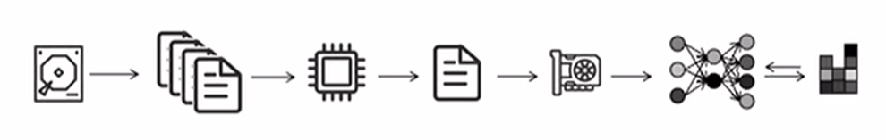
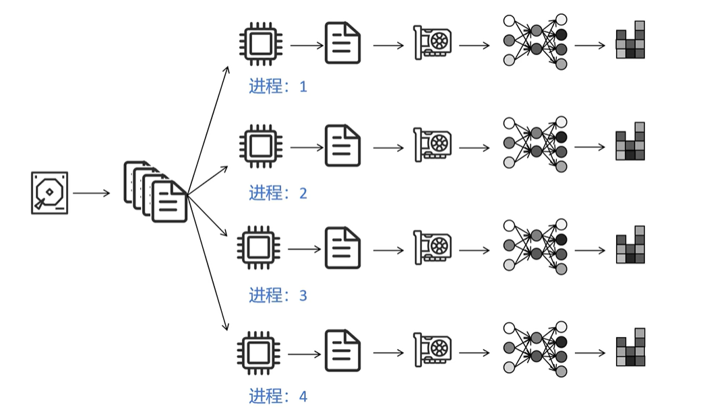
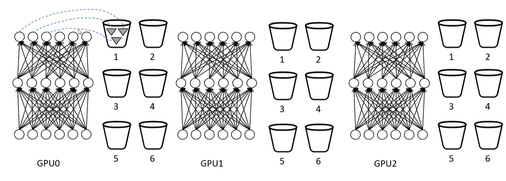
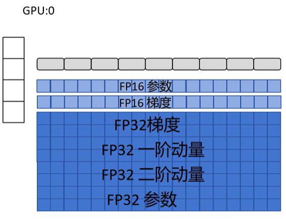
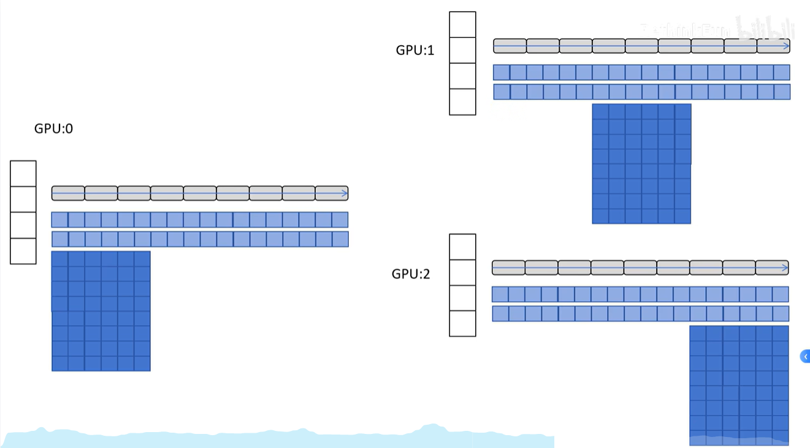
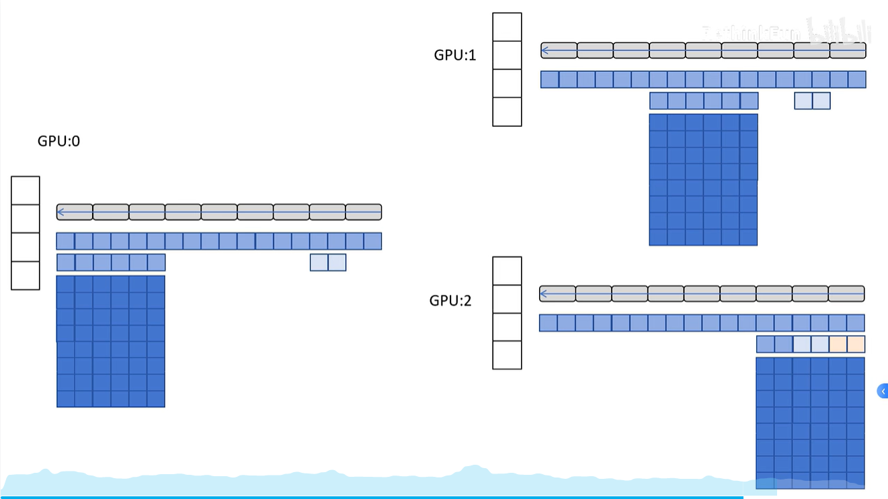

# 分布式训练

source: [动画理解Pytorch 大模型分布式训练技术 DP，DDP，DeepSpeed ZeRO技术_哔哩哔哩_bilibili](https://www.bilibili.com/video/BV1mm42137X8/?spm_id_from=333.337.search-card.all.click&vd_source=73e54c2ac162fbf942d5792a881e18b2)

## 单机单卡训练流程

硬盘读取数据 -> cpu处理数据 -> 将数据组成一个batch，传入GPU -> 进行网络前向传播，算出Loss，进行后向传播，计算梯度，更新网络参数

## Pytorch中的最早数据并行框架 Data Parallel - DP

### 宏观流程

硬盘读取数据 -> 一个CPU进程将数据分成多份，每个GPU一份，每个GPU独自进行前向传播、反向传播，计算各自的梯度；所有GPU将自己算的梯度传递到GPU 0上，进行平均，GPU 0用全局平均的梯度更新自己的网络，然后将更新后参数广播到其他GPU上

核心问题：如何减少多GPU间的通信量，以提高效率。单机多卡训练时，可能有一半多的时间都被GPU之间的通信占用

### DP 的通信量分析

假设参数量为*ψ*，节点数为*N*。

则对于 GPU:0
传入梯度为: (*N*−1)*ψ*
传出参数为: (*N*−1)*ψ*

对于其他 GPU:
传出梯度为*ψ*
传入参数为*ψ*

**问题1：**单进程，多线程，Python GIL只能利用一个CPU核

**问题2：**GPU1负责收集梯度，更新参数，同步参数。通信、计算压力大

## Distributed Data Parallel - DDP

Ring-AllReduce 一种集群通讯方式

### 宏观流程

假设有三块GPU，将所有可训练的权重参数接近平均地拆成三份：a, b, c

每块GPU分别反向传播算出梯度：

GPU 0拥有梯度$a_0, b_0, c_0$

GPU 1拥有梯度$a_1,b_1,c_1$

GPU 2拥有梯度$a_2,b_2,c_2$

**第一阶段：Scatter-Reduce**

- **第一回合：**

GPU 0传递$a_0$给GPU 1，GPU 1传递$b_1$给GPU 2，GPU 2传递$c_2$给GPU 0，这样：

GPU 0拥有$a_0,b_0,c_0+c_2$

GPU 1拥有$a_0+a_1,b_1,c_1$

GPU 2拥有$a_2,b_1+b_2,c_2$

- **第二回合：**

现在，每个GPU将**上一回合刚刚接收并计算过的那个数据块**继续传递给环上的下一个节点。

**GPU 0** 传递 $c_0 + c_2$ 给 **GPU 1**

**GPU 1** 传递 $a_0 + a_1$ 给 **GPU 2**

**GPU 2** 传递 $b_1 + b_2$ 给 **GPU 0**

当接收到数据后，再次与本地对应的数据块累加：

**GPU 0** 收到 $b_1 + b_2$，与自己的 $b_0$ 相加，得到 $b_0 + b_1 + b_2$ (我们称之为 $b_{total}$)

**GPU 1** 收到 $c_0 + c_2$，与自己的 $c_1$ 相加，得到 $c_0 + c_1 + c_2$ (我们称之为 $c_{total}$)

**GPU 2** 收到 $a_0 + a_1$，与自己的 $a_2$ 相加，得到 $a_0 + a_1 + a_2$ (我们称之为 $a_{total}$)

**第二阶段：All-Gather**

现在，我们需要让每个GPU都拥有全部的 $a_{total}$, $b_{total}$, $c_{total}$。这个阶段只传递数据，不再进行计算。

- **第三回合**

每个GPU将自己**当前持有的最终结果块**传递给下一个节点。

- **GPU 0** 传递 $b_{total}$ 给 **GPU 1**
- **GPU 1** 传递 $c_{total}$ 给 **GPU 2**
- **GPU 2** 传递 $a_{total}$ 给 **GPU 0**

操作结束后，每个GPU拥有了两个数据块的最终结果：

- **GPU 0** 拥有: $a_{total}$, $b_{total}$
- **GPU 1** 拥有: $b_{total}$, $c_{total}$
- **GPU 2** 拥有: $a_{total}$, $c_{total}$

- **第四回合**

最后一步，每个GPU将**上一回合刚刚接收到的那个数据块**继续传递给下一个节点。

**GPU 0** 传递 $a_{total}$ 给 **GPU 1**

**GPU 1** 传递 $b_{total}$ 给 **GPU 2**

**GPU 2** 传递 $c_{total}$ 给 **GPU 0**

**最终状态**

第四回合结束后，每个GPU都接收到了自己缺失的最后一个数据块。

**GPU 0** 拥有: $a_{total}$, $b_{total}$, $c_{total}$

**GPU 1** 拥有: $a_{total}$, $b_{total}$, $c_{total}$

**GPU 2** 拥有: $a_{total}$, $b_{total}$, $c_{total}$

**目标达成！** 所有GPU都拥有了完全一致的、全局同步后的梯度。接下来，它们就可以用这个全局梯度来更新各自本地的模型权重了。

DDP是**多进程**的，每个进程为自己的GPU准备数据

### 梯度分桶机制

要解决的**问题**——一个关键的性能瓶颈：如果等到所有参数的梯度都计算完毕后，再启动一次巨大的All-Reduce通信，那么在通信期间，GPU将处于空闲等待状态。为了最大化效率，我们希望**将梯度计算的过程与梯度通信的过程在时间上重叠（Overlap）起来**。

解决方案：

将反向传播中**计算顺序相近**的参数梯度放在同一个桶里，DDP会按照参数**梯度的计算顺序（即反向传播的顺序，定义的逆序）**来排列这些桶。

将所有参数都设置一个监听器（确定哪个参数更新好了），反向传播过程中当一个桶的参数全部计算完了，就把这个桶的参数进行Ring-AllReduce异步传给下一个GPU进行同步。以此类推

当所有桶梯度同步了，每个GPU分别调用各自的优化器来更新网络，此时所有参数都是同步的，更新完后就可以进行下一次训练了

### DDP 的通讯量分析

参数量为Ψ，进程数为N

对于每一个 GPU 进程：

- Scatter-Reduce 阶段传入 / 传出：$(N−1)\frac{Ψ}{N}≈Ψ$
- AllGather 阶段传入 / 传出：$(N−1)\frac{Ψ}{N}≈Ψ$

总传入 / 传出：2Ψ

与集群大小无关

**缺点：**每个GPU都要存储完整的神经网络，训练大模型时可能会显存不够

## DeepSpeed ZeRO-1

解决DDP这种每个GPU都要保存一份完整的神经网络的机制的显存不够的问题

原始版本：每个GPU完整地保存一份优化器的状态

### ZeRO-1流程

只将前向传播、反向传播需要的部分（float16的参数、float16的梯度），每个GPU放一份

高精度模型（float32的参数、float32的梯度），以及优化器所需的float32一阶动量、float32二阶动量每个GPU存储1/N份（假设共有N个GPU）

以下以N=3为例：

每个GPU存储约1/3比例参数的优化器状态，这里假设GPU 0存储前三层参数的优化器状态，GPU 1存储中间三层，GPU 2存储后三层。

反向传播时，从后面的层向前面的层计算梯度。当三个GPU都算完GPU 2负责的部分的梯度后，将梯度都传给GPU 2进行参数更新；继续计算至GPU 1负责的部分的梯度后，将梯度都传给GPU 1……以此类推。每个GPU上参数更新的机制：转化成FP32后进行缩放，更新FP32一阶动量、二阶动量，更新FP32参数

参数都更新完后，将自己的部分广播给其他GPU，进行下一轮训练

### 通讯量分析

参数量为$Ψ$，进程数为N

对于每一个 GPU 进程：

梯度收集阶段传入 / 传出：$(N−1)\frac{N}{Ψ}≈Ψ$

参数广播阶段传入 / 传出：$(N−1)\frac{N}{Ψ}≈Ψ$

总传入 / 传出：$2Ψ$

与 DDP 通讯量相同

- 每个GPU都只把自己计算的梯度传给了负责更新的唯一的那个GPU，而不是进行广播，这一过程减少了通讯量

## DeepSpeed ZeRO-2

### ZeRO-2 流程

与ZeRO-1区别：ZeRO-1每个GPU上都保存完整的一份梯度副本，ZeRO-2梯度也是分开存储的

反向传播时，单个GPU上，每算好一小块梯度（达到一个“桶”的大小），这块梯度就被发送至负责这块梯度的GPU，而不是还存在计算这份梯度的GPU上

### 通讯量分析

参数量为$Ψ$，进程数为N

对于每一个 GPU 进程：

梯度收集阶段传入 / 传出：$(N−1)\frac{N}{Ψ}≈Ψ$

参数广播阶段传入 / 传出：$(N−1)\frac{N}{Ψ}≈Ψ$

总传入 / 传出：$2Ψ$

与 DDP 通讯量相同，与ZeRO-1一样

## DeepSpeed ZeRO-3

### ZeRO-3 流程

在ZeRO-2基础上，又优化了每个GPU上不存完整的FP16的模型参数，而是分成N份到N个GPU上

前向传播时，计算每一层网络的输出结果时，都要从相关GPU上拿取有关参数，用完后本地直接销毁从其他GPU“借”来的参数。注意，这里每层的激活值都要存在本地，因为反向传播还要用。

反向传播时，计算到某一层时，也要从其他有关GPU上拿取有关参数。反向传播计算完后，把对应梯度也用Reduce-Scatter方式传给对应负责的GPU上，无关的部分本地销毁。

### 通讯量分析

参数量为 $\psi$，进程数为 $N$

对于每一个 GPU 进程：

梯度收集阶段传入/传出：$(N-1)\frac{\psi}{N} \approx \psi$

参数广播阶段传入/传出：$2 \cdot (N-1)\frac{\psi}{N} \approx 2\psi$

总传入/传出：$3\psi$

是 DDP 传输量的 1.5 倍
