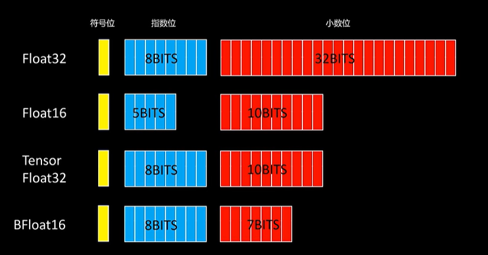
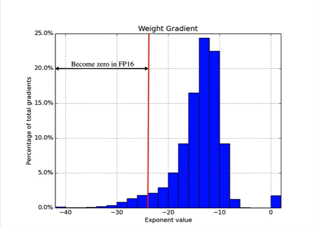
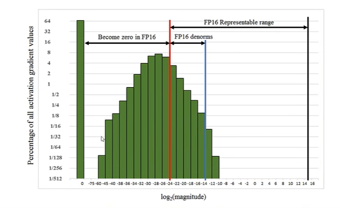

# 混合精度训练

[一次学懂混合精度训练 AMP Automatic Mixed Precision_哔哩哔哩_bilibili](https://www.bilibili.com/video/BV1qJ4m1w7ur/?spm_id_from=333.337.search-card.all.click&vd_source=73e54c2ac162fbf942d5792a881e18b2)

加速模型训练、减少显存占用、不影响模型精度

## float类型在计算机中的表示

略

- 不同float类型：

## 低精度带来的好处

1. 16倍的计算速度提升
2. 显存占用变小
3. 数据传输带宽占用小

## 低精度带来的问题

1. 表示范围问题：一些大/小数溢出

2. 大数吃小数问题

float16下，2048+0.5 = 2048

$2048 = 1.0 * 2^{11}$

$0.5=1.0*2^{-1} →0.000000000001*2^{11}$

## 混合精度

需要高精度时FP32+不需要高精度时FP16

神经网络的计算大部分在FP16下进行

但优化器需要保存一份FP32的参数值（Master-Weight）->防止优化时“大数吃小数”把小的梯度吃了不更新

（以下为梯度的分布情况，红线左侧如果用FP16会直接变成0）

- **全流程：**

1. Master-Weight(FP32)：优化器中保存的，高精度整个模型的参数
2. 将Master-Weight转化为FP16，模型输入值也是FP16，进行前向传播，得到的Activations也是FP16
3. 计算Loss时，计算成FP32的Loss。这是防止有的激活值太小导致FP16会“大数吃小数”

问题：激活梯度（反向传播中间过程的值）往往很小，很多部分处于FP16表示范围之外。

解决：对损失函数进行一定的缩放，这样由于链式法则，中间每层的梯度都被缩放了。

- **接着上面，全流程：**

4. 对算出的FP32 Loss，乘以N倍，得到Scaled Loss
5. 反向传播得到FP16的Scaled Gradients（这是因为，前向传播的中间计算值都是FP16的，所以算出的Gradients都是FP16的）由于我们缩放过，所以这里的FP16的Gradients基本不会溢出
6. 梯度更新时，由于主参数是FP32的，将Scaled Gradients转化为FP32，除以之前乘的N，对主参数进行更新

至此，一个训练循环结束